## Laboratory Experiments

With the laboratory completed, we will now move forward to the experiments related to ANYsec. Our aim for this section will be to analyse ANYsec´s most important components related to its tunnelling capabilities, and do some technical comparisons with MACsec.

## MKA over UDP, Handshake and KeepAlive comparisons with MACsec

For our first experience, we will study the way ANYsec does its authentication. Similar to MACsec, ANYsec uses MKA to perform its authentication process and to share the session keys that will be used to secure the traffic within ANYsec.

The main difference between ANYsec´s MKA and MACsec´s MKA, is that for ANYsec, the MKA packets are sent using UDP, since it is needed to send the packets through entire networks and not only on a link level.

!!! warning "For the majority, if not all of the ANYsec packets we will be analysing, WireShark is still incapable of dissecting them. As such all the figures we will display with dissected packets are done in WireShark with the plugin [ANYsec Dissectors](https://github.com/xavixava/anysec-dissectors) installed. We recommend installing it for the full experience."

We will then need to see the MKA process occuring to see any diferences or similarities. For this we will retrigger a handshake by rebooting routers PE1 and PE2 using the following command at both machines simultaneously:

```srl
admin reboot now
```

Before running the command place WireShark probes at the two ports of both routers that are facing P3 and P4, and then run the command to see the handshake and the MKA process.

The result will be similar to what we have seen in MACsec, a sudden break from the KeepAlive routine, and then the MKA Handshake packets appearing, followed by the routine packets again.

<figure markdown id="figure-1">
  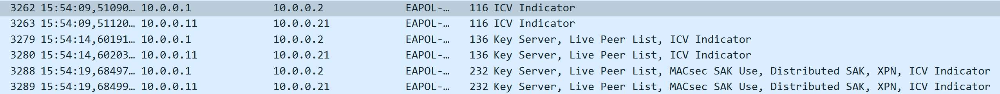
  <figcaption>Figure 1: MKA Handshake from the Key Server view</figcaption>
</figure>

From Figure 1 we can identify some interesting aspects. First of all, the MKA process is identical to the one we see in MACsec, and secondly, we can see two handshakes occuring at once, due to the two services using tunnel encryption.

<figure markdown id="figure-2">
  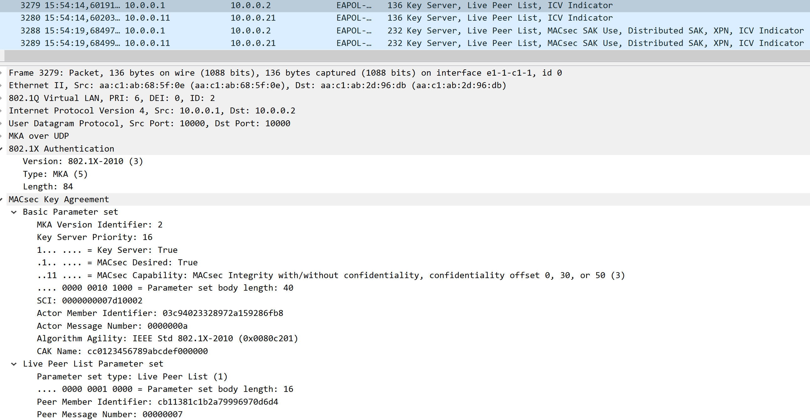
  <figcaption>Figure 2: MKA Handshake First Key Name</figcaption>
</figure>

<figure markdown id="figure-3">
  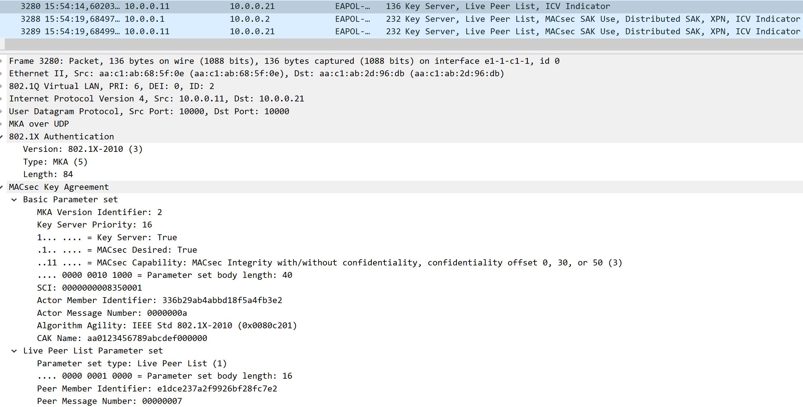
  <figcaption>Figure 3: MKA Handshake Second Key Name</figcaption>
</figure>

We can see in Figures 2 and 3, that the CAK names for both packets are different and match the names we used in the configuration of the two services using tunnel encryption.

<figure markdown id="figure-4">
  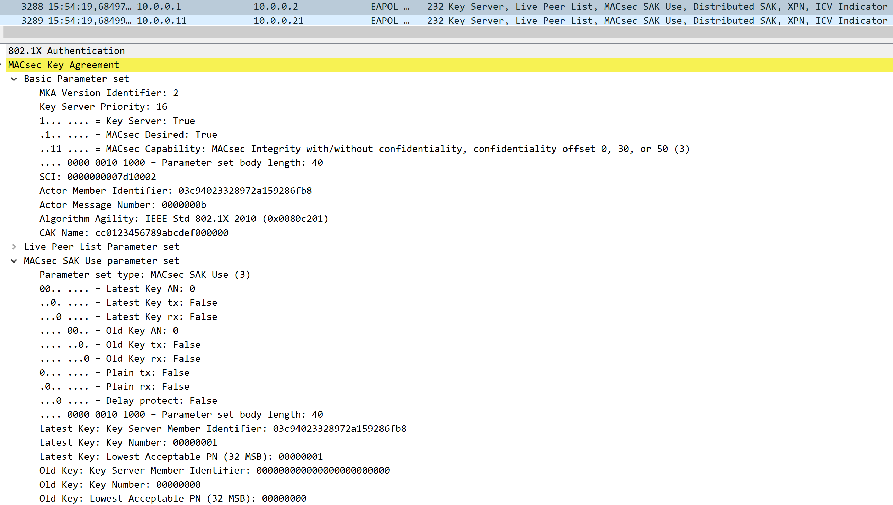
  <figcaption>Figure 4: MKA Handshake Second Key Name</figcaption>
</figure>

In Figure 4 we can see the final handshake packets, which distribute the two SAKs that will be used by the ANYsec tunnel, specifically the two services using tunnel encryption. This way each service has its own SAK, which means its own encryption, detached from the other services.

Following the full handshake process, we can see that ANYsec uses MKA to the letter, following exactly MACsec´s usage, with the difference that it is transported by UDP so it can traverse across several routers to its destination, and that several handshakes occur at once depending on how many CAs are needed for tunnels or services.

We will now briefly analyse the ANYsec KeepAlive, to see what it uses to maintain its connection.

<figure markdown id="figure-5">
  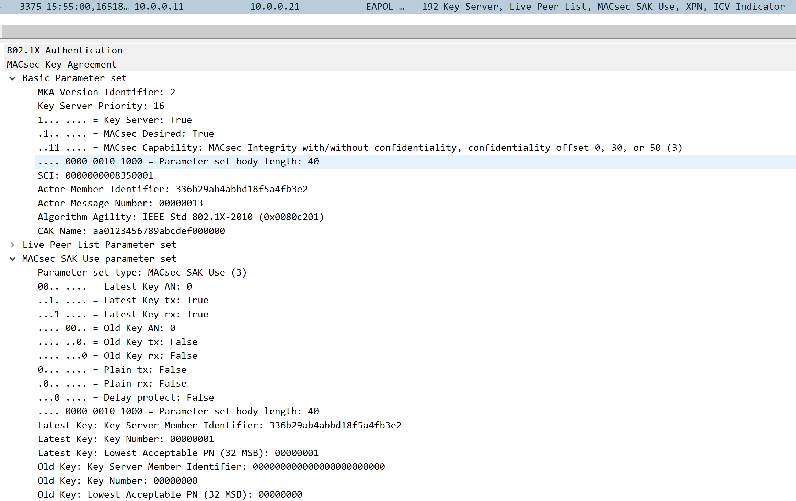
  <figcaption>Figure 5: ANYsec KeepAlive packet</figcaption>
</figure>

As we can see in Figure 5, the KeepAlive for ANYsec is identical to the one used by MACsec, sharing the same details in its parameters to prove it is still up and ready to communicate.

## End-to-End encryption vs Hop-by-Hop encryption

As we saw in the MACsec experiments, MACsec operates with Hop-by-Hop encryption, meaning that at every router a MACsec encrypted packet passes through, it must be decrypted and then encrypted again by a new SAK. This type of operation is valuable for added security, but it also adds challenges, mainly regarding performance.

ANYsec differs from MACsec in this regard, operating with End-to-End encryption, meaning that it encrypts a packet at the starting point of ANYsec, crossing several networks and routers, and only decrypts when it reaches the ending router of ANYsec.

This is possible due to ANYsec capability to operate above Layer 2, namely Layer 2.5 and 3, making it possible to be routed all the way to its destination without having to be decrypted.

With this experiment we will see this behaviour in action, sending packets across ANYsec, capturing them in routers P3 and P4, and comparing them to what we see arriving in routers PE1 and PE2, to confirm if it truly displays End-to-End encryption.

To begin, we will use Host 1 to send the pings, therefore we only need to place WireShark probes at port 1/1/c2/1 of P3 and P4 and at both ports of PE2.

After placing the probes and ensuring everything is running correctly, we will perform the same three pings we did to test the laboratory configuration:

```bash
ping 192.168.51.8
ping 192.168.52.8
ping 192.168.63.8
```

Let each ping run for some time, in order to capture several packets in every step of the way.

After all pings are done, use your WireShark capable of dissecting ANYsec packets to look at the captures.

In theory, the packets related to the service in 192.168.51.8 should have travelled through P3 to reach PE2 in port 1/1/c1/1, the packets related to the service in 192.18.52.8 should have travelled through P4 to reach PE2 in 1/1/c2/1, and the packets related to the service in 192.168.63.8 should have travelled through P4, then to P3, and finally arrived to PE2 in port 1/1/c1/1.

Let´s analyse the packets captured and see if our End-to-End theory is correct.

We will start by looking at the packets sent by pinging 192.168.51.8. These should be related to service 1001, meaning they should have the label 2101.

<figure markdown id="figure-6">
  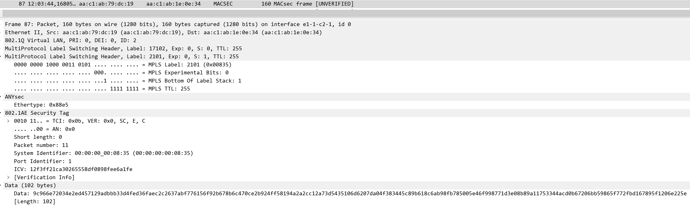
  <figcaption>Figure 6: ANYsec Service 1001 P3 Capture</figcaption>
</figure>

As we can see in Figure 6, the packet in P3 does have the expected 2101 label in MPLS, meaning it is one of the pings from the first address. Let´s now compare it to the packet received in PE2, and see if the information within MPLS, 802.1AE Security Tag and Data remains the same.

<figure markdown id="figure-7">
  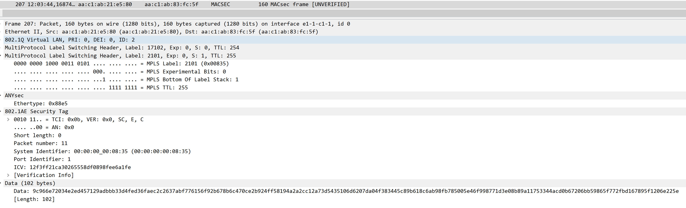
  <figcaption>Figure 7: ANYsec Service 1001 PE2 Capture</figcaption>
</figure>

We can observe in Figure 7 that the packet reached PE2 shortly after P3. We can confirm it is the same from its 2101 label. Furthermore, we can see absolutely no changes in any piece of information on the headers or in the data, proving that the packet crossed through the network untouched and arrived in PE2 in the same state as when it left PE1.

Now that we have proved our assumption, let´s look at the other two pings to confirm it follows the same pattern.

<figure markdown id="figure-8">
  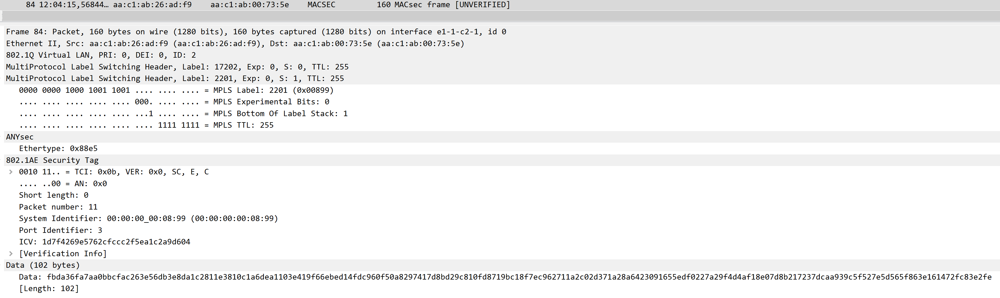
  <figcaption>Figure 8: ANYsec Service 1002 P4 Capture</figcaption>
</figure>

<figure markdown id="figure-9">
  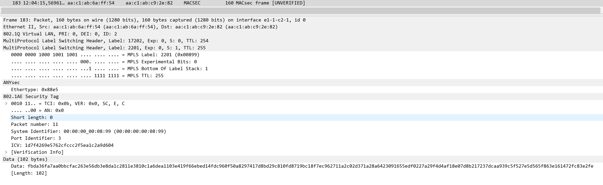
  <figcaption>Figure 9: ANYsec Service 1002 PE2 Capture</figcaption>
</figure>

As we can see in Figures 8 and 9, this packet belongs to service 1002, due to its 2201 MPLS label, and all the headers and data related to ANYsec remain the same, further proving the End-to-End encryption of ANYsec.

<figure markdown id="figure-10">
  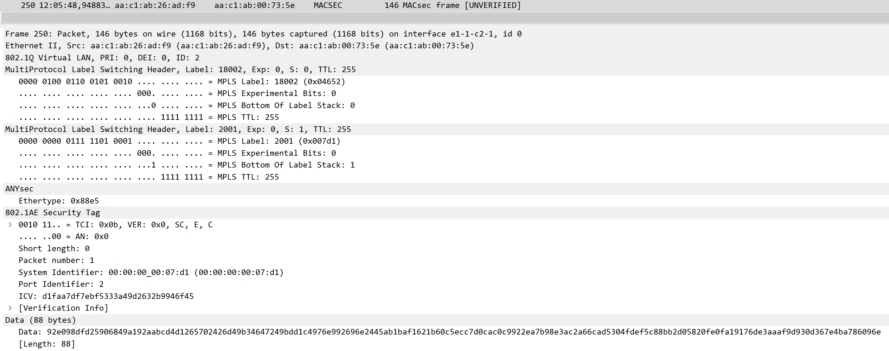
  <figcaption>Figure 10: ANYsec Service 1003 P4 Capture</figcaption>
</figure>

<figure markdown id="figure-11">
  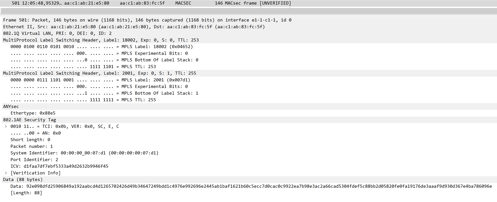
  <figcaption>Figure 11: ANYsec Service 1003 PE2 Capture</figcaption>
</figure>

And finally, in Figures 10 and 11, we can see that the service 1003, identified by the MPLS label 2001, also follows the same pattern of the other two services, and the packets fully match.

## Tunnel Encryption

For this experiment, we will be exploring one of ANYsec´s ways of encrypting its traffic, through Tunnel Encryption.

Tunnel Encryption was the first method of encryption developed for ANYsec. Its objective was to create a tunnel where all ANYsec traffic would pass through, encrypted with the same CA.

This experiment will focus on explaining the configurations of Tunnel Encryption and how to analyse and obtain information about it with router commands.

Firstly, to encrypt a service through Tunnel Encryption, it is necessary to create its Security Termination Policy and Encryption Group.

The Security Termination policy is essentialy a way to define the identity and the endpoint of the tunnel. It includes:

- Local Address
- Routing Protocol
- IGP Instance

And its configuration, for example for service 1001, is the following:

```srl
/configure anysec security-termination-policies policy "STP_VLL-1001" admin-state enable
/configure anysec security-termination-policies policy "STP_VLL-1001" local-address 10.0.0.11
/configure anysec security-termination-policies policy "STP_VLL-1001" rx-must-be-encrypted false
/configure anysec security-termination-policies policy "STP_VLL-1001" protocol sr-isis
/configure anysec security-termination-policies policy "STP_VLL-1001" igp-instance-id 1
```

The Encryption Group on the other hand, is used to define what is going to be encrypted and who the other endpoint is. It includes:

- Security Termination Policy
- Peer
- Peer tunnel information
- Encryption Label
- CA that will be used

Its configuration for service 1001 follows:

```srl
/configure anysec tunnel-encryption encryption-group "EG_VLL-1001" admin-state enable
/configure anysec tunnel-encryption encryption-group "EG_VLL-1001" security-termination-policy "STP_VLL-1001"
/configure anysec tunnel-encryption encryption-group "EG_VLL-1001" encryption-label 2101
/configure anysec tunnel-encryption encryption-group "EG_VLL-1001" ca-name "CA_VLL-1001"
/configure anysec tunnel-encryption encryption-group "EG_VLL-1001" peer-tunnel-attributes protocol sr-isis
/configure anysec tunnel-encryption encryption-group "EG_VLL-1001" peer-tunnel-attributes igp-instance-id 1
/configure anysec tunnel-encryption encryption-group "EG_VLL-1001" peer 10.0.0.21 admin-state enable
```

These two elements can be seen in the routers using the command:

```srl
show anysec tunnel-encryption encryption-group "EG_VLL-1001"
```

This command will display information regarding the Encryption Group associated with service 1001, including the Security Termination Policy, as we can see in Figure 12:

<figure markdown id="figure-12">
  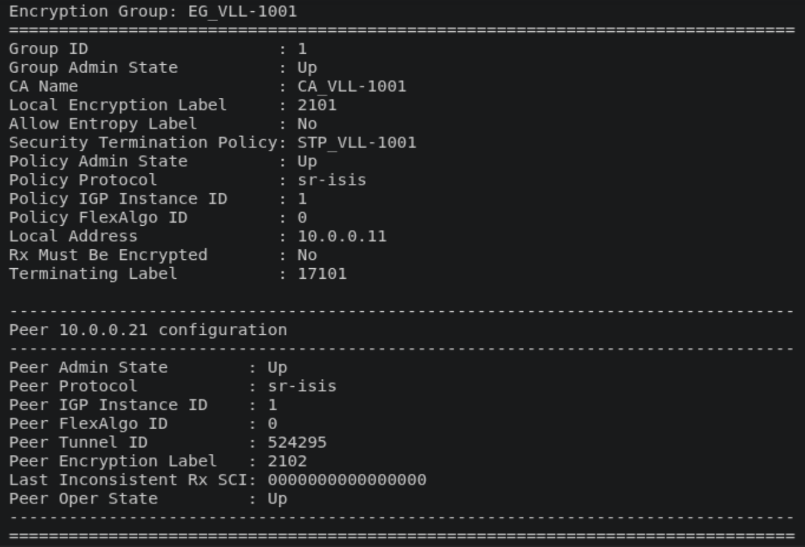
  <figcaption>Figure 12: ANYsec EG and STP</figcaption>
</figure>

We can see that all the information we configured is present here, including configurations regarding this router peer.

Another important part of the configuration is the CAs used by ANYsec.

To configure those, we configure the router to create several MACsec CAs, and configure it with the ANYsec flag on true, so that it knows it is using these for ANYsec and not MACsec.

With several CAs configured and assigned through the Encryption Group, the router will know which CAs to assign to which services, and each one will have its own set of keys.

The CA configuration can be seen below:

```srl
/configure macsec connectivity-association "CA_VLL-1001" admin-state enable
/configure macsec connectivity-association "CA_VLL-1001" description "Anysec ISIS 1"
/configure macsec connectivity-association "CA_VLL-1001" clear-tag-mode none
/configure macsec connectivity-association "CA_VLL-1001" cipher-suite gcm-aes-xpn-128
/configure macsec connectivity-association "CA_VLL-1001" anysec true
/configure macsec connectivity-association "CA_VLL-1001" static-cak active-psk 1
/configure macsec connectivity-association "CA_VLL-1001" static-cak mka-hello-interval 5
/configure macsec connectivity-association "CA_VLL-1001" static-cak pre-shared-key 1 encryption-type aes-128-cmac
/configure macsec connectivity-association "CA_VLL-1001" static-cak pre-shared-key 1 cak "0123456789ABCDEF0123456789ABCDEF"
/configure macsec connectivity-association "CA_VLL-1001" static-cak pre-shared-key 1 cak-name "AA0123456789ABCDEF"
/configure macsec connectivity-association "CA_VLL-1001" static-cak pre-shared-key 2 encryption-type aes-128-cmac
/configure macsec connectivity-association "CA_VLL-1001" static-cak pre-shared-key 2 cak "123456789ABCDEF0123456789ABCDEF0"
/configure macsec connectivity-association "CA_VLL-1001" static-cak pre-shared-key 2 cak-name "AA123456789ABCDEF0"
```

We can also see this in the router, by checking the MACsec CAs, or by checking the MKA sessions details of the EG:

```srl
show macsec connectivity-association "CA_VLL-1001"
show anysec tunnel-encryption encryption-group "EG_VLL-1001" mka-session
```

With the first command, we will see the details of the CA we just configured, and with the second command, we will see the status of the session that was established, as portrayed in Figures 13 and 14:

<figure markdown id="figure-13">
  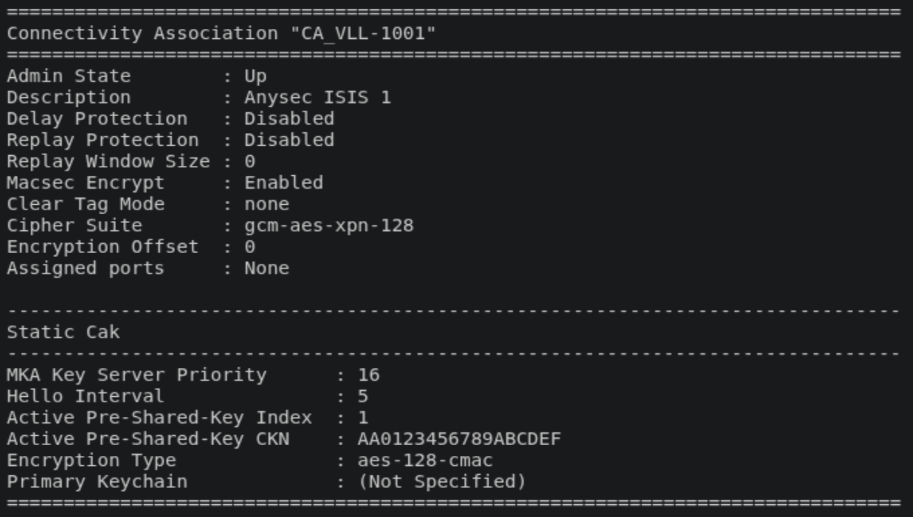
  <figcaption>Figure 13: ANYsec service 1001 CA</figcaption>
</figure>

<figure markdown id="figure-14">
  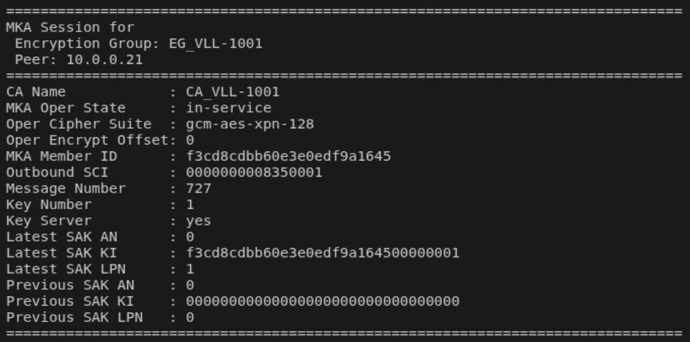
  <figcaption>Figure 14: ANYsec service 1001 MKA session</figcaption>
</figure>

With all these configurations, our router is now ready to create an ANYsec tunnel with two services using it.

## Service Encryption

For our final experiment, we will briefly analyse a new feature recently added to ANYsec, Service Encryption.

A simple way to describe Service Encryption, is to say it is a targeted way of protecting services, focusing on individual services instead of entire tunnels. It offers a higher degree of granularity regarding the protection and customization it offers.

Whilst Tunnel Encryption can encrypt everything within its tunnel, Service Encryption works only on a per-service basis.

To configure a service to be protected through Service Encryption, the process is similar to the previous one. We create our STP, this time without peer tunnel attributes:

```srl
/configure anysec security-termination-policies policy "STP_SERV-1002" admin-state enable
/configure anysec security-termination-policies policy "STP_SERV-1002" local-address 10.0.0.12
/configure anysec security-termination-policies policy "STP_SERV-1002" rx-must-be-encrypted false
/configure anysec security-termination-policies policy "STP_SERV-1002" protocol sr-isis
/configure anysec security-termination-policies policy "STP_SERV-1002" igp-instance-id 2
```

Then we create the EG, this time using the service encryption path:

```srl
/configure anysec service-encryption encryption-group "EG_SERV-1002" admin-state enable
/configure anysec service-encryption encryption-group "EG_SERV-1002" security-termination-policy "STP_SERV-1002"
/configure anysec service-encryption encryption-group "EG_SERV-1002" encryption-label 2201
/configure anysec service-encryption encryption-group "EG_SERV-1002" ca-name "CA_SERV-1002"
/configure anysec service-encryption encryption-group "EG_SERV-1002" peer 10.0.0.22 admin-state enable
```

Then, the MACsec CA, similar to the others:

```srl
/configure macsec connectivity-association "CA_SERV-1002" admin-state enable
/configure macsec connectivity-association "CA_SERV-1002" description "Anysec ISIS 2"
/configure macsec connectivity-association "CA_SERV-1002" clear-tag-mode none
/configure macsec connectivity-association "CA_SERV-1002" cipher-suite gcm-aes-xpn-128
/configure macsec connectivity-association "CA_SERV-1002" anysec true
/configure macsec connectivity-association "CA_SERV-1002" static-cak active-psk 1
/configure macsec connectivity-association "CA_SERV-1002" static-cak mka-hello-interval 5
/configure macsec connectivity-association "CA_SERV-1002" static-cak pre-shared-key 1 encryption-type aes-128-cmac
/configure macsec connectivity-association "CA_SERV-1002" static-cak pre-shared-key 1 cak "0123456789ABCDEF0123456789ABCDEF"
/configure macsec connectivity-association "CA_SERV-1002" static-cak pre-shared-key 1 cak-name "BB0123456789ABCDEF"
/configure macsec connectivity-association "CA_SERV-1002" static-cak pre-shared-key 2 encryption-type aes-128-cmac
/configure macsec connectivity-association "CA_SERV-1002" static-cak pre-shared-key 2 cak "123456789ABCDEF0123456789ABCDEF0"
/configure macsec connectivity-association "CA_SERV-1002" static-cak pre-shared-key 2 cak-name "BB123456789ABCDEF0"
```

And finally, when configuring the service, we assign the EG to the spoke we are using for that service, in order for the actual encryption to occur and traffic for this service to really be encrypted:

```srl
/configure service epipe "1002" admin-state enable
/configure service epipe "1002" description "SERV using ISIS 2 best IGP metric on Bottom"
/configure service epipe "1002" customer "1"
/configure service epipe "1002" service-mtu 8100
/configure service epipe "1002" spoke-sdp 2222:1002 admin-state enable
/configure service epipe "1002" spoke-sdp 2222:1002 anysec-encryption-group "EG_SERV-1002"
/configure service epipe "1002" sap 1/1/c3/1:1002 admin-state enable
```

This additional step is necessary compared to Tunnel Encryption, otherwise this service traffic would be in the clear throughout the network.

The command to see the STP and EG is similar changing only from tunnel-encryption to service-encryption:

```srl
show anysec service-encryption encryption-group "EG_SERV-1002"
```

The same happens for the MKA session command:

```srl
show anysec service-encryption encryption-group "EG_SERV-1002" mka-session
```

And as we can see in Figure 15, the output for these commands regarding service encryption does not change in a meaningful manner, only what would be expected of a different EG and STP:

<figure markdown id="figure-15">
  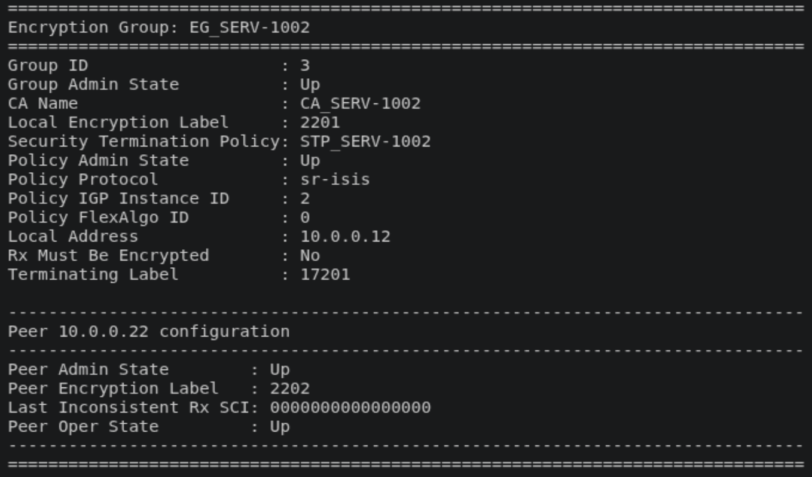
  <figcaption>Figure 15: ANYsec Service Encryption EG</figcaption>
</figure>

We hope that these experiments helped you understand ANYsec sligthly better, both in its differences and similarities to MACsec and other similar solutions, but also to its fundamental features, and that it may help you configure and understand your own ANYsec protected networks!

We hope to see you at our next laboratory regarding WireGuard!
