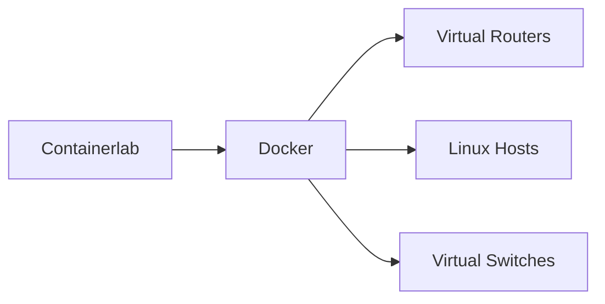

# Containerlab

Containerlab is a container-based network emulation framework designed for rapid deployment of virtual networking laboratories.

It enables the creation of complex topologies using Docker containers and virtual network operating systems. Our focus will
be the usage of Nokia´s SR SIM.

## Features

- Lightweight deployment
- Fast topology startup
- Native Linux networking
- Docker integration
- YAML-based topology definitions
- Integrated packet captures
- Automation friendly

## Architecture



---

## Installation

## Install Docker

=== "Ubuntu"

    ```bash
    sudo apt update
    sudo apt install docker.io -y
    sudo systemctl enable docker
    sudo systemctl start docker
    ```

=== "Debian"

    ```bash
    sudo apt update
    sudo apt install docker.io -y
    ```

---

## Install Containerlab

```bash
bash -c "$(curl -sL https://get.containerlab.dev)"
```

Verify installation:

```bash
containerlab version
```

---

## Basic Topology

Create a file named `lab.clab.yml`.

```yaml
name: simple-lab

topology:
  nodes:
    r1:
      kind: linux
      image: alpine

    r2:
      kind: linux
      image: alpine

  links:
    - endpoints: ["r1:eth1", "r2:eth1"]
```

---

## Deploy the Lab

```bash
sudo containerlab deploy -t lab.clab.yml
```

---

## Inspect Running Nodes

```bash
docker ps
```

```bash
sudo containerlab inspect -t lab.clab.yml
```

---

## Access Containers

```bash
docker exec -it clab-simple-lab-r1 sh
```

---

## Destroy the Lab

```bash
sudo containerlab destroy -t lab.clab.yml
```

---

## Nokia SR Linux Example

```yaml
name: srlab

topology:
  nodes:
    r1:
      kind: nokia_srlinux
      image: ghcr.io/nokia/srlinux

    r2:
      kind: nokia_srlinux
      image: ghcr.io/nokia/srlinux

  links:
    - endpoints: ["r1:e1-1", "r2:e1-1"]
```

Deploy:

```bash
sudo containerlab deploy -t srlab.clab.yml
```

---

## Useful Commands

| Command                | Purpose                 |
| ---------------------- | ----------------------- |
| `containerlab deploy`  | Start topology          |
| `containerlab destroy` | Remove topology         |
| `containerlab inspect` | Show topology info      |
| `docker ps`            | List running containers |
| `docker exec`          | Access containers       |

---

## Packet Capture

Capture traffic directly on links:

```bash
sudo tcpdump -i br-clab
```

Or capture inside a node:

```bash
docker exec -it clab-simple-lab-r1 tcpdump -i eth1
```

## Troubleshooting

## Containers Not Starting

Check Docker status:

```bash
sudo systemctl status docker
```

---

## Interface Issues

Verify Linux interfaces:

```bash
ip link show
```

---

## Bridge Problems

Inspect Linux bridges:

```bash
bridge link
```

---

## Verify Containerlab Topology

```bash
sudo containerlab inspect -t lab.clab.yml
```

---

!!! warning

    Containerlab requires Linux kernel networking support and performs best on native Linux environments.

!!! note

    Windows users should preferably run Containerlab inside WSL2 or a Linux virtual machine.
