## Laboratory Experiments

We will now begin our DTLS experiments, with the aim of deepening our knowledge of it, and to better understand what makes it different and similar to TLS. We will be comparing the handshakes and transport layer differences of the two, how their packets are built, how DTLS handles the tests on loss, duplication and reordering that we subjected TLS to, how DTLS handles the innate fragmentation of UDP and how it handles a replay attack.

## DTLS Handshake vs TLS Handshake

For our first experiment, we will be comparing the handshake of DTLS with what we saw in TLS.

An important note is that OpenSSL only has DTLS 1.2 available in this version, so we will be comparing DTLS 1.2 with TLS 1.2.

If you have tested DTLS in the Overview section, you should already have a complete handshake to analyse, if not, start a WireShark probe between the two DTLS peers and connect the client to the server. The handshake should look identical or similar to this:

<figure markdown id="figure-1">
  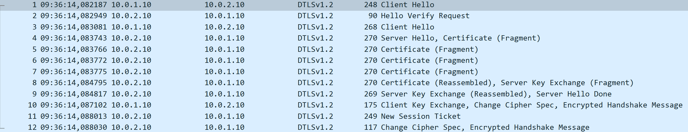
  <figcaption>Figure 1: DTLS Handshake</figcaption>
</figure>

This handshake bears some similarity to the TLS 1.2 handshake, but it also has its differences.

Although the structure is relatively the same, we can right from the start identify a change, there is no transport layer session establishment. Since DTLS uses UDP, which does not require a connection to communicate, the first packets are already part of th DTLS handshake.

The first two packets are related to another innovation for DTLS, a stateless cookie, which is used by the server to ensure that the client trying to connect is real and can respond, saving valuable resources from being spent on fake requests.

We can see in Figure 2 the cookie being sent by the server, and in Figure 3 the second Client Hello now has added a cookie to its request.

<figure markdown id="figure-2">
  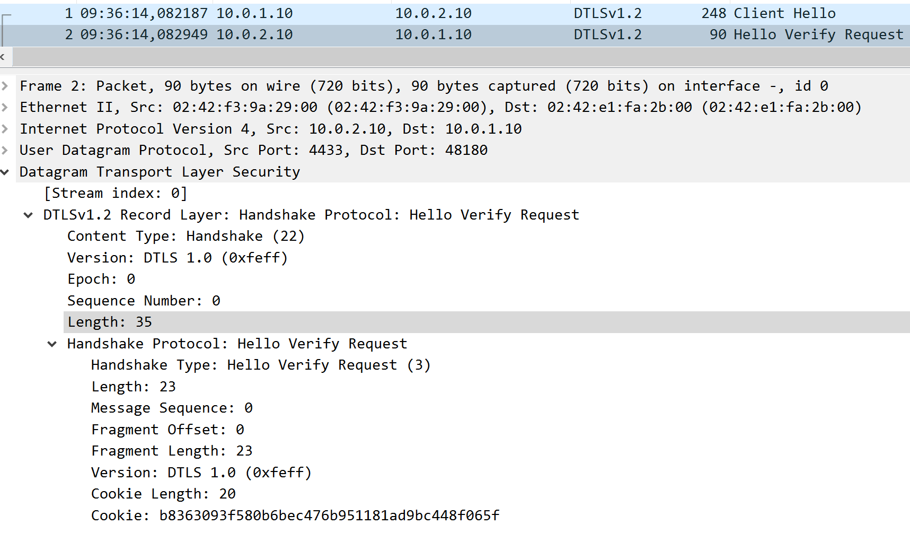
  <figcaption>Figure 2: DTLS Server sends a Cookie</figcaption>
</figure>

<figure markdown id="figure-3">
  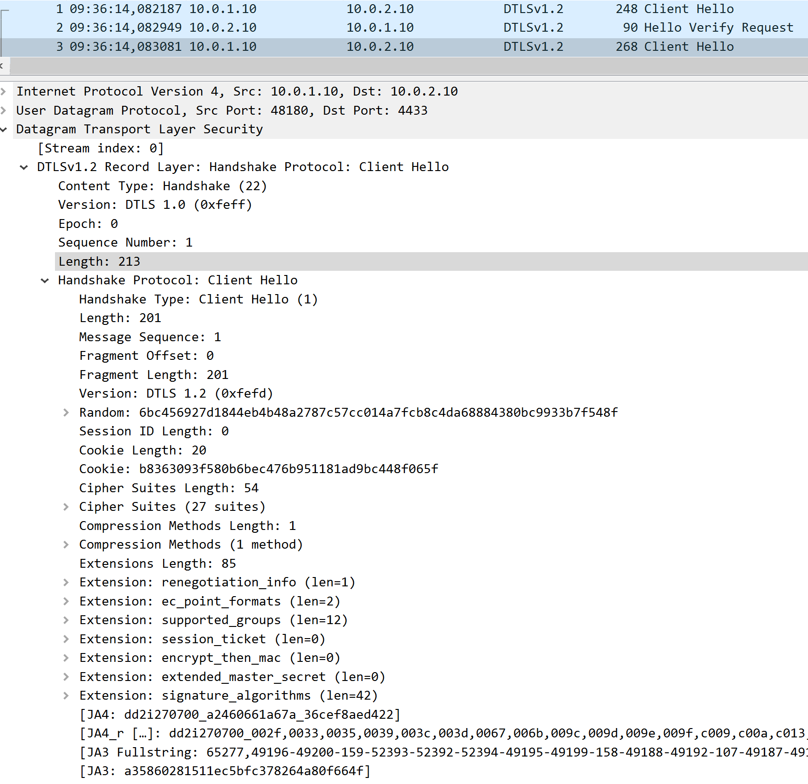
  <figcaption>Figure 3: DTLS Client sends request with Cookie</figcaption>
</figure>

We can now also identify what the Client sends in its Hello packet with Figure 3. We can see the similarities with TLS in the form of the session ID, the random, the sharing of cypher suites and other necessary negotiated extensions.

But we can also identify some differences in the form of sequence number and epoch, used to prevent duplication and reordering, message sequence and fragment offset and length, which are used by DTLS to handle the reordering and fragmentation added by UDP, and the cookie sent by the server, used to ensure real connections to the server.

Moving forward we can see the Server Hello, and notice another sign of the usage of UDP, which is the fragmentation of the Server Hello into multiple packets due to the datagram format of UDP.

<figure markdown id="figure-4">
  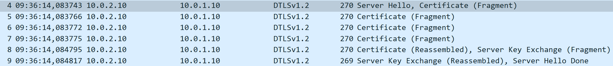
  <figcaption>Figure 4: DTLS fragmented Server Hello</figcaption>
</figure>

This is expected from the usage of UDP, and does not interfere with the handshake, thanks to the safeguards that DTLS has in place to give some reliability to UDP.

<figure markdown id="figure-5">
  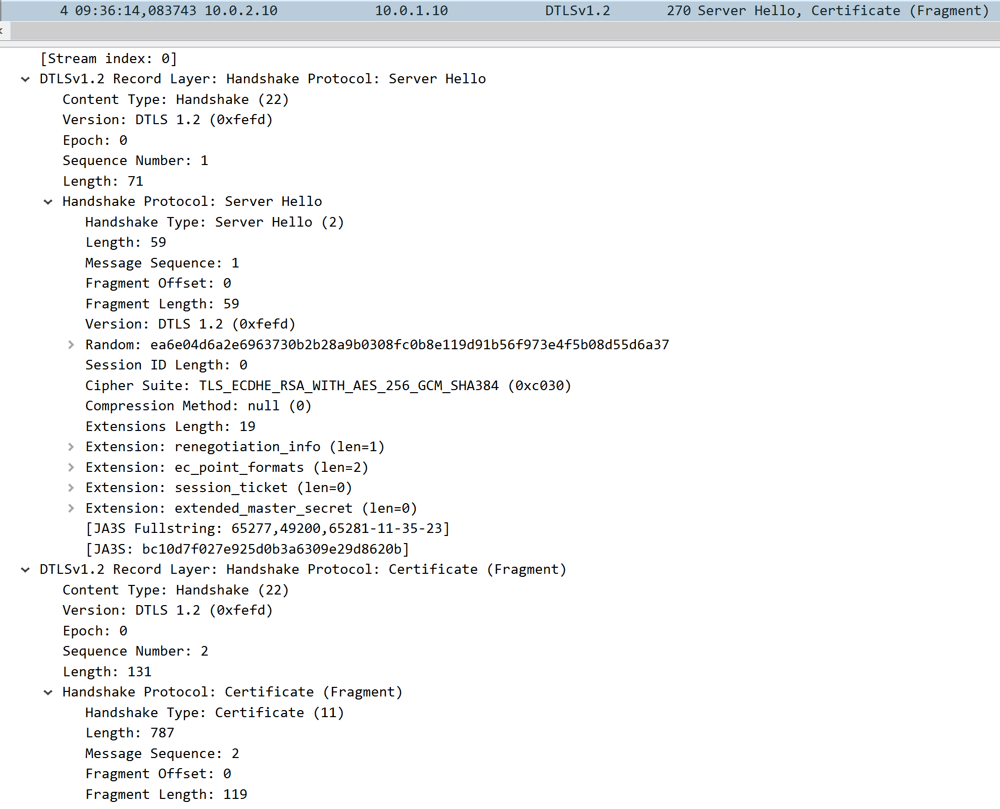
  <figcaption>Figure 5: DTLS Server Hello</figcaption>
</figure>

Looking at Figure 5, we can see that the structure from TLS 1.2 does not change by much, maintaing the same elements from the Client Hello, like session ID, random, choosing the cypher suite and sending the certificate, which is fragmented in this case.

It also includes the new DTLS additions, sequence number and epoch, message sequence and fragment offset and length, which are mainly used by the certificate.

<figure markdown id="figure-6">
  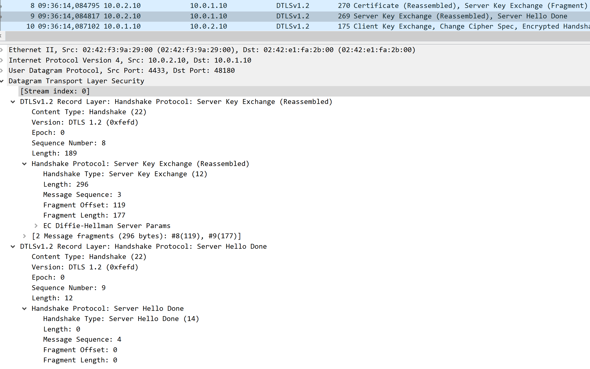
  <figcaption>Figure 6: DTLS Server Hello Key Exchange and End</figcaption>
</figure>

After reassembling the certificate, we can see that the server finishes its Hello, by sending its proposed Key Exchange method and its Done flag, which include all the reliability upgrades introduced by DTLS.

<figure markdown id="figure-7">
  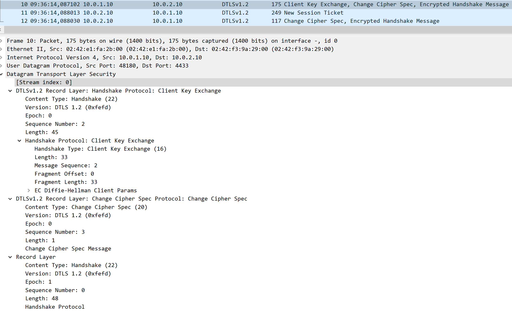
  <figcaption>Figure 7: DTLS Client Response</figcaption>
</figure>

Finally, through Figure 7, we can see that the client responds to the server, choosing the KEM, changing cypher spec and beggining encrypted communication, which alters its Epoch, from 0 to 1. The server responds by starting a session and beggining encrypted communication as well.

From this experiment, we were able to compare the handshakes between DTLS 1.2 and TLS 1.2, seeing that the main points remain similar, with the addition of some safeguards to ensure some reliability from the underlying UDP, so that a tunnel can be formed and used for secure communication without reliability issues.

## DTLS tolerance to loss, duplication and reordering

For this experience, we will be testing how DTLS handles the same traffic problems we tested TLS against. We will be analyzing DTLS´s response to the loss of packets, duplication of packets and reordering, expecting to see how its reliability safeguards help in keeping the protocol functional.

We will begin by testing its tolerance to the loss of packets. To do so, we will access the MitM machine, and use the following command to introduce loss:

```bash
tc qdisc add dev eth1 root netem loss 80%
```

This command provides a 80% chance that a packet is dropped while crossing MitM. This value is high to ensure loss during the handshake process, to truly see how it is handled. We will now restart the client and see how the handshake is processed with this kind of loss.

<figure markdown id="figure-8">
  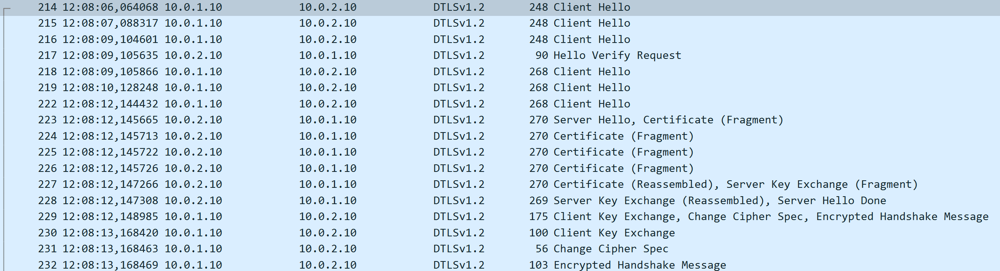
  <figcaption>Figure 8: DTLS Loss Response Part 1</figcaption>
</figure>

<figure markdown id="figure-9">
  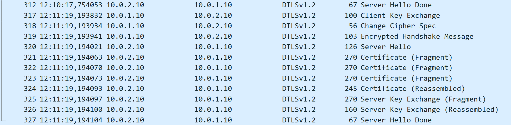
  <figcaption>Figure 9: DTLS Loss Response Part 2</figcaption>
</figure>

As we can see from Figures 8 and 9, the high loss rate lead to a high retransmission rate from DTLS, since when no response is detected in a certain timeframe, DTLS repeats its message hoping it will reach its destination. Even with this abnormally high loss, DTLS was capable of finishing its handshake and establish a session, with a lot more messages and time to do so.

Now, we will be testing its duplication safeguards, to see how this is handled. To do so, first clear the last rule with:

```bash
tc qdisc del dev eth1 root
```

Then apply the duplciation rule with:

```bash
tc qdisc add dev eth1 root netem \
    duplicate 50%
```

This will give a 50% chance to duplicate any packet crossing MitM. Restart the server and client and let´s see in a probe between MitM and DTLSServer what DTLS does.

<figure markdown id="figure-10">
  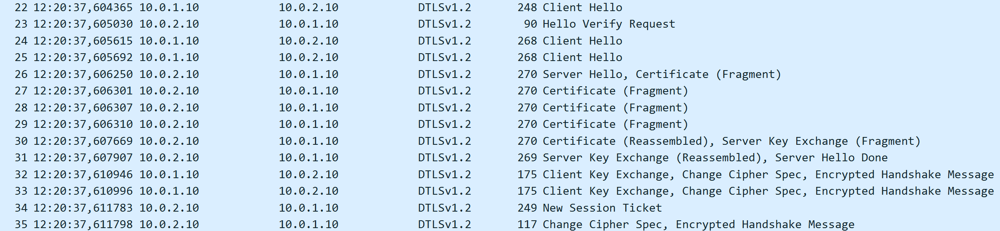
  <figcaption>Figure 10: DTLS Duplication Response</figcaption>
</figure>

As we can see from Figure 10, despite the duplication of some packets in the handshake, DTLS uses its epoch and sequence number together, to track duplicate packets, and simply ignores them and proceeds with the normal course of the handshake. We could even send repeated messages from client to server, and see that the number of messages is the same in both sides, even with duplicated packets, thanks to the added protections from DTLS.

For the final test of this section, we will be reordering the packets that arrive at the server, and see if it changes the handshake process.

Firstly, clear the previous command:

```bash
tc qdisc del dev eth1 root
```

Then, place the new reorder rule with:

```bash
tc qdisc add dev eth1 root netem \
    delay 100ms \
    reorder 50% 50%
```

Restart the connection, and search the captures for any anomalies. In this particular case, we could not detect any anomalies in WireShark, and the handshake occured without any delays or other problems, marking yet another potential issue that DTLS is capable of resolving, through the usage of sequence numbers, message sequence and fragment offset and length.

## DTLS Fragmentation Handling

For this experiment, we will be looking more closely at how DTLS handles fragmentation and how to alter its MTU to change how many fragments are sent.

From previous experiments, we could already see what DTLS has implemented to be able to handle the native fragmentation of datagram-based transport. Through the usage of message sequence numbers, DTLS can keep track from which part of a message a fragment belongs, and then through the fragment offset and length it knows if there are more fragments left, and what composes each fragment, in order to reassemble it when all parts arrive.

<figure markdown id="figure-11">
  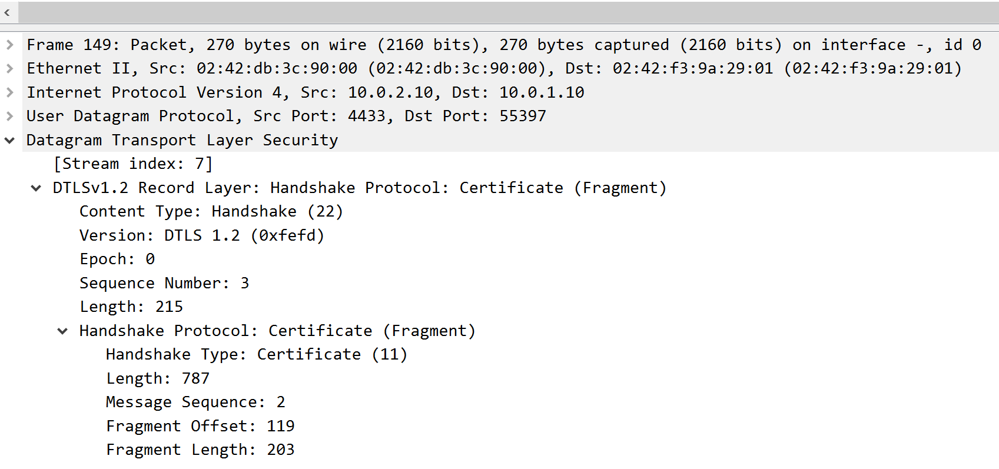
  <figcaption>Figure 11: DTLS Fragmentation</figcaption>
</figure>

To change the MTU, or Maximum Transmission Unit, we add the flag -mtu to the server and client command. With a higher MTU we can reduce the number of fragments sent and with a lower MTU we can increase the number of fragments and the messages that need to be fragmented.

An example of a higher MTU is the following:

```bash
openssl s_server \
    -dtls1_2 \
    -accept 4444 \
    -cert server.crt \
    -key server.key \
    -mtu 500 \
    -timeout \
    -msg
```

```bash
openssl s_client \
    -dtls1_2 \
    -connect 10.0.2.10:4444 \
    -mtu 500 \
    -timeout \
    -msg
```

If we look at WireShark with this MTU, we can see a reduction in the fragmented messages, and the amount of fragments for the ones still fragmented, like the certificate, as we can see in Figure 11

<figure markdown id="figure-12">
  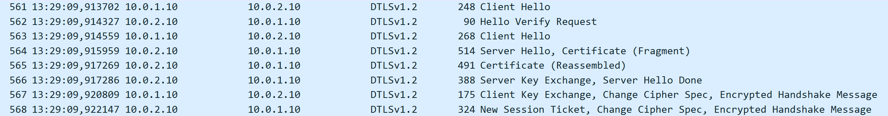
  <figcaption>Figure 12: DTLS Fragmentation reduced</figcaption>
</figure>

And when we use the lowest MTU possible, 256, we go back to more fragmented messages and fragments, seen in Figure 13.

<figure markdown id="figure-13">
  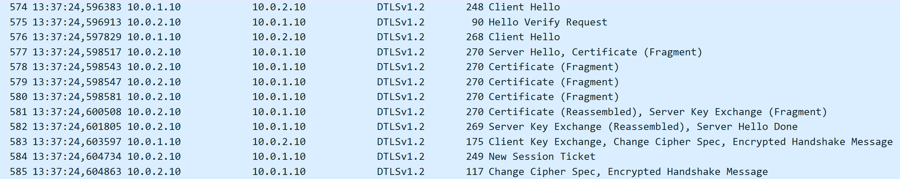
  <figcaption>Figure 13: DTLS Fragmentation increased</figcaption>
</figure>

From this experience we now have a better understanding how DTLS handles fragmentation and how we can influence it when creating its servers and clients.

## DTLS Replay Protection and Attack

For our final experiment, we will be testing the replay protection that DTLS offers. To do this, we will use a new MitM device, the one used in the IPsec labs, ghcr.io/groudonramsay/ipsec-replay:latest, which will replace the one we have been using.

We will be using this machine for its capture and replay capabilities, with tcpdump and tcpreplay. Firstly, configure the new machine with the necessary configurations for traffic to flow through:

```bash
ip addr add 10.0.1.1/24 dev eth0
ip link set eth0 up
ip addr add 10.0.2.1/24 dev eth1
ip link set eth1 up
sysctl -w net.ipv4.ip_forward=1
```

With this done, we will now begin capturing traffic with the MitM device, using the command:

```bash
tcpdump -ni eth0 -w /pcaps/replay-capture.pcap
```

This will capture traffic sent by the client. Now, restart the client and the server and then send some messages through the DTLS tunnel. After sending the handshake and some messages, stop the capture in MitM. We now have a .pcap file with a few packets within, this is what we will replay to test DTLS´s security capabilities.

To execute this attack, we will use the command:

```bash
tcpreplay -i eth1 /pcaps/replay-capture.pcap
```

<figure markdown id="figure-14">
  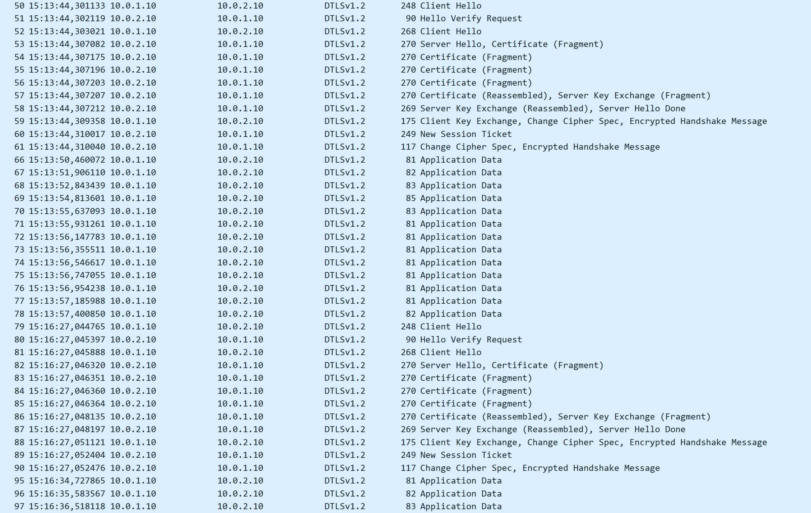
  <figcaption>Figure 14: DTLS Replay Attack</figcaption>
</figure>

You will be able to see between MitM and DTLSServer, in Figure 14, the messages appear in WireShark, with sequence numbers and epochs that are outdated, and as such, we will see no change in either device, since when they receive these messages, DTLS checks them, detects past sequence numbers and epochs and discards them for being replayed packets, as we can see in Figure 15, following exactly what we expected it to do.

<figure markdown id="figure-15">
  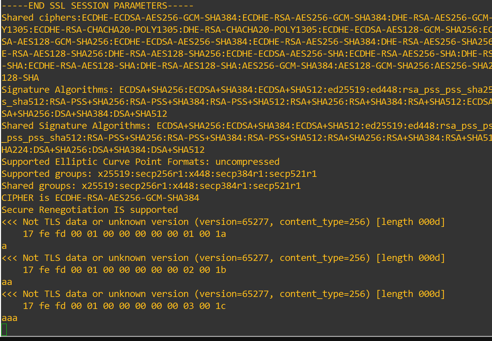
  <figcaption>Figure 15: DTLS Replay Attack unsuccessful</figcaption>
</figure>

With these experiments, we hope that your understanding of DTLS´s inner workings has improved. Not only have we studied how these tunnels form, use UDP, and compare to their TLS and TCP counterparts, but we have also tested them pratically through traffic control, fragmentation support and replay attacks.

We hope to see you in the next lab: SSH!
