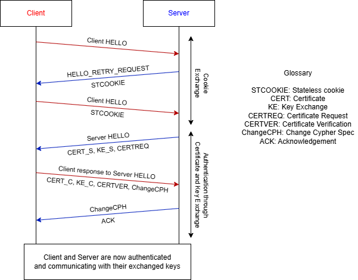
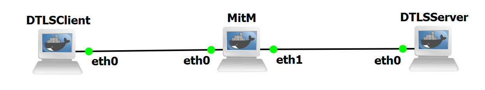

## DTLS LAboratory

Datagram Transport Layer Security (DTLS) is the datagram-based analogue of TLS, designed to provide authentication, confidentiality, and integrity over the unreliable transports of UDP.

Unlike TLS, which requires a reliable, ordered byte stream, DTLS preserves the essential properties of datagram communication, allowing applications to maintain low latency and tolerate packet loss without the overhead of TCP’s connection management.

As a result, DTLS is widely adopted in scenarios such as VoIP, WebRTC media channels, online gaming, IoT protocols, and real-time telemetry, where strict ordering or retransmission could degrade application performance.

## DTLS Handshake

DTLS 1.3, defined in RFC 9147, introduces major improvements that align the protocol closely with TLS 1.3 while addressing datagram-specific challenges.

Like TLS 1.3, DTLS 1.3 provides a simplified handshake, seen in Figure 1, which reduces round-trip time and handshake complexity, compared with previous versions, benefiting performance in high-latency and low-power environments.

<figure markdown id="figure-1">
  
  <figcaption>Figure 1: DTLS 1.3 Handshake</figcaption>
</figure>

## Laboratory Topology

The topology of this laboratory consists in:

- Three docker containers, using the container in ghcr.io-groudonramsay-tls, labeled as DTLSClient, DTLSServer and MitM.

The topology is visible in Figure 2:

<figure markdown id="figure-2">
  
  <figcaption>Figure 2: TLS Topology</figcaption>
</figure>

When adding the container to your templates, use 2 adapters and the following environment variables:

```bash
--cap-add NET_ADMIN
--cap-add NET_RAW
```

## Device Configuration
