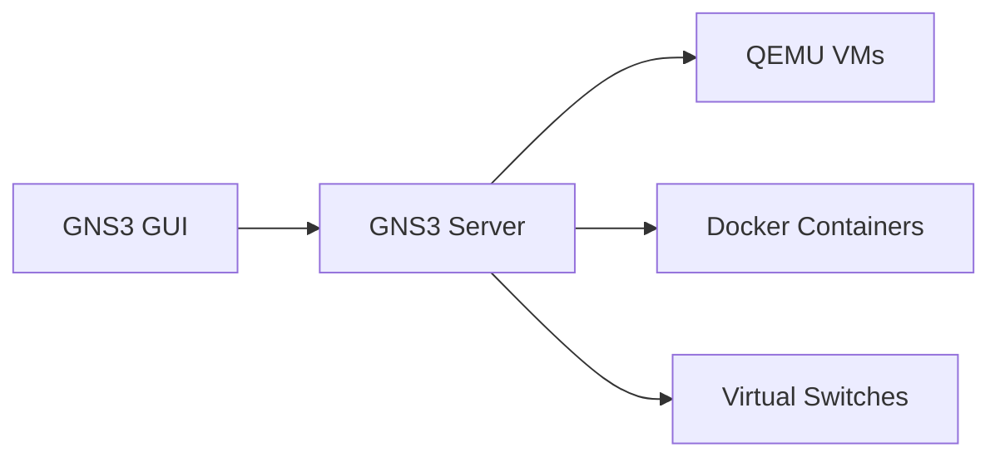
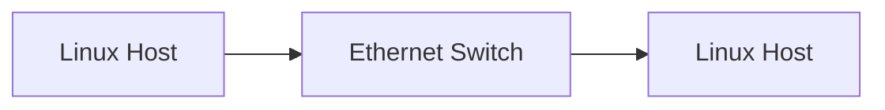

# GNS3

GNS3 is a network emulation platform used to build and test virtual networking environments.

It supports:

- Virtual routers
- Virtual switches
- Linux hosts
- Security appliances
- Packet captures
- Real-world networking operating systems

## Features

- Graphical topology editor
- Multi-vendor support
- QEMU virtualization
- Docker integration
- Wireshark captures

## Architecture



---

## Installation

## Download GNS3

Download from:

- https://www.gns3.com/software/download

---

## Install Components

During installation, enable:

- GNS3 GUI
- GNS3 Server
- Wireshark
- Npcap
- Dynamips

---

## Recommended Requirements

| Resource       | Recommendation  |
| -------------- | --------------- |
| CPU            | 4+ cores        |
| RAM            | 16 GB minimum   |
| Storage        | SSD preferred   |
| Virtualization | Enabled in BIOS |

---

## VMware or VirtualBox

GNS3 commonly uses:

=== "VMware Workstation"

    Best performance and stability.

=== "VirtualBox"

    Easier setup for small labs.

---

## GNS3 VM

The GNS3 VM improves performance and enables appliance execution.

Recommended for:

- Cisco images
- Juniper images
- Fortinet
- SR Linux
- Large topologies

---

## Importing Appliances

Navigate to:

```text
File → Import Appliance
```

Supported appliance types:

- QEMU VMs
- Docker containers
- Dynamips routers

---

## Basic Linux Lab

Example topology:



---

## Docker Support

Enable Docker integration:

```text
Edit → Preferences → Docker Containers
```

Example containers:

- Alpine Linux
- Ubuntu
- FRRouting
- Kali Linux

---

## Packet Captures

Right-click a link:

```text
Start Capture
```

Wireshark opens automatically.

---

## Cloud Connectivity

Use the Cloud node to connect labs to:

- Physical NICs
- VPNs
- Linux bridges
- External networks

---

## Example Use Cases

=== "Routing"

    OSPF, BGP, MPLS laboratories.

=== "Security"

    IPsec, MACsec, WireGuard validation.

=== "Linux Networking"

    Bridges, namespaces, VLANs.

=== "Packet Analysis"

    Wireshark protocol inspection.

---

## Common Troubleshooting

## QEMU Does Not Start

Verify virtualization support:

```text
Intel VT-x or AMD-V enabled
```

---

## Permission Problems

Run GNS3 as Administrator on Windows.

---

## High CPU Usage

Reduce idle-PC values for Dynamips devices.

---

## Broken Links

Restart the GNS3 server:

```text
Edit → Preferences → Server → Restart
```

---

## Wireshark Not Launching

Verify installation path:

```text
Edit → Preferences → Packet Capture
```

---

## Recommended Workflow

1. Build topology
2. Configure addressing
3. Verify connectivity
4. Enable encryption/tunnelling
5. Capture traffic
6. Validate routing
7. Troubleshoot failures

---

## Useful Integrations

| Tool       | Purpose                |
| ---------- | ---------------------- |
| Wireshark  | Packet analysis        |
| Docker     | Lightweight containers |
| QEMU       | VM execution           |
| VMware     | Virtualization backend |
| VirtualBox | Alternative hypervisor |

---

!!! note

    GNS3 is ideal for visually designing and debugging complex networking environments.

!!! warning

    Large topologies can consume substantial CPU and RAM resources.
