## Laboratory Experiments

With the laboratory setup complete, we shall now perform our experiences, in order to better understand and use IPsec. We will see IKEv1 and IKEv2 in action, see the operating differences of AH and ESP, and understand how certificates and signatures can be used in the authentication process of Tunnelling protocols.

## Verify IKEv1 Handshake, KeepAlive and Regular Operation

For our first experiment, we will observe the handshake performed by IKEv1, which we saw theoretically in Figure 1 of the Overview page, comparing our diagram with the one we will observe in the simulation.

To perform this observation, we need to see the handshake occuring. To this end, we will first set up a WireShark probe between R1 and RA. Afterwards, we will access R1, and use the command:

```bash
clear crypto session
```

This will clear the current tunnel they have formed, and trigger IKE into performing its handshake to form a new tunnel.

The handshake packets in WireShark should look like this:

<figure markdown id="figure-1">
  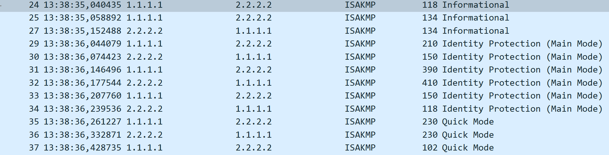
  <figcaption>Figure 1: IKEv1 Handshake Packets</figcaption>
</figure>

As we can see, the theory matches reality. After the Informational packets trying to start a tunnel, IKEv1 enters into Main Mode, needing 6 messages, 2 to negotiate their Policy, 2 to exchange keys and 2 to authenticate both peers, followed by 3 messages, in Quick Mode, to create the tunnel and acknowledge its creation.

Let´s look more closely at each set of messages.

The first two Main Mode packets refer to the negotiation of policy for IPsec. As such the packets must include the elements we configured in our policy, such as AES with 256 bits for encryption, SHA for hash, group 5 for Diffie-Hellman, pre-shared key as the authentication method and 86400 seconds for lifetime.

Let´s look at the payload of the first message to see if it matches our expectations.

<figure markdown id="figure-2">
  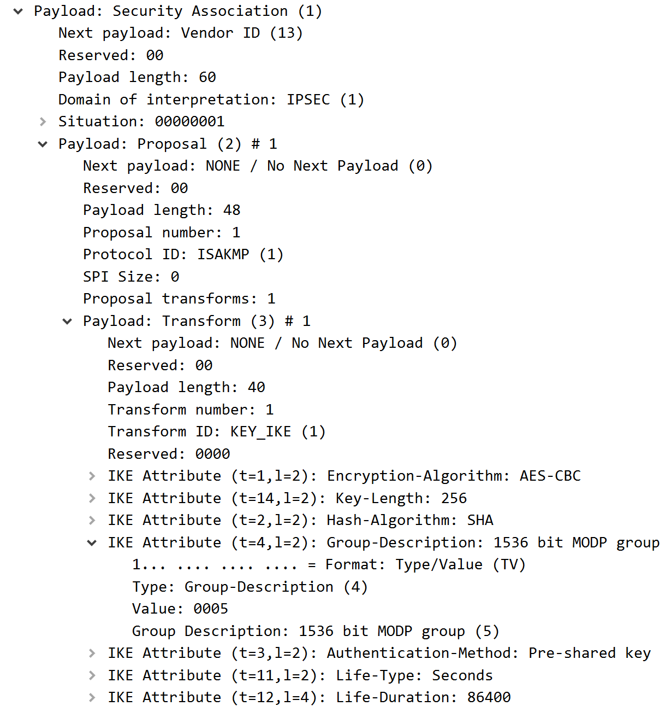
  <figcaption>Figure 2: IKEv1 Policy Negotiation</figcaption>
</figure>

As we can see in Figure 2, the policy negotiation packets follow the policy we configured to the letter, including all expected elements in the proposed transform set and policy.

Moving forward, let´s look at the second set, which handles the Key Exchange. In these packets, we expect to find a Nonce, the key being exchanged and then some information regarding Vendor IDs.

<figure markdown id="figure-3">
  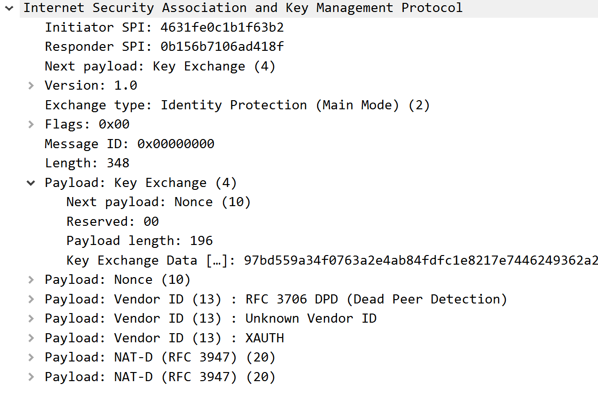
  <figcaption>Figure 3: IKEv1 Key Exchange</figcaption>
</figure>

As we can see from Figure 3, the Key Exchange packets also match what we expected, possessing the Nonce, the Vendor ID and most importantly, the Key Exchange payload, with the key data within.

From this point, all messages in the exchange become encrypted, as we have seen in the diagram, which makes it impossible to further analyse the remaining packets. But from our configuration, we know that for the final Main Mode set, the peers will exchange their Pre-Shared key, authenticating themselves, moving forward to Quick Mode to create the tunnel.

We know this has happened, because the handshake continued and the packets to form the tunnel and acknowledge it were sent, proving the authentication was a success.

IPsec also includes a KeepAlive, in order to maintain the SA and the tunnel running. However, it is usually disabled by default, and we have not enabled it, since we have a long duration tunnel for test purposes only.

Finally, for the regular operation, we can repeat the ping we performed to test the setup, and quickly see that our packets are encrypted by IPsec, only being able to see the IPv4 header before reaching the ESP protected section, as seen in Figure 4.

<figure markdown id="figure-4">
  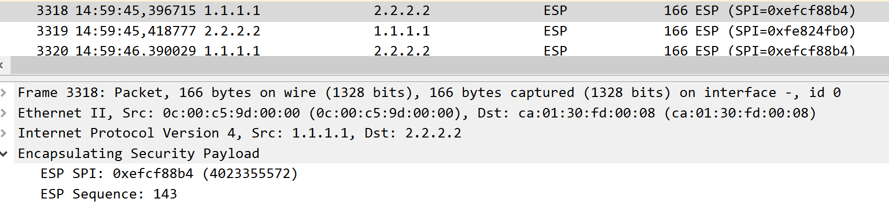
  <figcaption>Figure 4: IKEv1 Regular Operation</figcaption>
</figure>

## AH vs ESP in practice

For this experiment, we will switch our IPsec to use AH instead of ESP, to see the practical differences between the two.

For this to happen, run the following commands on the routers in configuration mode:

```bash
int Tunnel0
no tunnel protection ipsec profile myIPSecProfile
no crypto ipsec profile myIPSecProfile
no crypto ipsec transform-set myTSet
crypto ipsec transform-set myTSet ah-sha-hmac
crypto ipsec profile myIPSecProfile
set transform-set myTSet
int Tunnel0
tunnel protection ipsec profile myIPSecProfile
exit
exit
```

When this is done in both sides, the tunnel will reform with our new Transform Set, which dictates to only perform authentication of the packets.

First of all, let´s look into the handshake process, and see if there is any change:

<figure markdown id="figure-5">
  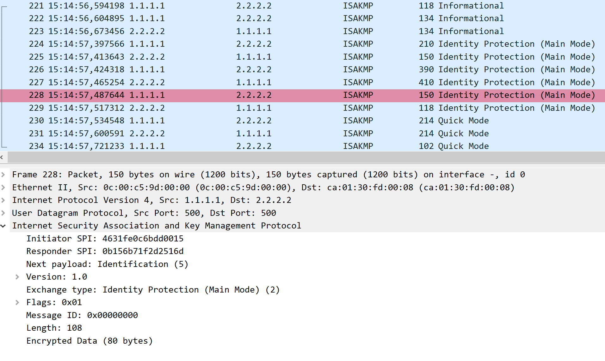
  <figcaption>Figure 5: IKEv1 AH Handshake</figcaption>
</figure>

As we can see, not only is the handshake order unaffected, but the encrypted sections remain encrypted. This is what we expected, since IKE operates with its own rules, and only sets the policy for IPsec. As such, the changes to encryption only occur to traffic within the newly formed IPsec tunnel.

However, the regular traffic within the tunnel is bound to have suffered some changes. Let´s perform a ping again and see what is different:

<figure markdown id="figure-6">
  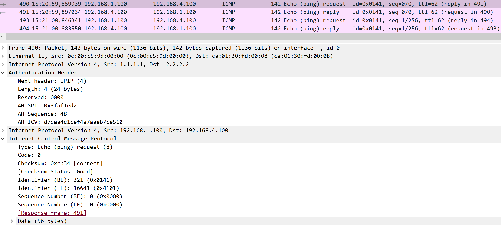
  <figcaption>Figure 6: IKEv1 AH Regular Operation</figcaption>
</figure>

As we can see in Figure 6, the traffic is now passing in the clear. We can now see it is ICMP, and the real source and destination of the packets. We can also see the Authentication Header, which includes an ICV to guarantee the integrity of this message.

In conclusion, we can see that the difference between AH and ESP only exists in the actual operation of the protocol. Whilst IKE is unaffected, the regular operation of IPsec changes, with packets now crossing in the clear, with only their integrity and authenticity assured, unlike ESP, which secures the packets integrity, authenticity and confidentiality.

## IKEv2 configuration and comparison with IKEv1

We will now analyse IKEv2, comparing it to its predecessor, IKEv1, seeing the changes in the handshake and in available modes, cryptographic algorithms and other factors.

To clear the routers for the new configuration, use the following commands:

```bash
write erase
reload
```

By accepting both commands and choosing not to save the configuration when reloading, the router will be factory reset.

When this is done, we will begin setting up the new configuration.

Starting with R1, the configuration is the following:

```bash
hostname R1

interface g0/0
 ip address 200.1.1.1 255.255.255.0
 ip ospf 1 area 0
 no shutdown

interface g0/1
 ip address 192.168.2.1 255.255.255.0
 ip ospf 2 area 0
 no shutdown

interface l0
 ip address 1.1.1.1 255.255.255.255
 ip ospf 1 area 0

crypto ikev2 proposal myProposal
 encryption aes-cbc-256
 integrity sha512
 prf sha512
 group 16

crypto ikev2 policy myIKEv2Policy
 proposal myProposal

crypto ikev2 keyring myKeyring
 peer R2
  address 2.2.2.2
  pre-shared-key ipsec

crypto ikev2 profile myIKEv2Profile
 match identity remote address 2.2.2.2 255.255.255.255
 authentication local pre-share
 authentication remote pre-share
 keyring local myKeyring

crypto ipsec transform-set myTSet esp-aes esp-sha-hmac

crypto ipsec profile myIPSecProfile
 set transform-set myTSet
 set ikev2-profile myIKEv2Profile

interface Tunnel0
 ip unnumbered g0/1
 tunnel source l0
 tunnel destination 2.2.2.2
 tunnel mode ipsec ipv4
 tunnel protection ipsec profile myIPSecProfile
 ip ospf 2 area 0

router ospf 1
 router-id 1.1.1.1

router ospf 2
 router-id 11.11.11.11
```

We can see some changes in the configurations used for IKEv2. Namely, stronger encryption and hash algorithms, a Pseudo Random function for added security, larger Diffie-Hellman groups, a Keyring with the peer address and key, and an IKEv2 profile that goes within the IPsec profile.

Now for R2:

```bash
hostname R2

interface g0/0
 ip address 200.2.2.2 255.255.255.0
 ip ospf 1 area 0
 no shutdown

interface g0/1
 ip address 192.168.3.2 255.255.255.0
 ip ospf 2 area 0
 no shutdown

interface l0
 ip address 2.2.2.2 255.255.255.255
 ip ospf 1 area 0

crypto ikev2 proposal myProposal
 encryption aes-cbc-256
 integrity sha512
 prf sha512
 group 16

crypto ikev2 policy myIKEv2Policy
 proposal myProposal

crypto ikev2 keyring myKeyring
 peer R1
  address 1.1.1.1
  pre-shared-key ipsec

crypto ikev2 profile myIKEv2Profile
 match identity remote address 1.1.1.1 255.255.255.255
 authentication local pre-share
 authentication remote pre-share
 keyring local myKeyring

crypto ipsec transform-set myTSet esp-aes esp-sha-hmac

crypto ipsec profile myIPSecProfile
 set transform-set myTSet
 set ikev2-profile myIKEv2Profile

interface Tunnel0
 ip unnumbered g0/1
 tunnel source l0
 tunnel destination 1.1.1.1
 tunnel mode ipsec ipv4
 tunnel protection ipsec profile myIPSecProfile
 ip ospf 2 area 0

router ospf 1
 router-id 2.2.2.2

router ospf 2
 router-id 22.22.22.22
```

After configuring, it might be needed to save the configuration and reload the routers again for it to take full effect.

A simple ping afterwards will confirm that everything is running as expected.

With the configurations successfully altered, let´s proceed to the experiment part and see what the IKEv2 handshake consists of.

To do this, reactivate the WireShark probe between R1 and RA, and run the command:

```bash
clear crypto session
```

We will be able to see the following handshake:

<figure markdown id="figure-7">
  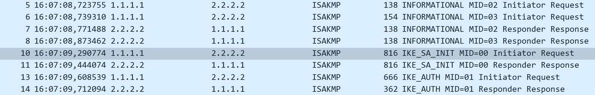
  <figcaption>Figure 7: IKEv2 Handshake</figcaption>
</figure>

As we can see in Figure 7, the handshake matches what we had seen before in the diagram, starting with two IKE_SA_INIT messages, that handle both policy negotiation and key exchange, followed by two IKE_AUTH messages, already encrypted and responsible for authenticating the two peers.

One of the major differences between both IKEs, is the number of handshake messages. IKEv2 can do in 4 messages what IKEv1 needs 6 to do, improving overall performance.

Another important difference lies in IKEv1 several operating modes for several scenarios, while IKEv2 only has IKE_SA_INIT and IKE_AUTH, simplifying the handshake process and reducing the room for misconfigurations and attacks.

Another important detail, is the fact that IKEv2 has a reduced and updated algorithm list, meaning that the algorithms used for encryption and integrity are stronger, more secure, leaving behind outdated algorithms that could invite easy attacks.

We can see some of these updated algorithms in Figures 8 and 9:

<figure markdown id="figure-8">
  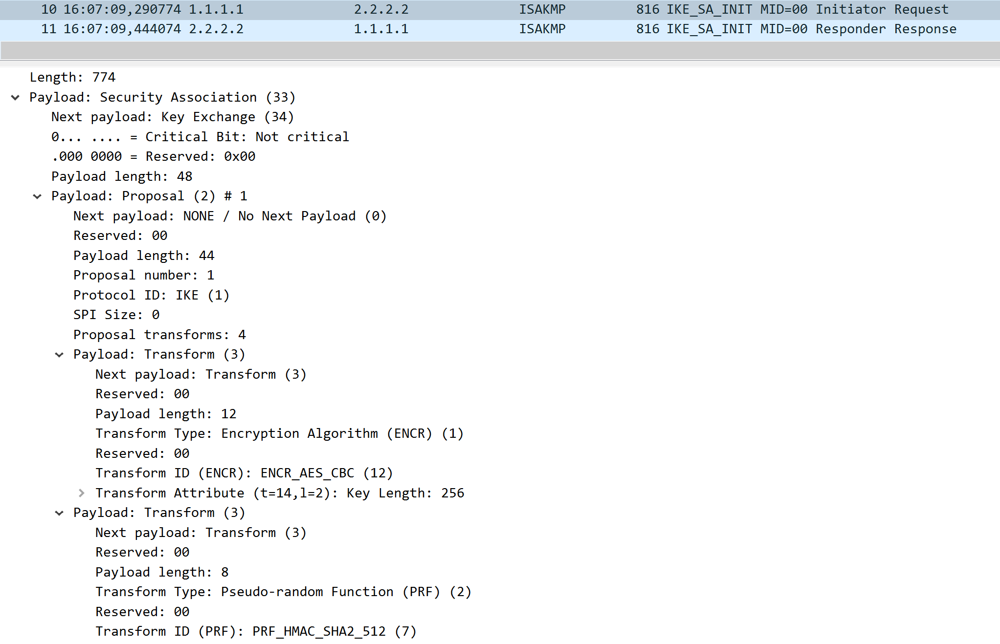
  <figcaption>Figure 8: IKEv2 Handshake First Part</figcaption>
</figure>

In Figure 8, we can see that there are some changes from IKEv1, namely, a stronger encryption algorithm, in the form of AES_CBC with 256 bits and a Pseudo-random function, in the form of SHA with 512 bits, used for stronger key generation.

<figure markdown id="figure-9">
  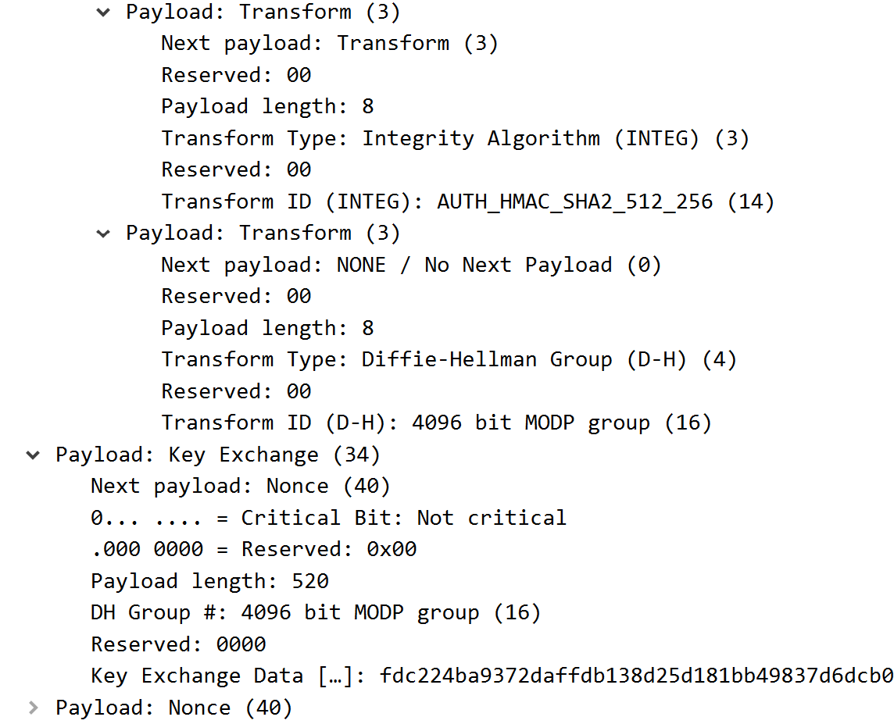
  <figcaption>Figure 9: IKEv2 Handshake Second Part</figcaption>
</figure>

Following those, we can see in Figure 9, the hash algorithm, SHA with 512 bits again, group 16 for Diffie-Hellman offering extra key security, and finally the Key Exchange payload aswell.

As we could see from our experiment, IKEv2 is the evolution of IKEv1 in every aspect. It is more efficient in messages transmited and in their usage, with less operating modes, with a more robust and shorter list of cryptographic algorithms, and overall more secure both in generating session keys and in exchanging them.

## IKEv2 with Digital Signatures and Certificates as Authentication

For our next experiment, we will be analysing how a tunnelling protocol interacts with PKI-based authentication. Namely, we will see how IPsec, especially IKEv2, interact with authentication through certificates and not PSK.

For this experiment, we will have to change some configurations in our IPsec routers, and in RA.

Firstly, we need to add some configuration to RA, which will be acting as the Certificate Authority, which will provide the Certificates R1 and R2 will use to authenticate themselves during the IKEv2 handshake.

The configuration is the following:

```bash
ntp master

ip http server

crypto pki server myCA
 issuer-name cn=ipsecCA
 lifetime certificate 365
 grant auto
 no shutdown
```

When asked for a password, input a password with at least 8 characters that you can easily remember.

With this configuration we add a clock to the router with ntp, necessary for certificate signing. We also set a PKI in this router, named myCA, self-issued by ipsecCA and it automatically grants all certificates that are requested. This behaviour is not recommended for real world implementations, but it is a useful simplification for our experiment.

Then, we need to modify R1 and R2 to, use the ntp clock in RA, and to start using certificates as their authentication method.

To do this, reset the routers as before, with:

```bash
wr erase
reload
```

Then, enter configuration mode and use the following configuration:

```bash
hostname R1

interface g0/0
 ip address 200.1.1.1 255.255.255.0
 ip ospf 1 area 0
 no shutdown

interface g0/1
 ip address 192.168.2.1 255.255.255.0
 ip ospf 2 area 0
 no shutdown

interface l0
 ip address 1.1.1.1 255.255.255.255
 ip ospf 1 area 0

ntp server 200.1.1.10

crypto pki trustpoint myTrustpoint
 enrollment url http://200.1.1.10:80
 revocation-check none

crypto ikev2 proposal myProposal
 encryption aes-cbc-256
 integrity sha512
 prf sha512
 group 16

crypto ikev2 policy myPolicy
 proposal myProposal

crypto ikev2 profile myProfile

 match identity remote any

 authentication local rsa-sig
 authentication remote rsa-sig

 pki trustpoint myTrustpoint

crypto ipsec transform-set myTSet esp-aes esp-sha-hmac

crypto ipsec profile myIPSecProfile
 set transform-set myTSet
 set ikev2-profile myProfile

interface Tunnel0
 ip unnumbered g0/1

 tunnel source l0
 tunnel destination 2.2.2.2

 tunnel mode ipsec ipv4

 tunnel protection ipsec profile myIPSecProfile

 ip ospf 2 area 0

router ospf 1
 router-id 1.1.1.1

router ospf 2
 router-id 11.11.11.11
```

This configuration follows mostly what was done before for IKEv2, with some important changes.

Firstly, we are now using ntp to sync a clock with the Certificate Authority, in order for our certificates to function properly. Afterwards, we now create a PKI trustpoint, with the address of RA, which we assign to our IKEv2 profile, along with a change to the authentication method, to use RSA signatures.

With these changes, R1 is ready to enroll for a certificate with RA, and then use it for authentication when forming a tunnel with R2.

The configuration for R2 is the following:

```bash
hostname R2

interface g0/0
 ip address 200.2.2.2 255.255.255.0
 ip ospf 1 area 0
 no shutdown

interface g0/1
 ip address 192.168.3.2 255.255.255.0
 ip ospf 2 area 0
 no shutdown

interface l0
 ip address 2.2.2.2 255.255.255.255
 ip ospf 1 area 0

ntp server 200.1.1.10

crypto pki trustpoint myTrustpoint
 enrollment url http://200.1.1.10:80
 revocation-check none

crypto ikev2 proposal myProposal
 encryption aes-cbc-256
 integrity sha512
 prf sha512
 group 16

crypto ikev2 policy myPolicy
 proposal myProposal

crypto ikev2 profile myProfile

 match identity remote any

 authentication local rsa-sig
 authentication remote rsa-sig

 pki trustpoint myTrustpoint

crypto ipsec transform-set myTSet esp-aes esp-sha-hmac

crypto ipsec profile myIPSecProfile
 set transform-set myTSet
 set ikev2-profile myProfile

interface Tunnel0

 ip unnumbered g0/1

 tunnel source l0
 tunnel destination 1.1.1.1

 tunnel mode ipsec ipv4

 tunnel protection ipsec profile myIPSecProfile

 ip ospf 2 area 0

router ospf 1
 router-id 2.2.2.2

router ospf 2
 router-id 22.22.22.22
```

When both configurations are set and saved into the startup configuration, reload both routers for the changes to take effect.

With this done, the final step of the setup is to ask the Certificate Authority for a certificate. To do this use the following commands on R1 and R2, in configuration mode:

```bash
crypto pki authenticate myTrustpoint
crypto pki enroll myTrustpoint
```

Answer the questions to receive CA´s certificate first, and then to enroll and receive your own certificate.

When this is done in both routers, IKE should start, the tunnel should form and a ping should be possible to do, protected by the tunnel.

After confirming that the ping is indeed protected, we can reset the crypto session in order to see IKEv2 occuring. Although the IKE_AUTH step will still be protected, and we won´t be able to see the certificates being used there, we can still see that certificates are being used in IKE_SA_INIT, in the response:

<figure markdown id="figure-10">
  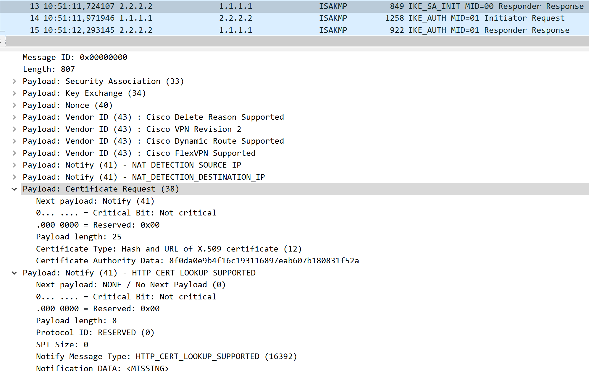
  <figcaption>Figure 10: IKEv2 Certificate Request</figcaption>
</figure>

We can see in Figure 10, that in the IKE_SA_INIT response, R2 requests that in the following message, IKE_AUTH Initiator Request, a certificate is sent for authentication, which R1 will send, and then ask for R2´s certificate, sucessfully authenticating each other and forming the tunnel.

To finish this experiment, we can see the information that each certificate contains, by using:

```bash
show crypto pki certificate
```

This command will display both certificates stored in R1, its own and the trustpoint certificate.

!!! question "What are the informations stored in each certificate? Are they important for identification and authentication purposes?"

## Replay Protection and Attack

Our final experiment will focus on testing the capability of IPsec to withstand replay attacks. One of IPsec´s features is its replay protection, using sequence numbers to detect messages out of order, discarding them, in order to keep the users safe.

For our experiment, we will place a new device between R1 and RA, which we will use to capture traffic crossing the tunnel, and then replay it to R1, hoping to see the packets get dropped by IPsec.

To begin, we will delete the connection between R1 and RA, and we will create a new Docker container with two adapaters. The name of the image is:

```bash
ghcr.io/groudonramsay/ipsec-replay:latest
```

And the envirnoment variables used are:

```bash
--cap-add=NET_RAW
--cap-add=NET_ADMIN
```

This device contains tcpdump and tcpreplay, used to capture packets and replay them, and the necessary tools to turn this device into an L2 Switch, making it transparent to traffic, allowing us to place it between the routers without interfering with their operation.

To setup this device, we first need to turn it into a bridge, using the commands:

```bash
ip link set eth0 up
ip link set eth1 up

ip link add name br0 type bridge

ip link set eth0 master br0
ip link set eth1 master br0

ip link set br0 up
```

With this done, the device is ready to listen and replay, without interfering with traffic.

For the experiment itself, we will set two WireShark probes, one between the device and R1, and one between R1 and R3, to see if the replayed traffic crosses through.

With this done, begin capturing ESP packets with the command:

```bash
tcpdump -ni eth0 esp -w /pcaps/replay-capture.pcap
```

This will capture ESP packets coming from R1 and saves them in the replay-capture.pcap file.

We can inspect the contents with:

```bash
tcpdump -nn -r /pcaps/replay-capture.pcap
```

Which allows us to see the captured ESP packets.

To generate more packets for capture, run simultaneously a ping from PC1 to PC2.

When you have enough packets, stop the capture and begin the attack against R1 with the command:

```bash
tcpreplay -i eth0 /pcaps/replay-capture.pcap
```

During the attack, you will see several packets appear in WireShark between the device and R1, with a warning for out of order sequence numbers, as we expected and can confirm in Figure 11:

<figure markdown id="figure-11">
  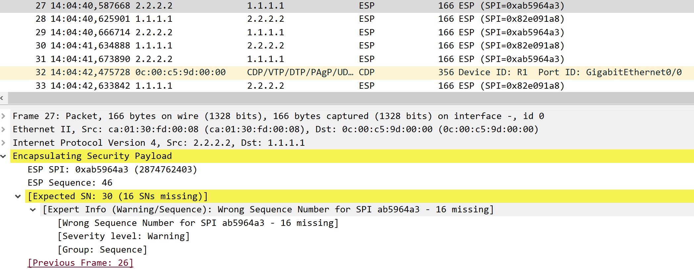
  <figcaption>Figure 11: Out of Order ESP packets</figcaption>
</figure>

And we will see in the second probe, that no packets are appearing, which means that R1 is correctly applying the rules that IPsec is setting for replay protection.

We can also confirm this in the router by running the command:

```bash
show crypto ipsec sa detail
```

Which will show all the information regarding that IPsec SA, including rejected packets, where we should see some, similar to Figure 12:

<figure markdown id="figure-12">
  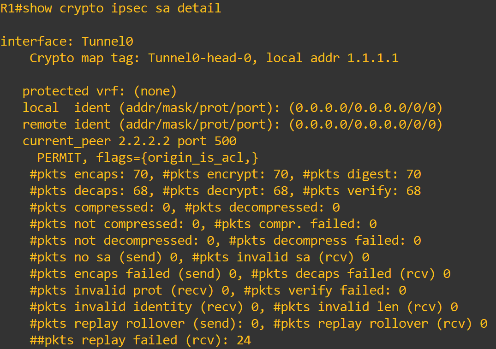
  <figcaption>Figure 12: Rejected packets by IPsec</figcaption>
</figure>

As we can see in the last line, 24 packets were rejected for being part of our replay attack, confirming that our attack happened, and that it was sucessfully defended by IPsec.

With this, we conclude our series of experiments. We hope that through these experiments, you have learned more about how IPsec works, how tunnelling protocols perform their handshake, in this case through IKEv1 and IKEv2, how there are several methods to authenticate two devices on the internet and how IPsec itself protects the packets that cross its tunnels, be it through AH ensuring their integrity and authenticity, or ESP which builds upon AH and ensures their confidentiality aswell.

Thank you for finishing our laboratory, and we hope to see you in TLS!
