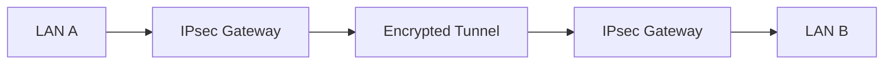

# IPsec

IPsec (Internet Protocol Security) is a Layer 3 security framework providing encryption, integrity, and authentication for IP traffic.

---

## Components

| Component | Purpose              |
| --------- | -------------------- |
| AH        | Authentication       |
| ESP       | Encryption           |
| IKE       | Key exchange         |
| SA        | Security Association |

---

## Modes

=== "Transport Mode"

    Encrypts the payload only.

=== "Tunnel Mode"

    Encrypts the full IP packet.

---

## Common Use Cases

- Site-to-site VPNs
- Enterprise WAN security
- Secure datacenter interconnects
- Remote-access VPNs

---

## IPsec Architecture



---

## Topics Covered

- IKEv2
- ESP and AH
- Tunnel vs transport mode
- strongSwan
- Linux IPsec
- Routing integration
- Troubleshooting

---

## Example strongSwan Service

```bash
sudo systemctl restart strongswan
sudo ip xfrm state
```

!!! note

    ESP is significantly more common than AH in modern deployments.
