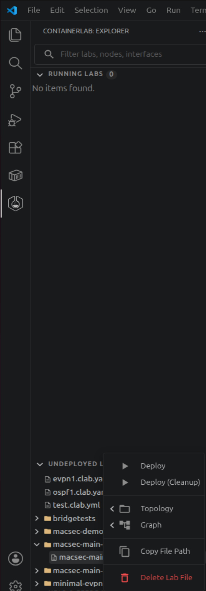
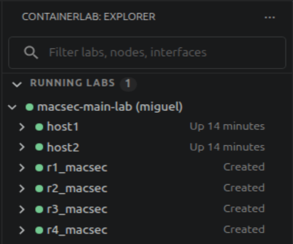
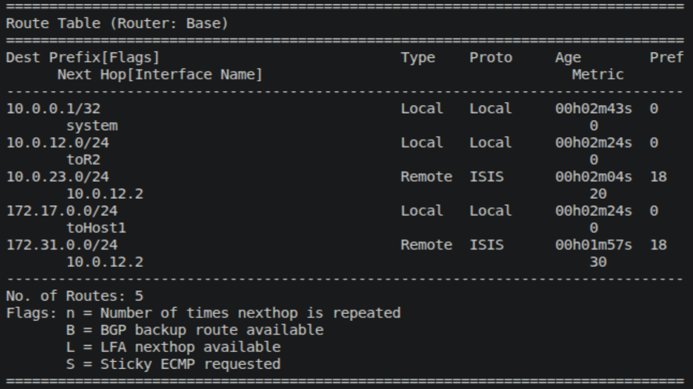
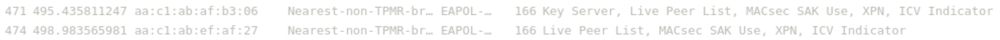
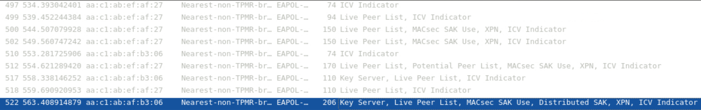
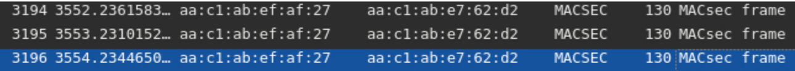
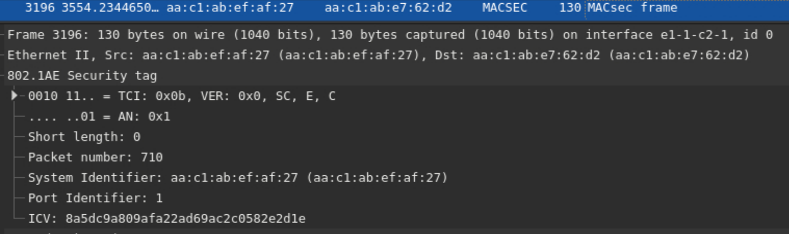

## Laboratory Experiments

Now that we have completed the laboratory setup, including its routers, hosts and linux bridges, we can begin with the experimental section, seeing MKA and MACsec in action, testing their features and learning about their inner workings.

## Deploy your laboratory

Let´s begin with deploying our laboratory. Go to the ContainerLab page in VSCode, open the folder with your laboratory and select Deploy.

<figure markdown id="figure-4">
  {width="200"}
  <figcaption>Figure 4: Deploy Function</figcaption>
</figure>

When the deployment is finished you should have your laboratory and its devices appear in the deployed section.

<figure markdown id="figure-5">
  {width="200"}
  <figcaption>Figure 5: Deployed Lab</figcaption>
</figure>

## Verify MKA, MACsec and IS-IS

Now that everything is running, access all four routers, and ensure that MKA has live peers, that MACsec has the CAs formed and that the routing table displays the subnets learnt from IS-IS.

To check the first two, you can run the following commands:

```srl
show macsec connectivity-association
show macsec mka-session
```

The first command will show the CAs present at that router, and the second will display all the peers that are running MKA with the selected router.

??? question "How many CAs does R1 have? What about the other routers? Is there a difference between them?"

    !!! solution "R1 has one CA, MACSEC_12, since it is the only association it participates in. R3 also participates in only one CA, MACSEC_23. The other two routers, R2 and R4, differ from the previous two, since they participate in two associations at the same time, showing in their tables both MACSEC_12 and MACSEC_23."

After this check being positive, we will check the routing table to ensure we are capable of communicating between the two hosts. To do that we use the command:

```srl
show router route-table
```

The result for this command should be a table similar in entries to the one presented below:

<figure markdown id="figure-6">
  
  <figcaption>Figure 6: Route Table</figcaption>
</figure>

With all these elements in place and confirmed, we will now perform the final test to ensure the lab is ready for our experiments.

Now we will ping from host 1 to host 2. To do that, simply access host 1 through its shell and ping host 2 with the command:

```bash
ping 172.31.0.1
```

You should see a positive response and your ping being answered by host 2.

## MKA and MACsec packet analysis

For this section, we will start going more in-depth regarding MKA and MACsec, triggering MKA to start again in order to see its handshake and the packets that are involved.

To achieve that, we will reboot both R2 and R4, and place Wireshark probes on both of their interfaces, in order to see the MKA packets traversing our laboratory.

To place the probes, use the available Capture function from VSCode, and place on both interfaces of both routers.

To reboot the routers, you can use the following commands:

```srl
configure global
admin reboot now
```

This command should restart both routers, dropping your connection shortly after, you can reconnect into the router and see that the Live Peer list is now empty or still forming. This is where MKA comes in, rebuilding the CAs, reelecting a Key Server and redistributing the SAKs to initiate MACsec again.

By sorting your Wireshark for EAPOL, you will be able to see only MKA packets. With this filter, it will be easy to identify a pattern of MKA normal operation with the connection already formed and functioning. But when the reboot is performed, we will be able to detect a major change in this pattern, which will allow us to detect and study the packets sent during the handshake.

MKA normal operation should look like this:

<figure markdown id="figure-7">
  
  <figcaption>Figure 7: MKA Normal Operation</figcaption>
</figure>

In Figure 7, the first packet that we see is from the Key Server, which announces itself, and then sends information to keep the association alive. The other routers respond with their own information and the KeepAlive is complete.

When we upset this pattern by resetting the connection, we expect something similar to the next image to appear:

<figure markdown id="figure-8">
  
  <figcaption>Figure 8: MKA Handshake</figcaption>
</figure>

The first five packets are unsuccessful attempts to find more peers and begin MKA. But at the sixth packet, numbered 512, we see that both peer lists and basic parameters are sent, signaling that peers were found and that the Key Server election has begun.

The following message comes from the elected Key Server notifying its peers of its election, which the other peers respond positively.

Finally the Key Server distributes the SAK, which will be used by all peers to encrypt packets that use MACsec for protection.

!!! question "What is the cypher used for the key? What is this key identifier number? According to MACsec SAK Use were there any keys before this one?"

Now that MKA has been analysed, and its packets dissected, let´s move forward and view packets encrypted by MACsec and what are their contents.

To begin, keep your Wireshark probes active, in order to capture the ICMP packets that will be crossing from our ping, encrypted by MACsec.

With the probes active, return to host 1, and begin a ping to host 2.

With the ping active, we will be able to see packets like the following pass through:

<figure markdown id="figure-9">
  
  <figcaption>Figure 9: MACsec Packets</figcaption>
</figure>

These packets contain within the ICMP packets that compose a Ping, albeit we cannot see them due to MACsec´s encryption. Let´s analyse the security tag, and see if it matches what was displayed in Figure 1.

<figure markdown id="figure-10">
  
  <figcaption>Figure 10: Live Security Tag</figcaption>
</figure>

As we can see, the security tag in our packet contains the TCI and AN in the beggining, followed by the SL, PN, the SCI and finally the ICV, which matches what we saw theoretically in the introduction of this laboratory. The following data is protected by the SAK and we cannot view it, as we expected.

## Key Server Election and Reelection

## MKA Rekeying

## Replay Protection
