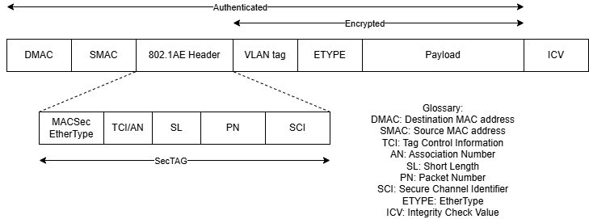
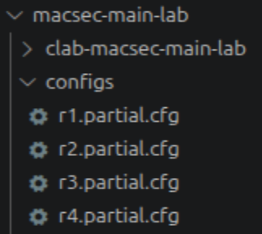

# MACsec Laboratory

MACsec, standardized in IEEE 802.1AE, provides link-layer security by ensuring confidentiality, integrity, and authenticity of Ethernet frames.

Operating at Layer 2 allows MACsec to protect traffic between adjacent devices such as switches, routers, and hosts. Its hop-by-hop protection model distinguishes it from network-layer solutions like IPsec, enabling protection across enterprise LANs, data centres, and metropolitan Ethernet networks.

MACsec addresses long-standing weaknesses in switched networks, such as, susceptibility to eavesdropping, MAC spoofing, manipulation of broadcast traffic, and insertion of rogue devices.

To support secure operation, the MACsec Key Agreement (MKA) protocol, defined within IEEE 802.1X, performs authentication of participants, derives cryptographic keys, and manages security
associations.

# MACsec Architecture

MACsec organizes link-layer protection around Connectivity Associations (CAs), which are responsible for the distribution of keys performed by MKA, Secure Associations (SAs), which are used to identify transmitted and received data within MACsec, and Secure Channels (SCs), which contain multiple SAs, are unidirectional and are used to transmit and receive data.

Each SA is bound to a distinct Security Association Key (SAK), used to encrypt and decrypt data sent using that specific SA.
As seen in Figure 1, protected frames include a MACsec Security Tag and Integrity Check Value, with encryption and authentication performed using AES-GCM.

<figure markdown id="figure-1">
  
  <figcaption>Figure 1: MACsec Frame</figcaption>
</figure>

The MACsec Security Tag, present in Figure 1 as SecTAG, is inserted into Ethernet frames after the destination and source MAC addresses, which allows it to operate with other higher-layer protocols without conflict.

MACsec can protect both user data and control-plane traffic such as LLDP or Spanning Tree. MKA integrates with this architecture by authenticating devices and securely distributing SAKs to all authorized members of a Connectivity Association.

# MKA Overview

The MACsec Key Agreement (MKA) protocol relies on a pre-established Connectivity Association Key (CAK), derived either from successful authentication, for example, EAP-TLS, or from pre-shared credentials.

The CAK is not used directly for data protection, instead, it is used to derive a Key Encryption Key (KEK) and an Integrity Check Key (ICK).

The KEK protects sensitive MKA payload fields, whilst the ICK is used to generate the ICV, shown in Figure 1, which is used to authenticate the entire MKA Protocol Data Unit (MKPDUs), ensuring both confidentiality, for sensitive key material, and integrity/authenticity of control messages.

# MACsec Laboratory Overview

Now that we have studied some of the basic concepts and features of MACsec, we will begin the configuration of the laboratory itself, to see all this concepts and more in practice.

This laboratory demonstrates:

- SR SIM MACsec and IS-IS configuration
- Linux Bridge integration
- MKA session establishment
- MACsec encrypted Ethernet transport
- IS-IS routing across encrypted links

## What Are Linux Bridges?

Linux bridges are virtual, Layer 2 switches, implemented directly inside the Linux kernel.

They forward Ethernet frames between interfaces similarly to a physical Ethernet switch.

We will use these devices to connect our routers, allowing three-way Connectivity Associations.

## Laboratory Topology

The topology contains:

- Four SR SIM routers
- Two Linux bridges
- Two Linux hosts
- Two MACsec Connectivity Associations
- IS-IS routing

<figure markdown id="figure-2">
  
  <figcaption>Figure 2: MACsec Laboratory Topology</figcaption>
</figure>

## Containerlab Topology File

Create:

```text
macsec-lab.clab.yml
```

Then place the following configuration:

```yaml
name: macsec-lab
prefix: "m"

mgmt:
  network: macsec-lab
  ipv4-subnet: 172.10.10.0/24

topology:
  kinds:
    # Nokia´s router image
    nokia_srsim:
      type: sr-1x-48d
      image: localhost/nokia/srsim:25.10.R3
      license: (Your License File).txt

    # Host computers image
    linux:
      image: ghcr.io/srl-labs/network-multitool

  nodes:
    r1_macsec:
      kind: nokia_srsim
      startup-config: configs/r1.partial.cfg
      components:
        - slot: A
        - slot: 1

    r2_macsec:
      kind: nokia_srsim
      startup-config: configs/r2.partial.cfg
      components:
        - slot: A
        - slot: 1

    r3_macsec:
      kind: nokia_srsim
      startup-config: configs/r3.partial.cfg
      components:
        - slot: A
        - slot: 1

    r4_macsec:
      kind: nokia_srsim
      startup-config: configs/r4.partial.cfg
      components:
        - slot: A
        - slot: 1

    # Linux Bridges
    MACBridge1:
      kind: bridge

    MACBridge2:
      kind: bridge

    #Linux Computers
    host1:
      kind: linux
      mgmt-ipv4: 172.10.10.31
      exec:
        - ip route delete default
        - ip addr add 172.17.0.1/24 dev eth1
        - ip link add link eth1 name eth1.100 type vlan id 100
        - ip addr add 192.168.10.1/24 dev eth1.100
        - ip link set eth1.100 up
        - ip route add default via 172.17.0.254
        - ip -6 addr add 2002::172:17:0:1/96 dev eth1
        - echo 'export PS1="\h:\w\$ "' >> ~/.bashrc
      group: server

    host2:
      kind: linux
      mgmt-ipv4: 172.10.10.32
      exec:
        - ip route delete default
        - ip addr add 172.31.0.1/24 dev eth1
        - ip link add link eth1 name eth1.200 type vlan id 200
        - ip addr add 192.168.10.2/24 dev eth1.200
        - ip link set eth1.200 up
        - ip route add default via 172.31.0.254
        - ip -6 addr add 2002::172:31:0:1/96 dev eth1
        - echo 'export PS1="\h:\w\$ "' >> ~/.bashrc
      group: server

  links:
    # CA1 (R1-R2-R4 via bridge)
    - endpoints: ["r1_macsec:1/1/c2/1", "MACBridge1:eth1"]
    - endpoints: ["r2_macsec:1/1/c2/1", "MACBridge1:eth2"]
    - endpoints: ["r4_macsec:1/1/c2/1", "MACBridge1:eth3"]

    # CA2 (R2-R3-R4 via bridge)
    - endpoints: ["r2_macsec:1/1/c3/1", "MACBridge2:eth4"]
    - endpoints: ["r3_macsec:1/1/c2/1", "MACBridge2:eth5"]
    - endpoints: ["r4_macsec:1/1/c3/1", "MACBridge2:eth6"]

    # HOST CONNECTIONS
    - endpoints: ["host1:eth1", "r1_macsec:1/1/c1/1"]
    - endpoints: ["host2:eth1", "r3_macsec:1/1/c1/1"]
```

!!! warning

    To perform this laboratory you must possess a Nokia SR SIM image, and its associated license key. If not, you may try with the publicly available SR Linux but the commands to setup may differ.

## Router Setup

We will now proceed to setup the routers for our laboratory. We will begin with R1_macsec.

To begin the configuration, we will create a configuration file that will be used on startup, allowing our routers to be immediately configured when the laboratory is deployed.

Within the laboratory folder, create another folder named "configs" and place within the following files:

<figure markdown id="figure-3">
  
  <figcaption>Figure 3: Configs folder</figcaption>
</figure>

Then open the r1.partial.cfg file to begin configuring R1.

The first thing we will configure is CA1, which will connect R1 to R2 and R4.

Paste the following code into the file:

```srl
configure {
    macsec {
        connectivity-association "MACSEC_12" {
            admin-state enable
            description "R1-R2-R4 MACsec"
            macsec-encrypt true
            clear-tag-mode none
            cipher-suite gcm-aes-xpn-128
            static-cak {
                active-psk 1
                mka-key-server-priority 10
                mka-hello-interval 5
                pre-shared-key 1 {
                    encryption-type aes-128-cmac
                    cak 0123456789ABCDEF0123456789ABCDEF
                    cak-name "CA12"
                }
            }
        }
    }
```

These configuration creates the CA name "MACSEC_12", which will encrypt the traffic that passes within, and uses a Pre-Shared Key to authenticate devices during MKA.

Now we will configure the ports used by the router, 1/1/c2/1 for MACsec and 1/1/c1/1 for Host1:

```srl
port 1/1/c2 {
        admin-state enable
        connector {
            breakout c1-100g
        }
    }

    port 1/1/c2/1 {
        admin-state enable
        description "toR2"
        ethernet {
            mode hybrid
            encap-type dot1q
            dot1x {
                macsec {
                    sub-port 1 {
                        admin-state enable
                        ca-name "MACSEC_12"
                        max-peers 3
                    }
                }
            }
        }
    }

    port 1/1/c1 {
        admin-state enable
        description "toHost1"
        connector {
            breakout c1-100g
        }
    }

    port 1/1/c1/1 {
        admin-state enable
        description "toHost1"
        ethernet {
            mode hybrid
            encap-type dot1q
            mtu 9000
        }
    }
```

As we can see, port 1/1/c2/1 includes an additional configuration aimed at enabling MACsec, choosing the CA and how many peers can connect at most.

Now we will finish the configuration by adding the remaining necessary steps, the IP configuration and the IS-IS setup:

```srl
system {
         name "r1"
    }
    router "Base" {
        router-id 10.0.0.1
        interface "system" {
            admin-state enable
            ipv4 {
                primary {
                    address 10.0.0.1
                    prefix-length 32
                }
            }
        }
        interface "toR2" {
            admin-state enable
            port 1/1/c2/1:0
            ipv4 {
                primary {
                    address 10.0.12.1
                    prefix-length 24
                }
            }
        }
        interface "toHost1" {
            admin-state enable
            port 1/1/c1/1:0
            ipv4 {
                primary {
                    address 172.17.0.254
                    prefix-length 24
                }
            }
        }
        isis 0 {
            admin-state enable
            system-id 0000.0000.0001

            level-capability 2

            area-address [49.0001]

            interface "toR2" {
                interface-type broadcast
                level 2 {
                    metric 10
                }
            }

            interface "toHost1" {
                passive true
                level 2 {
                    metric 10
                }
            }
        }
    }
}
```

As we can observe, we set the IP addresses for the two interfaces we are using, enabled them, and set the IS-IS in R1 to allow routing to other subnets.

With all these configurations, your R1 should now fully work.

We will now demonstrate the configuration for R2, since it slightly differs from R1.

We begin again with the MACsec configuration, this time with two CAs, since R2 is in the middle and connects to two different MACsec CAs:

```srl
configure {
    macsec {
        connectivity-association "MACSEC_12" {
            admin-state enable
            description "R1-R2-R4 MACsec"
            macsec-encrypt true
            clear-tag-mode none
            cipher-suite gcm-aes-xpn-128
            static-cak {
                active-psk 1
                mka-key-server-priority 1
                mka-hello-interval 5
                pre-shared-key 1 {
                    encryption-type aes-128-cmac
                    cak 0123456789ABCDEF0123456789ABCDEF
                    cak-name "CA12"
                }
            }
        }

        connectivity-association "MACSEC_23" {
            admin-state enable
            description "R2-R3-R4 MACsec"
            macsec-encrypt true
            clear-tag-mode none
            cipher-suite gcm-aes-xpn-128
            static-cak {
                active-psk 1
                mka-key-server-priority 1
                mka-hello-interval 5
                pre-shared-key 1 {
                    encryption-type aes-128-cmac
                    cak ABCDEF0123456789ABCDEF0123456789
                    cak-name "CA23"
                }
            }
        }
    }
```

The configurations are similar, with the difference being in the name and the Pre-Shared Key.

The ports are both configured for MACsec, with a different CA in each one:

```srl
port 1/1/c2 {
        admin-state enable
        connector {
            breakout c1-100g
        }
    }
    port 1/1/c2/1 {
        admin-state enable
        description "toR1"
        ethernet {
            mode hybrid
            encap-type dot1q
            dot1x {
                macsec {
                    sub-port 1 {
                        admin-state enable
                        ca-name "MACSEC_12"
                        max-peers 3
                    }
                }
            }
        }
    }

    port 1/1/c3 {
        admin-state enable
        connector {
            breakout c1-100g
        }
    }
    port 1/1/c3/1 {
        admin-state enable
        description "toR3"
        ethernet {
            mode hybrid
            encap-type dot1q
            dot1x {
                macsec {
                    sub-port 1 {
                        admin-state enable
                        ca-name "MACSEC_23"
                        max-peers 3
                    }
                }
            }
        }
    }
```

The remaining configuration is similar to R1, with the due changes to IPs and to IS-IS:

```srl
system {
         name "r2"
    }
    router "Base" {
        router-id 10.0.0.2

        interface "system" {
            admin-state enable
            ipv4 {
                primary {
                    address 10.0.0.2
                    prefix-length 32
                }
            }
        }

        interface "toR1" {
            admin-state enable
            port 1/1/c2/1:0
            ipv4 {
                primary {
                    address 10.0.12.2
                    prefix-length 24
                }
            }
        }

        interface "toR3" {
            admin-state enable
            port 1/1/c3/1:0
            ipv4 {
                primary {
                    address 10.0.23.2
                    prefix-length 24
                }
            }
        }
        isis 0 {
            admin-state enable
            system-id 0000.0000.0002

            level-capability 2

            area-address [49.0001]

            interface "toR1" {
                interface-type broadcast
                level 2 {
                    metric 10
                }
            }

            interface "toR3" {
                interface-type broadcast
                level 2 {
                    metric 10
                }
            }
        }
    }
}
```

With these R2 now works properly and should form a CA with R1.

??? question "Can you configure R3 and R4, based on the previous configurations?"

    ??? solution "Solution for R3 is the following:"

        ```srl
        configure {
          macsec {
              connectivity-association "MACSEC_23" {
                  admin-state enable
                  description "R2-R3-R4 MACsec"
                  macsec-encrypt true
                  clear-tag-mode none
                  cipher-suite gcm-aes-xpn-128
                  static-cak {
                      active-psk 1
                      mka-key-server-priority 10
                      mka-hello-interval 5
                      pre-shared-key 1 {
                          encryption-type aes-128-cmac
                          cak ABCDEF0123456789ABCDEF0123456789
                          cak-name "CA23"
                      }
                  }
              }
          }
          port 1/1/c2 {
              admin-state enable
              connector {
                  breakout c1-100g
              }
          }
          port 1/1/c2/1 {
              admin-state enable
              description "toR2"
              ethernet {
                  mode hybrid
                  encap-type dot1q
                  dot1x {
                      macsec {
                          sub-port 1 {
                              admin-state enable
                              ca-name "MACSEC_23"
                              max-peers 3
                          }
                      }
                  }
              }
          }

          port 1/1/c1 {
              admin-state enable
              description "toHost2"
              connector {
                  breakout c1-100g
              }
          }
          port 1/1/c1/1 {
              admin-state enable
              description "toHost2"
              ethernet {
                  mode hybrid
                  encap-type dot1q
                  mtu 9000
              }
          }
          system {
              name "r3"
          }
          router "Base" {
              router-id 10.0.0.3
              interface "system" {
                  admin-state enable
                  ipv4 {
                      primary {
                          address 10.0.0.3
                          prefix-length 32
                      }
                  }
              }
              interface "toR2" {
                  admin-state enable
                  port 1/1/c2/1:0
                  ipv4 {
                      primary {
                          address 10.0.23.3
                          prefix-length 24
                      }
                  }
              }
              interface "toHost2" {
                  admin-state enable
                  port 1/1/c1/1:0
                  ipv4 {
                      primary {
                          address 172.31.0.254
                          prefix-length 24
                      }
                  }
              }
              isis 0 {
                  admin-state enable
                  system-id 0000.0000.0003

                  level-capability 2

                  area-address [49.0001]

                  interface "toR2" {
                      interface-type broadcast
                      level 2 {
                          metric 10
                      }
                  }

                  interface "toHost2" {
                      passive true
                      level 2 {
                          metric 10
                      }
                  }
              }
          }
        }
        ```

    ??? solution "Solution for R4 is the following:"

        ```srl
        configure {
          system {
              name "r4"
          }
          macsec {
              connectivity-association "MACSEC_12" {
                  admin-state enable
                  description "R1-R2-R4 MACsec"
                  macsec-encrypt true
                  clear-tag-mode none
                  cipher-suite gcm-aes-xpn-128
                  static-cak {
                      active-psk 1
                      mka-key-server-priority 0
                      mka-hello-interval 5
                      pre-shared-key 1 {
                          encryption-type aes-128-cmac
                          cak 0123456789ABCDEF0123456789ABCDEF
                          cak-name "CA12"
                      }
                  }
              }
              connectivity-association "MACSEC_23" {
                  admin-state enable
                  description "R2-R3-R4 MACsec"
                  macsec-encrypt true
                  clear-tag-mode none
                  cipher-suite gcm-aes-xpn-128
                  static-cak {
                      active-psk 1
                      mka-hello-interval 5
                      mka-key-server-priority 0
                      pre-shared-key 1 {
                          encryption-type aes-128-cmac
                          cak ABCDEF0123456789ABCDEF0123456789
                          cak-name "CA23"
                      }
                  }
              }
          }

          port 1/1/c2 { admin-state enable connector { breakout c1-100g } }
          port 1/1/c3 { admin-state enable connector { breakout c1-100g } }

          port 1/1/c2/1 {
              admin-state enable
              description "toCA12"
              ethernet {
                  mode hybrid
                  encap-type dot1q
                  dot1x {
                      macsec {
                          sub-port 1 {
                              admin-state enable
                              ca-name "MACSEC_12"
                              max-peers 3
                          }
                      }
                  }
              }
          }

          port 1/1/c3/1 {
              admin-state enable
              description "toCA23"
              ethernet {
                  mode hybrid
                  encap-type dot1q
                  dot1x {
                      macsec {
                          sub-port 1 {
                              admin-state enable
                              ca-name "MACSEC_23"
                              max-peers 3
                          }
                      }
                  }
              }
          }

          router "Base" {
              router-id 10.0.0.4
              interface "system" {
                  admin-state enable
                  ipv4 { primary { address 10.0.0.4 prefix-length 32 } }
              }
              interface "toCA1" {
                  admin-state enable
                  port 1/1/c2/1:1
                  ipv4 { primary { address 10.0.12.4 prefix-length 24 } }
              }
              interface "toCA2" {
                  admin-state enable
                  port 1/1/c3/1:1
                  ipv4 { primary { address 10.0.23.4 prefix-length 24 } }
              }
              isis 0 {
                  admin-state enable
                  system-id 0000.0000.0004
                  area-address [49.0001]
                  level-capability 2

                  interface "toCA1" {
                      interface-type broadcast
                      level 2 { metric 10 }
                  }

                  interface "toCA2" {
                      interface-type broadcast
                      level 2 { metric 10 }
                  }
              }
            }
          }
        ```

With all routers and hosts configured, we are only missing the configuration for our Linux Bridges.

Since these bridges operate on Linux itself, and not on the emulated environment, their configuration is performed directly on the CLI. Their configuration is the following:

```bash
sudo ip link add dev MACBridge1 type bridge group_fwd_mask 0xFFF8
sudo ip link add dev MACBridge2 type bridge group_fwd_mask 0xFFF8

sudo ip link set MACBridge1 up
sudo ip link set MACBridge2 up

sudo sh -c 'echo 0 > /sys/devices/virtual/net/MACBridge1/bridge/multicast_snooping'
sudo sh -c 'echo 0 > /sys/devices/virtual/net/MACBridge2/bridge/multicast_snooping'

sudo ip link set dev MACBridge1 allmulticast on
sudo ip link set dev MACBridge1 multicast on
sudo ip link set dev MACBridge1 arp on
sudo ip link set dev MACBridge1 promisc on
sudo ip link set dev MACBridge2 allmulticast on
sudo ip link set dev MACBridge2 multicast on
sudo ip link set dev MACBridge2 arp on
sudo ip link set dev MACBridge2 promisc on
```

This configuration ensures the bridges allow the necessary MKA and MACsec traffic to flow through, allowing the CAs to form, then the SAs and IS-IS to create its database, allowing packets to go from host1 to host2 fully encrypted.

# Deploy the Laboratory

Start the topology:

```bash
sudo containerlab deploy -t macsec-main-lab.clab.yml
```

---

# Verify Nodes

```bash
docker ps
```

---

# Verify Linux Bridges

```bash
bridge link
```

---

# MACsec Verification

Verify MACsec sessions:

```srl
show system security macsec connectivity-association
```

---

# Verify MKA Sessions

```srl
show system security macsec mka
```

---

# Verify IS-IS

```srl
show network-instance default protocols isis adjacency
```

---

# Packet Captures

Capture traffic on the Linux bridge:

```bash
sudo tcpdump -i MACBridge1 -e
```

MACsec traffic should appear with EtherType:

```text
0x88e5
```

---

# Expected Results

| Validation        | Expected Result  |
| ----------------- | ---------------- |
| MACsec CA         | Established      |
| MKA Sessions      | Up               |
| IS-IS Adjacencies | Operational      |
| Host Connectivity | Successful       |
| Packet Captures   | Encrypted frames |

---

# Troubleshooting

## MACsec Sessions Down

Verify:

- CAK matches
- CKN matches
- Interface state
- Ethernet connectivity

---

## Linux Bridge Problems

Inspect bridge forwarding:

```bash
bridge link
```

Verify multicast behavior:

```bash
ip link show MACBridge1
```

---

## IS-IS Adjacency Failure

Verify:

- MACsec operational state
- MTU configuration
- Interface bindings

---

## Traffic Appears Unencrypted

Possible causes:

- MACsec disabled
- Incorrect Connectivity Association
- Bridge filtering issues

---

!!! warning

    Linux bridges may filter MACsec EtherTypes unless forwarding behavior is configured correctly.

!!! note

    MACsec WAN mode preserves VLAN tags while encrypting Ethernet payloads.
