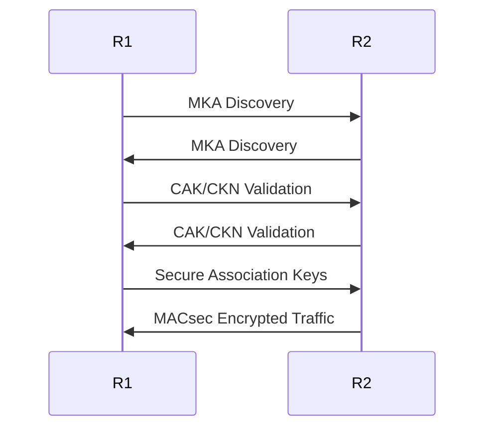
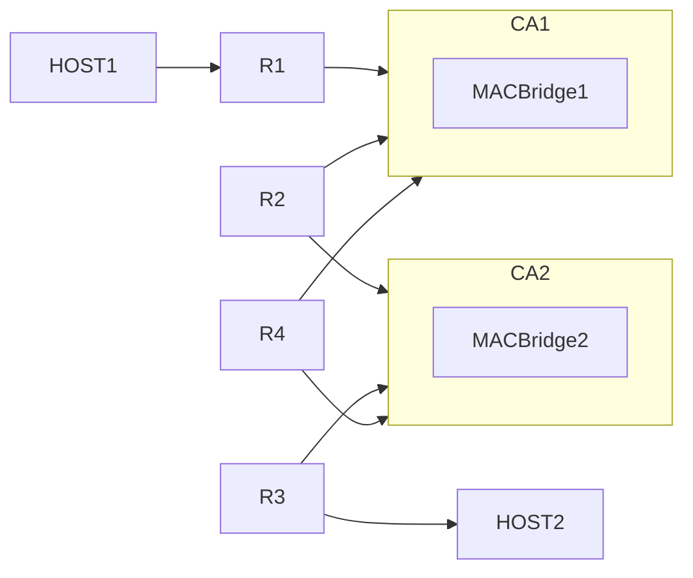

# MACsec

MACsec (Media Access Control Security) is a Layer 2 encryption protocol defined by IEEE 802.1AE. It provides confidentiality, integrity, replay protection, and secure Ethernet transport between directly connected devices.

MACsec is commonly used in:

- Datacenter fabrics
- Service provider transport networks
- Enterprise switching
- Secure Ethernet backbones
- Encrypted VLAN transport

---

# MACsec Overview

MACsec operates directly on Ethernet frames and encrypts traffic between neighboring devices.

Unlike IPsec, which operates at Layer 3, MACsec protects Layer 2 traffic transparently.

---

## MACsec Features

| Feature           | Description              |
| ----------------- | ------------------------ |
| Encryption        | AES-GCM frame encryption |
| Integrity         | Prevents frame tampering |
| Replay Protection | Drops replayed packets   |
| Layer             | Layer 2                  |
| Transparency      | No IP changes required   |

---

## MACsec Architecture


---

# MKA Overview

MACsec itself only encrypts traffic.

The MACsec Key Agreement protocol (MKA), defined in IEEE 802.1X, handles:

- Peer discovery
- Authentication
- Key exchange
- Secure Association management
- Rekeying

MKA automatically distributes encryption keys between MACsec peers.

---

## MKA Components

| Component | Purpose                           |
| --------- | --------------------------------- |
| CAK       | Connectivity Association Key      |
| CKN       | Connectivity Association Key Name |
| SCI       | Secure Channel Identifier         |
| SAK       | Secure Association Key            |

---

## MKA Operation



---

# MACsec Laboratory

This laboratory demonstrates:

- MACsec Connectivity Associations
- Multiple encrypted Ethernet segments
- IS-IS routing across MACsec links
- VLAN transport
- Host-to-host encrypted communication
- SR SIM MACsec deployment inside Containerlab

---

# Laboratory Topology

## Topology Overview



---

# Laboratory Goals

The objective of this laboratory is to:

- Build two MACsec Connectivity Associations
- Configure encrypted Layer 2 transport
- Run IS-IS across MACsec links
- Validate encrypted VLAN forwarding
- Verify secure host communication

---

# Containerlab Topology File

Create the following file:

```text
macsec-main-lab.clab.yml
```

## Topology Definition

```yaml
name: macsec-main-lab
prefix: "x"

mgmt:
  network: macsec-main
  ipv4-subnet: 172.10.10.0/24

topology:
  kinds:
    nokia_srsim:
      type: sr-1x-48d
      image: localhost/nokia/srsim:25.10.R3
      license: SR_SIM_license_IST.txt

    linux:
      image: ghcr.io/srl-labs/network-multitool

  nodes:
    r1_macsec:
      kind: nokia_srsim
      startup-config: configs/r1.partial.cfg
      components:
        - slot: A
        - slot: 1

    r2_macsec:
      kind: nokia_srsim
      startup-config: configs/r2.partial.cfg
      components:
        - slot: A
        - slot: 1

    r3_macsec:
      kind: nokia_srsim
      startup-config: configs/r3.partial.cfg
      components:
        - slot: A
        - slot: 1

    r4_macsec:
      kind: nokia_srsim
      startup-config: configs/r4.partial.cfg
      components:
        - slot: A
        - slot: 1

    MACBridge1:
      kind: bridge

    MACBridge2:
      kind: bridge

    host1:
      kind: linux
      mgmt-ipv4: 172.10.10.31

    host2:
      kind: linux
      mgmt-ipv4: 172.10.10.32

  links:
    - endpoints: ["r1_macsec:1/1/c2/1", "MACBridge1:eth1"]
    - endpoints: ["r2_macsec:1/1/c2/1", "MACBridge1:eth2"]
    - endpoints: ["r4_macsec:1/1/c2/1", "MACBridge1:eth3"]

    - endpoints: ["r2_macsec:1/1/c3/1", "MACBridge2:eth4"]
    - endpoints: ["r3_macsec:1/1/c2/1", "MACBridge2:eth5"]
    - endpoints: ["r4_macsec:1/1/c3/1", "MACBridge2:eth6"]

    - endpoints: ["host1:eth1", "r1_macsec:1/1/c1/1"]
    - endpoints: ["host2:eth1", "r3_macsec:1/1/c1/1"]
```

---

# MACsec Design

## Connectivity Association 1

CA1 interconnects:

- R1
- R2
- R4

Through:

```text
MACBridge1
```

---

## Connectivity Association 2

CA2 interconnects:

- R2
- R3
- R4

Through:

```text
MACBridge2
```

---

# Routing Design

IS-IS is configured on all routers.

The routing domain enables:

```text
Host1 <-> Host2
```

communication through encrypted MACsec segments.

---

# Example MACsec Configuration

## Define CAK and CKN

```srl
/system security
    macsec
        connectivity-association CA1
            cak 00112233445566778899AABBCCDDEEFF
            ckn CA1_KEY
```

---

## Enable MACsec on Interface

```srl
set / interface ethernet-1/1 admin-state enable

set / interface ethernet-1/1 ethernet
    macsec
        admin-state enable
        connectivity-association CA1
```

---

# Example IS-IS Configuration

```srl
set / network-instance default protocols isis instance CORE admin-state enable

set / network-instance default interface ethernet-1/1.0
```

---

# Deploy the Laboratory

## Start the Lab

```bash
sudo containerlab deploy -t macsec-main-lab.clab.yml
```

---

## Verify Nodes

```bash
docker ps
```

---

## Inspect Topology

```bash
sudo containerlab inspect -t macsec-main-lab.clab.yml
```

---

# Verification

## Verify MACsec Sessions

```srl
show system security macsec connectivity-association
```

---

## Verify MKA

```srl
show system security macsec mka
```

---

## Verify IS-IS Adjacencies

```srl
show network-instance default protocols isis adjacency
```

---

## Verify Routing

```bash
ping 192.168.10.2
```

---

# Traffic Validation

Use packet captures to validate encryption.

---

## Capture on Linux Bridge

```bash
sudo tcpdump -i MACBridge1 -e
```

Encrypted MACsec frames should appear as:

```text
EtherType 0x88e5
```

---

# Expected Results

| Validation        | Expected Result  |
| ----------------- | ---------------- |
| MKA Sessions      | Established      |
| MACsec CA         | Active           |
| IS-IS Adjacencies | Up               |
| Host Connectivity | Successful       |
| Packet Capture    | Encrypted frames |

---

# Troubleshooting

## MACsec Session Down

Verify:

- Matching CAK
- Matching CKN
- Interface admin-state
- L2 connectivity

---

## IS-IS Adjacency Failure

Verify:

- MACsec operational state
- Interface MTU
- Subinterface configuration

---

## Host Connectivity Failure

Verify:

- VLAN configuration
- Default gateways
- IS-IS routes

---

## Packet Capture Shows Cleartext

Possible causes:

- MACsec not operational
- Incorrect CA association
- Interface not encrypted

---

!!! warning

    Linux bridges may filter MACsec EtherTypes unless multicast and forwarding behavior are adjusted appropriately.

!!! note

    MACsec in WAN mode preserves VLAN headers in cleartext while encrypting Ethernet payloads.
