## Laboratory Experiments

We will now begin the PKI experiments, where our focus will be on seeing how the hierarchy of a PKI works and how the certificates of an entire chain are used to validate an end-entity certificate, how TLS and DTLS change their own handshake and authentication processes when both devices have certificates from a CA, and some cases of what occurs when wrong or invalid certificates are used.

## PKI Hierarchy and Certificate Chain Validation

For this experiment, we will be studying how a PKI is organized, how that organization is used to issue certificates, and how that process forms a chain of certificates used to trust certificates sent for authentication.

As we can see from our topology, a PKI is a hierarchical structure. This hierarchy consists of a root CA, which is the final step in any certificate chain, since it signs the certificates used to then sign more certificates, Any device that wants to use certificate-based authentication must have its own certificate, and the whole hierarchy of certificates from its own to the root.

This certificate chain that the device stores is an important feature of PKI, as it allows to track the source of a certificate, checking if it is trustworthy and signed by a trusted root and intermediate CAs. After confirming the chain is correct and trusted, our certificate can then be used to authenticate our own device, and open a tunnel.

We will now see this in practice, by first verifying the chain of our TLS certificates, and then performing a TLS connection, to see these chains in practice.

Firstly, we can use the following command to ensure the TLSServer certificate has been issued correctly by a trusted source:

```bash
openssl verify     -CAfile /root/pki/tls-server/root-ca.crt     -untrusted /root/pki/tls-server/int-ca1.crt     /root/pki/tls-server/tls-server.crt
```

The response should be an OK, confirming that the chain of certificates that led to our certificate is authentic and trustworthy.

We can do the same in TLSClient:

```bash
openssl verify     -CAfile /root/pki/tls-client/root-ca.crt     -untrusted /root/pki/tls-client/int-ca1.crt     /root/pki/tls-client/tls-client.crt
```

With both certificates being verified, we can now begin a TLS connection between these two devices, and see how TLS uses and verifies the chain of certificates.

In TLSServer, use the following command for a connection:

```bash
openssl s_server     -accept 4433     -cert /root/pki/tls-server/tls-server.crt     -key /root/pki/tls-server/tls-server.key     -cert_chain /root/pki/tls-server/int-ca1.crt     -CAfile /root/pki/tls-server/root-ca.crt     -Verify 1     -verify_return_error
```

And then, in TLSClient, use the following command to connect:

```bash
openssl s_client     -connect 10.0.7.2:4433     -CAfile /root/pki/tls-client/root-ca.crt     -cert /root/pki/tls-client/tls-client.crt     -key /root/pki/tls-client/tls-client.key     -cert_chain /root/pki/tls-client/int-ca1.crt     -verify_return_error
```

A TLS tunnel should form in an instant, and now we can scroll up and check the handshake logs in the terminal, to see where the certificate chain is and how it is used.

<figure markdown id="figure-1">
  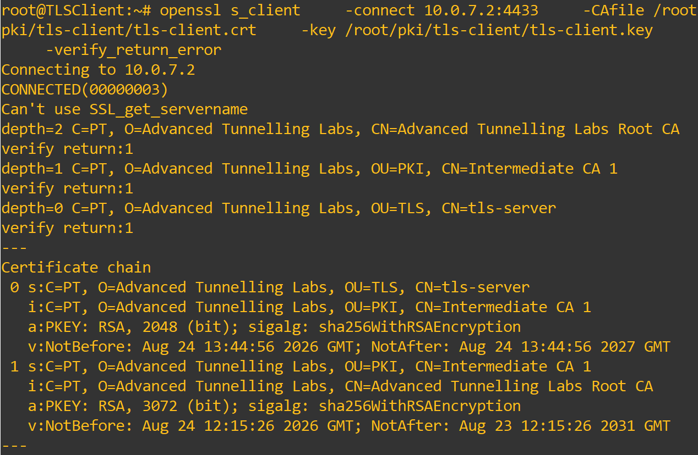
  <figcaption>Figure 1: Client-side certificate chain</figcaption>
</figure>

As we can see in Figure 1, when the client first connects to the server and begins authentication, it receives the certificate chain for the server certificate.

We can see that this chain has a depth of 2, meaning there is the end device certificate, an intermediate certificate that signed that one, and finally a root certificate that signed the intermediate.

We can then see the full information regarding the first two certificates, such as name, issuer, validity, signing algorithm used, public key, among others.

<figure markdown id="figure-2">
  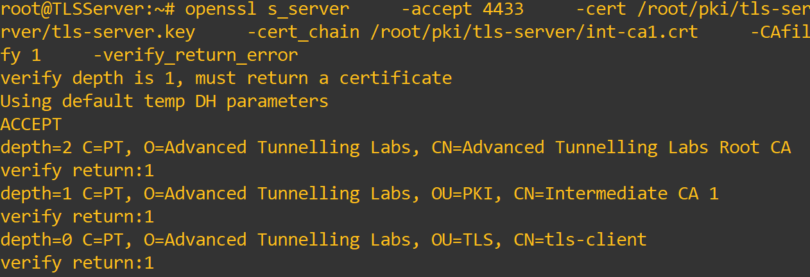
  <figcaption>Figure 2: Server-side certificate chain</figcaption>
</figure>

In Figure 2, we can see the chain from the server side, the only change being the last certificate, which is the client certificate, instead of the server´s.

We can also see that only the client side verified the certificate chain more deeply. This is an important step in the handshake, to ensure that the server is who it says it is.

## Mutual Authentication in TLS/DTLS

For our next experiment, we will be testing the authentication used by TLS and DTLS, checking what is done when the authentication is server only, or mutual.

We will begin by analysing how the authentication process is done with a server only authentication for TLS. To do this, in TLSServer, use the command:

```bash
openssl s_server \
    -accept 4433 \
    -cert /root/pki/tls-server/tls-server.crt \
    -key /root/pki/tls-server/tls-server.key \
    -cert_chain /root/pki/tls-server/int-ca1.crt
```

Notice that this command is different, namely we are not using the parameters that ask for a client certificate.

Then connect to the server, in TLSClient, using:

```bash
openssl s_client \
    -connect 10.0.7.2:4433 \
    -CAfile /root/pki/tls-client/root-ca.crt
```

As we can see in Figure 3, the client-side has minimal to no changes, still checking the certificate chain for the server, and then performing the normal authentication.

<figure markdown id="figure-3">
  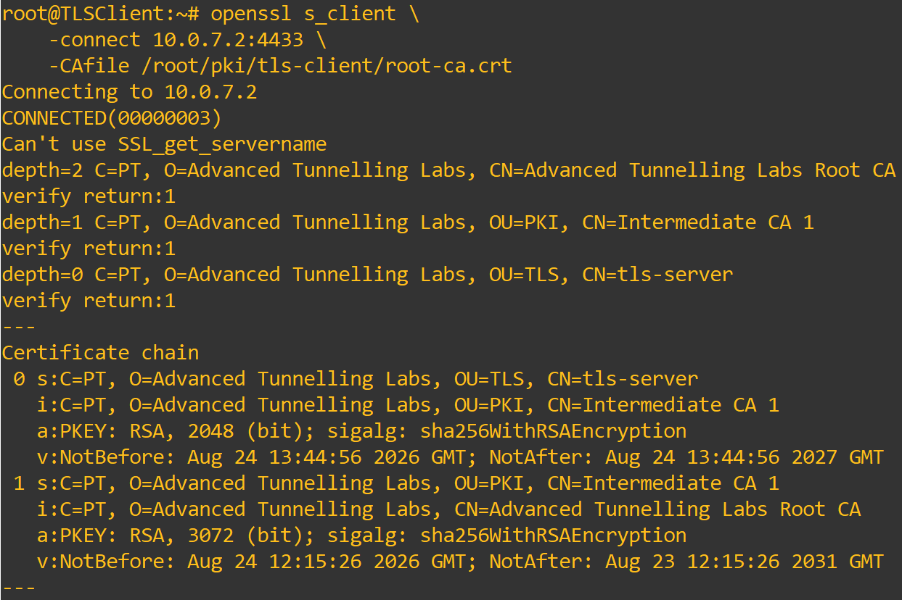
  <figcaption>Figure 3: Client-side TLS authentication</figcaption>
</figure>

On the server side however, no client certificate is received. As such the server only performs the normal handshake, exchanging algorithms and parameters and then forming the tunnel, without any kind of authentication done on the client´s identity, as seen in Figure 4.

<figure markdown id="figure-4">
  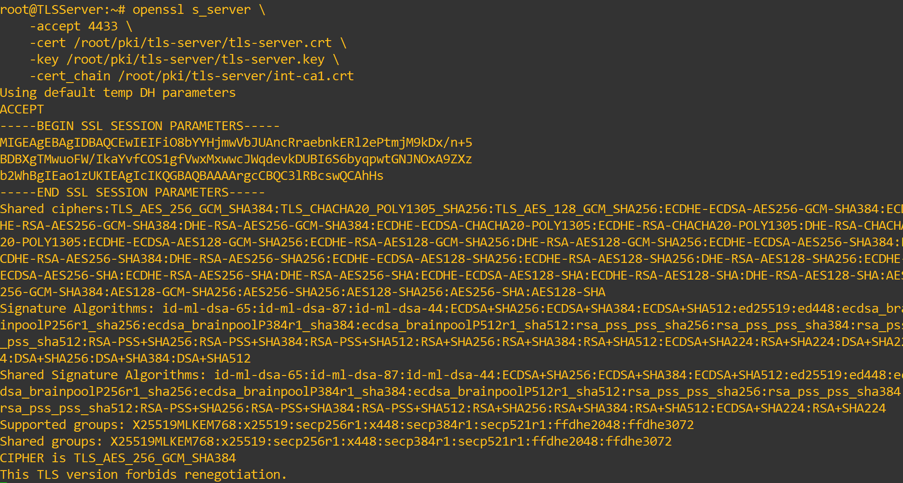
  <figcaption>Figure 4: Server-side TLS authentication</figcaption>
</figure>

We will now check the difference between mutual authentication in DTLS, and server only authentication.

Beggining with server only, we will use the following commands on DTLSServer:

```bash
openssl s_server \
    -dtls1_2 \
    -accept 4444 \
    -cert /root/pki/dtls-server/dtls-server.crt \
    -key /root/pki/dtls-server/dtls-server.key \
    -cert_chain /root/pki/dtls-server/int-ca2.crt
```

We can now connect a WireShark probe between the DTLS devices, to see what certificates are sent through their link.

And then, connect the client, which will not send a certificate, using:

```bash
openssl s_client \
    -dtls1_2 \
    -connect 10.0.8.2:4444 \
    -CAfile /root/pki/dtls-client/root-ca.crt
```

We can see the client output in Figure 5, which includes the certificate chain belonging to the server certificate, which means the server has been authenticated.

<figure markdown id="figure-5">
  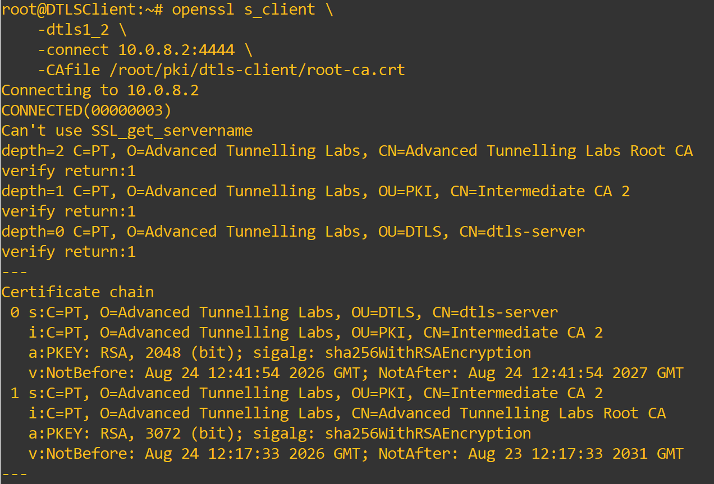
  <figcaption>Figure 5: Client-side DTLS authentication</figcaption>
</figure>

But from the server output, in Figure 6, we can see that no certificate was received, and that only parameters and algorithms were negotiated, with no client authentication.

<figure markdown id="figure-6">
  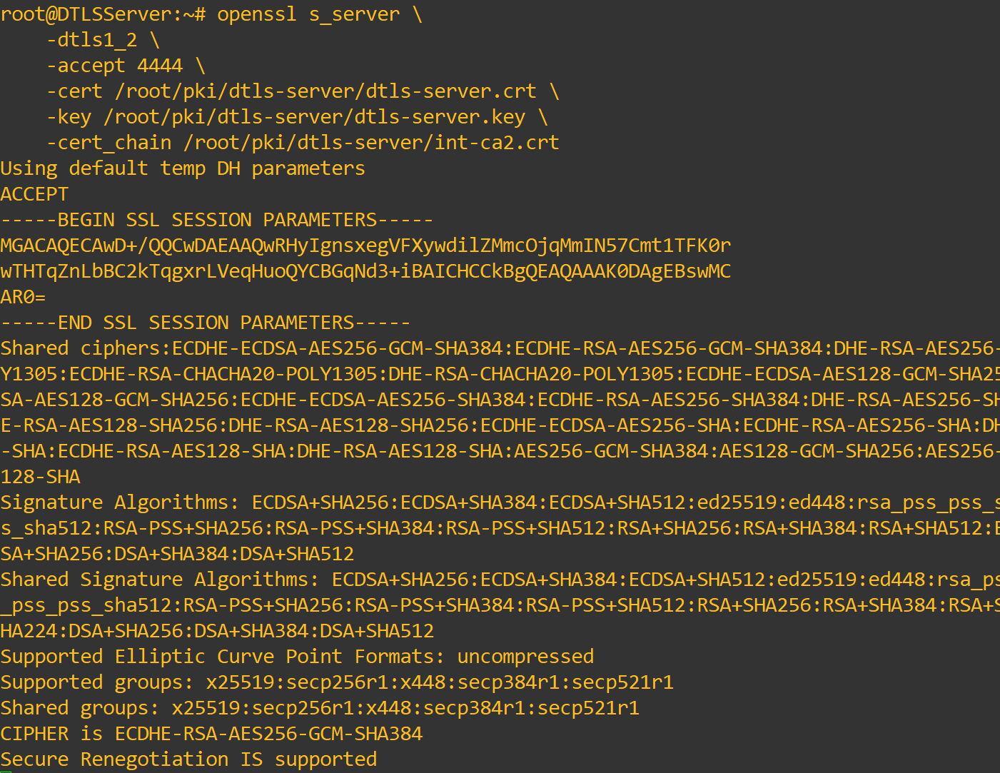
  <figcaption>Figure 6: Server-side DTLS authentication</figcaption>
</figure>

This is further confirmed by Figure 7, which shows the two certificates that were sent through the link, the dtls-server certificate and the IntermediateCA2 certificate.

<figure markdown id="figure-7">
  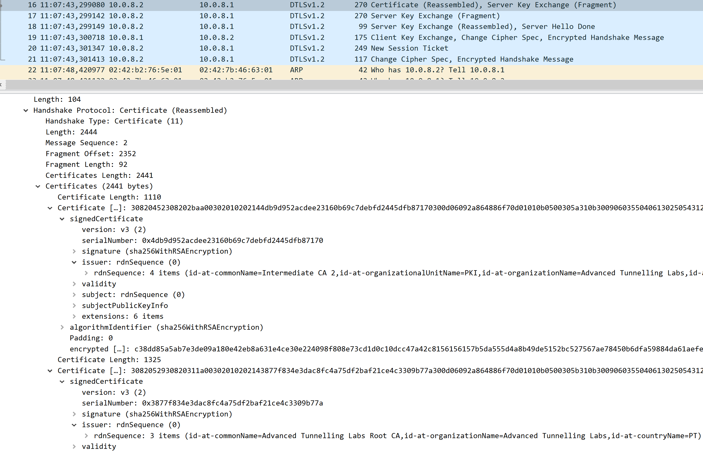
  <figcaption>Figure 7: Server-side DTLS authentication</figcaption>
</figure>

Let´s move forward and check how mutual authentication works and looks like in DTLS.

Firstly, use the following command on DTLSServer:

```bash
openssl s_server \
    -dtls1_2 \
    -accept 4444 \
    -cert /root/pki/dtls-server/dtls-server.crt \
    -key /root/pki/dtls-server/dtls-server.key \
    -cert_chain /root/pki/dtls-server/int-ca2.crt \
    -CAfile /root/pki/dtls-server/root-ca.crt \
    -Verify 1 \
    -verify_return_error
```

And then, use the following command on DTLSClient:

```bash
openssl s_client \
    -dtls1_2 \
    -connect 10.0.8.2:4444 \
    -CAfile /root/pki/dtls-client/root-ca.crt \
    -cert /root/pki/dtls-client/dtls-client.crt \
    -key /root/pki/dtls-client/dtls-client.key \
    -cert_chain /root/pki/dtls-client/int-ca2.crt \
    -verify_return_error
```

We can see that the DTLS client-side has no meaningful changes, performing the same server certificate chain validation, and then the server authentication through its certificate.

The main difference lies in the server-side of DTLS and on what was captured by WireShark. Firstly, we can now observe, in Figure 8, that the client certificate, and its chain are received by the server, which will authenticate the client, completing the mutual authentication process.

<figure markdown id="figure-8">
  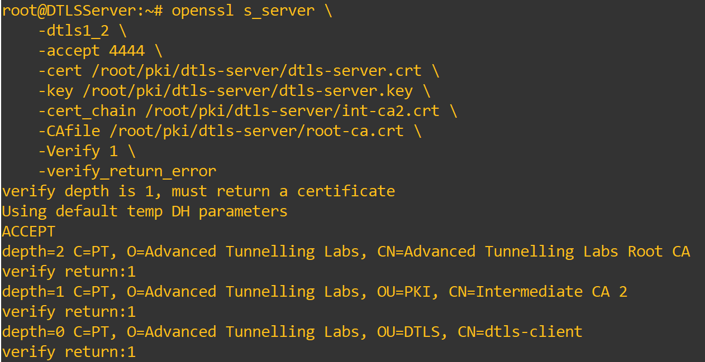
  <figcaption>Figure 8: Server-side DTLS authentication</figcaption>
</figure>

Secondly, we can see in WireShark, in Figure 9, that with mutual authentication, not only is the server certificate sent, but the client´s certficate is sent afterwards for authentication.

<figure markdown id="figure-9">
  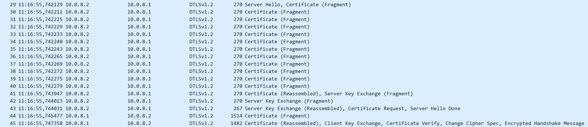
  <figcaption>Figure 9: Server and Client certificate in WireShark</figcaption>
</figure>

We could see from these experiments that the changes between these two authentication methods, Server only and Mutual, are not only present in how the connection is more secure and reliable between two trustworthy peers, but that there are also changes to how the handshake itself is performed, both in TLS and DTLS.

## Usage of wrong or invalid certificates in authentication

For our final experiment, we will be using some out of place certificates and CAs to experiment on how authentication is affected by this, namely the one performed by TLS.

For the first part, we will be using the certificate from another device, in this case DTLSServer, as the certificate used by TLSClient, and see how TLSServer responds to this.

To do this, copy the certificate from DTLSServer, and paste it in TLSClient, using:

```bash
cat /root/pki/dtls-server/dtls-server.crt

nano /root/pki/tls-client/dtls-server.crt
```

With the wrong certificate in place, we will now attempt to connect to TLSServer using this certificate, and see its reaction.
Firstly, start the server with:

```bash
openssl s_server \
    -accept 4433 \
    -cert /root/pki/tls-server/tls-server.crt \
    -key /root/pki/tls-server/tls-server.key \
    -cert_chain /root/pki/tls-server/int-ca1.crt \
    -CAfile /root/pki/tls-server/root-ca.crt \
    -Verify 1 \
    -verify_return_error
```

And then connect to it, using the wrong certificate, with:

```bash
openssl s_client     -connect 10.0.7.2:4433     -CAfile /root/pki/tls-client/root-ca.crt     -cert /root/pki/tls-client/dtls-server.crt     -key /root/pki/tls-client/tls-client.key     -cert_chain /root/pki/tls-client/int-ca1.crt     -verify_return_error
```

The first error we get, is from a mismatch between the certificate and the public key used, which is expected since the certificate comes from a different device and key. Let´s try copying the key unto TLSClient, and see what else can occur:

```bash
cat /root/pki/dtls-server/dtls-server.key

nano /root/pki/tls-client/dtls-server.key
```

```bash
openssl s_client     -connect 10.0.7.2:4433     -CAfile /root/pki/tls-client/root-ca.crt     -cert /root/pki/tls-client/dtls-server.crt     -key /root/pki/tls-client/dtls-server.key     -cert_chain /root/pki/tls-client/int-ca1.crt     -verify_return_error
```

With this configuration we can see a more interesting error, seen in Figure 10, which shows that the handshake failed due to the server being incapable of verifying the local issuer of the certificate, since IntermediateCA2 appears in the certificate chain, but is not a part of the server´s known sources.

<figure markdown id="figure-10">
  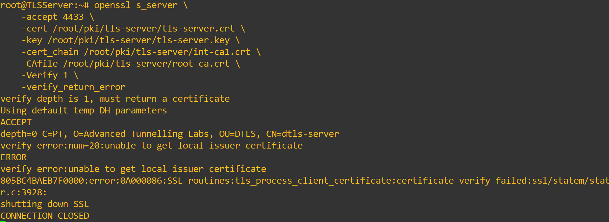
  <figcaption>Figure 10: Client certificate failed authentication</figcaption>
</figure>

Now, let´s see how using the wrong CA when attempting a connection also affects the handshake and authentication process.

To do this, we will copy the IntermediateCA2 certificate onto TLSClient:

```bash
cat /root/pki/int-ca2/certs/int-ca2.crt

nano /root/pki/tls-client/int-ca2.crt
```

Then reconnect the client to the server using:

```bash
openssl s_client \
    -connect 10.0.7.2:4433 \
    -CAfile /root/pki/tls-client/int-ca2.crt \
    -cert /root/pki/tls-client/tls-client.crt \
    -key /root/pki/tls-client/tls-client.key \
    -cert_chain /root/pki/tls-client/int-ca1.crt \
    -verify_return_error
```

Since the client was expecting the CA of the server to be IntCA2, but the chain that the server sent used IntCA1, the client reached an error while authenticating the server due to the mismatching CAs. Although the error, which we can see in Figure 11, is the same from the previous attempt, unable to get local issuer certificate, it occurs for a different reason.

<figure markdown id="figure-11">
  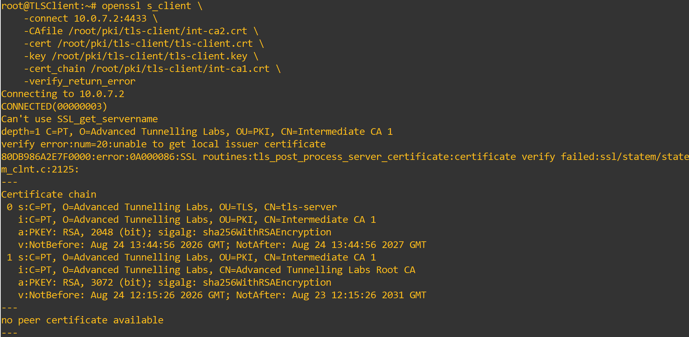
  <figcaption>Figure 11: Server certificate failed authentication in Client</figcaption>
</figure>

Instead of an out of place certificate being sent to the server with a chain that does not belong in that device, the client is expecting the server´s certificate chain to include IntCA2, however it includes IntCA1, which is technically correct for a normal connection, but with our connection, the client rejects the certificate and closes the handshake because it was not the expected CA.

With this we conclude our PKI experiments. We hope that through the configuration process and the experiments, you have deepened your knowledge of what a PKI is, the shapes it can take, how its hierarchy and chains work, how its certificates are used for authentication and how it must be properly configured and its certificates must be correctly placed, otherwise it will cause problems for any protocol using them.

We hope you have enjoyed PKI and our remaining laboratories, and hope to see you again!
