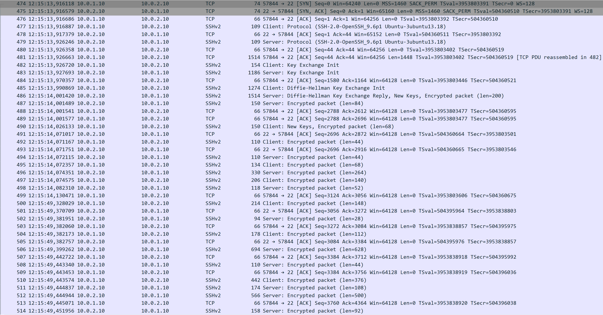
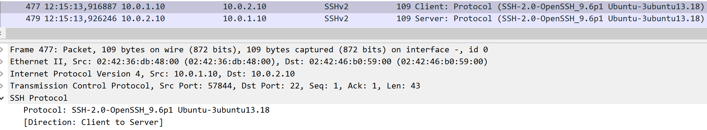
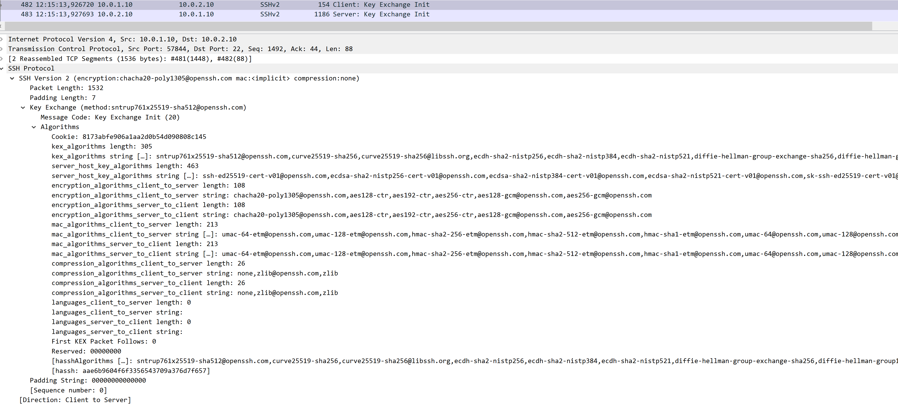
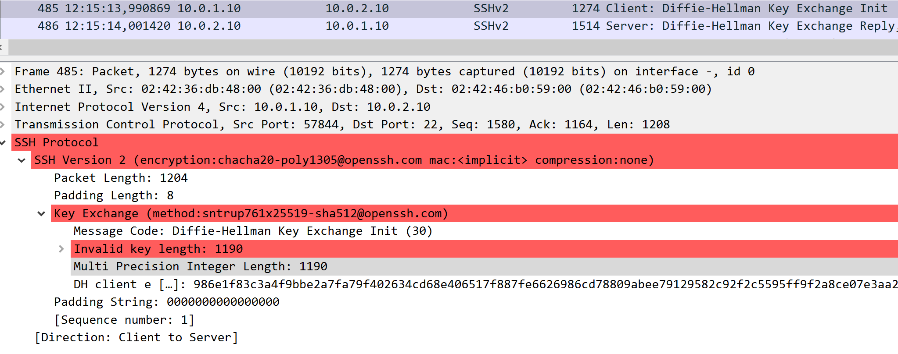
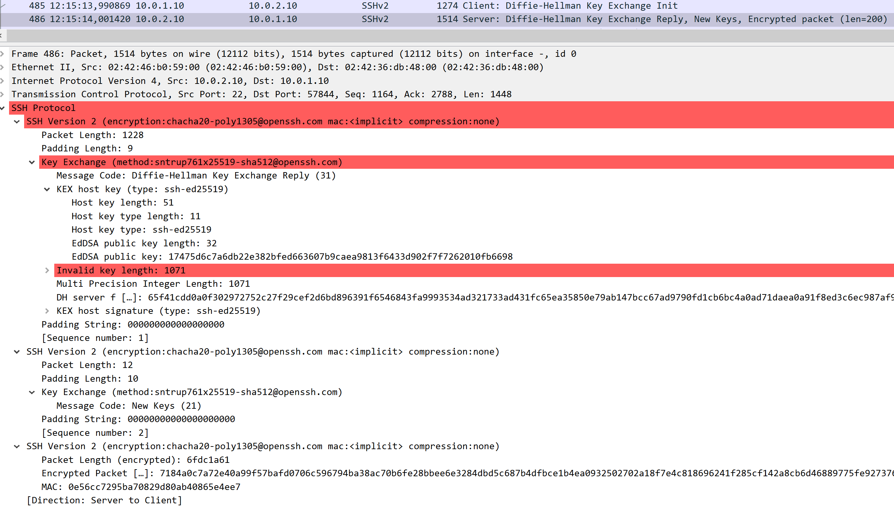
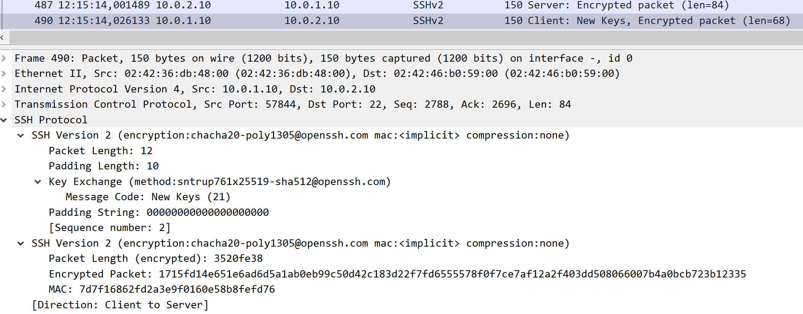
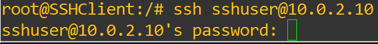
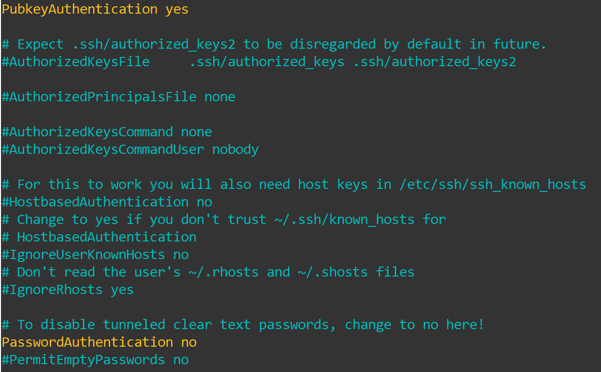
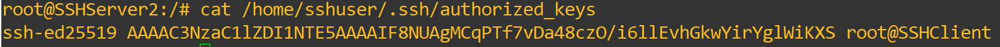
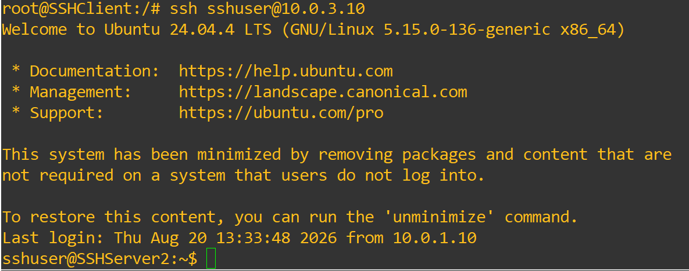

## Laboratory Experiments

We will now begin the SSH experiments, studying its handshake, algorithms used for key exchange, host-key generation and as cyphers, the authentication of the server´s host-key, the differences in configuration and in practice between password and public key authentication, and how SSH can handle a replay attack, like the one we tested other protocols with.

## SSH Handshake and Algorithms

We will begin our experiments by studying the handshake that SSH uses to establish a tunnel between a client and a server and verifying if it matches what we saw in the Overview.

To do this, begin by setting a WireShark probe between SSHClient and MitM, then establish a connection between SSHClient and SSHServer1.

<figure markdown id="figure-1">
  
  <figcaption>Figure 1: SSH Handshake</figcaption>
</figure>

As we can see in Figure 1, the SSH handshake is quite extensive, as we expected from the previous example.

The first three packets are used to establish the TCP connection that will be used by SSH to continue the handshake.

Following those, we will use a filter in WireShark, ssh, to reduce the clutter in the handshake and to see each step more clearly.

<figure markdown id="figure-2">
  
  <figcaption>Figure 2: SSH Version identification</figcaption>
</figure>

In the first two SSH messages, displayed in Figure 2, we can see that the only information exchanged is the SSH version and the OS version used by both devices. Although a simple step, it is vital to prevent any mismatches that could affect future steps in the handshake.

<figure markdown id="figure-3">
  
  <figcaption>Figure 3: SSH Key Exchange negotiation</figcaption>
</figure>

Following those messages, the next two, seen in Figure 3, demonstrate the Key Exchange negotiation between the server and client, where the client sends its list of Key Exchange, Encryption, Compression and HMAC algorithms, and then receives an answer from the server with its own list of algorithms.

<figure markdown id="figure-4">
  
  <figcaption>Figure 4: SSH Client Diffie-Hellman public key shared</figcaption>
</figure>

The next message is sent by the client, seen in Figure 4, which contains the public key generated by the Diffie-Hellman group that was chosen for the key exchange. The server answers with the message in Figure 5, replying with its own generated host key, Diffie-Hellman public key and the hash used to authenticate its host key and shared key. Lastly, it sends the information that it will begin using the session key to encrypt the messages sent afterwards.

<figure markdown id="figure-5">
  
  <figcaption>Figure 5: SSH Server begins encrypted exchange</figcaption>
</figure>

The client answers with the message in Figure 6, informing it will also begin using the session key, and the remaining traffic is now encrypted, although we know it is the password authentication of the user using SSH to access the server.

<figure markdown id="figure-6">
  
  <figcaption>Figure 6: SSH Client begins encrypted exchange</figcaption>
</figure>

With this, we have analysed the live handshake done by our SSHClient and SSHServer1, and we can confirm that it followed exactly what our handshake example had set.

We will now briefly analyse what algorithms SSH has at its disposal for its several functions, such as, Key Exchange, Encryption, Compression and HMAC and how to choose them instead of letting the two devices negotiate.

We will begin by analysing the algorithms available for Key Exchange, using the command:

```bash
ssh -Q kex
```

This will provide us with the list of algorithms available, which should be:

```bash
diffie-hellman-group1-sha1
diffie-hellman-group14-sha1
diffie-hellman-group14-sha256
diffie-hellman-group16-sha512
diffie-hellman-group18-sha512
diffie-hellman-group-exchange-sha1
diffie-hellman-group-exchange-sha256
ecdh-sha2-nistp256
ecdh-sha2-nistp384
ecdh-sha2-nistp521
curve25519-sha256
curve25519-sha256@libssh.org
sntrup761x25519-sha512@openssh.com
```

Some of these algorithms, namely the first four, are already old or very close to it, being already insecure and considered legacy. The remaining algorithms are relatively modern and secure, although none are prepared for the post-qauntum era, except for the last one, sntrup761x25519-sha512@openssh.com, which is a hybrid key exchange algorithm, which mixes the classical X25519 elliptic-curve Diffie-Hellman key exchange with Streamlined NTRU Prime post-quantum encapsulation method to guarantee confidentiality even when a quantum computer would try to break it.

For the next list, Encryption, we will use the following command:

```bash
ssh -Q cipher
```

The list of algorithms available is:

```bash
3des-cbc
aes128-cbc
aes192-cbc
aes256-cbc
aes128-ctr
aes192-ctr
aes256-ctr
aes128-gcm@openssh.com
aes256-gcm@openssh.com
chacha20-poly1305@openssh.com
```

For the following list, HMAC, we will use the following command:

```bash
ssh -Q mac
```

The list of algorithms available is:

```bash
hmac-sha1
hmac-sha1-96
hmac-sha2-256
hmac-sha2-512
hmac-md5
hmac-md5-96
umac-64@openssh.com
umac-128@openssh.com
hmac-sha1-etm@openssh.com
hmac-sha1-96-etm@openssh.com
hmac-sha2-256-etm@openssh.com
hmac-sha2-512-etm@openssh.com
hmac-md5-etm@openssh.com
hmac-md5-96-etm@openssh.com
umac-64-etm@openssh.com
umac-128-etm@openssh.com
```

For the final list, Host Key Algorithms, we will use the following command:

```bash
ssh -Q key
```

The list of algorithms available is:

```bash
ssh-ed25519
ssh-ed25519-cert-v01@openssh.com
sk-ssh-ed25519@openssh.com
sk-ssh-ed25519-cert-v01@openssh.com
ecdsa-sha2-nistp256
ecdsa-sha2-nistp256-cert-v01@openssh.com
ecdsa-sha2-nistp384
ecdsa-sha2-nistp384-cert-v01@openssh.com
ecdsa-sha2-nistp521
ecdsa-sha2-nistp521-cert-v01@openssh.com
sk-ecdsa-sha2-nistp256@openssh.com
sk-ecdsa-sha2-nistp256-cert-v01@openssh.com
ssh-dss
ssh-dss-cert-v01@openssh.com
ssh-rsa
ssh-rsa-cert-v01@openssh.com
```

For these last three lists, we invite you to study them, learn more about the algorithms in it, their age, the security they offer or offered before being obsolete and what each of them offers to SSH.

Finally, if you want to force a certain algorithm to be used, you can use a command similar to the following:

```bash
ssh -o KexAlgorithms=curve25519-sha256 user@10.10.2.10
```

In this case, the KEX algorithm will curve25519-sha25 without negotiation, but you can try different combinations and commands to find more ways to change the negotiation during the handshake.

## Host-key Authentication

For this experiment, we will be analysing the Client-side authentication of a server Host Key, which is used to identify servers we have previously communicated with and to prevent Server Impersonation attacks.

We can begin by inspecting all the key host files that the server stores with:

```bash
ls -l /etc/ssh/ssh_host_*
```

From this list, let´s inspect the public key that the server used on its first connection with our client with:

```bash
ssh-keygen -lf /etc/ssh/ssh_host_ed25519_key.pub
```

With the result being:

```bash
256 SHA256:FbflQZqRspzFr6G9b3Q3/wZrWem0ECAIybM7wK3aqGE root@buildkitsandbox (ED25519)
```

This is what a server can use to authenticate itself with a client.
In the first connection, a client must accept the server host key to begin a connection, but further attempts will no longer ask for this, since for the client, the server is now a known entity.

This helps protect against server impersonation attacks, since if we try to connect to a server, and there is a mismatch between the host key that is sent and the one that is stored, SSH knows that there is a problem with that server and does not allow the connection to move forward.

To reset the host key of a server, for example to see the first connection again, you can use the following command:

```bash
ssh-keygen -R 10.0.2.10
```

## Password Authentication vs Public Key Authentication

For this experiment we will be looking at the different configurations needed for Password and Public Key Authentication, and what are the practical and security differences between the two.

Starting with the configurations, we can see from what we used in the Device Configuration section, that there are two very distinct ways of preparing a SSH server for a user using a password and a user using a public key.

Firstly, the authentication through password is the default method for this distribution of SSH, and as such we did not have to modify the configurations.

What we did was create a user, sshuser, and associate a password to it, ssh1234.

```bash
useradd -m -s /bin/bash sshuser
passwd sshuser
ssh1234
```

This way, when that user connects to the server, the server automatically asks for a password, which is stored in its files.

<figure markdown id="figure-7">
  
  <figcaption>Figure 7: SSH Client password login</figcaption>
</figure>

While straightforward to implement and use, this method allows attackers that obtained the password in some way to simply log into the server and perform any action within.

Our second method, despite needing some more preparation, is more secure in the sense that the client device attempting to login must have the key stored within, otherwise it will fail the login.

To configure this method, we began by creating the user, sshuser, but without password, and altered the SSH configurations to use Public Key authentication, instead of Password authentication.

```bash
useradd -m -s /bin/bash sshuser
nano /etc/ssh/sshd_config
```

<figure markdown id="figure-8">
  
  <figcaption>Figure 8: SSH Server 2 configuration</figcaption>
</figure>

With this done, we then generated a key pair for the client to use, and copied that key into the authorized keys file in the server.

```bash
ssh-keygen -t ed25519
cat ~/.ssh/id_ed25519.pub
mkdir -p /home/sshuser/.ssh
nano /home/sshuser/.ssh/authorized_keys
```

<figure markdown id="figure-9">
  
  <figcaption>Figure 9: SSH Server 2 authorized keys</figcaption>
</figure>

With all this configured, when logging in to SSHServer 2, we are immediately logged into the server, since our key pair was what handled authentication.

<figure markdown id="figure-10">
  
  <figcaption>Figure 10: SSH Client authenticated through key pair</figcaption>
</figure>

Despite the additional steps necessary to configure, this method offers a more streamlined login experience, and more secure, since for an attacker to login with this method, they would need either to gain access to the server in some other way and add its own key, or it would need to steal the key pair from the client, which should prove more difficult than guessing or stealing a password.

## Replay Attack

For our final experiment, we will be subjecting SSH to our now, well-known Replay Attack, to see if this protocol is vulnerable to this kind of attack.

To do this, prepare the MitM device to listen in on traffic with:

```bash
tcpdump -ni eth0 -w /pcaps/replay-capture.pcap
```

With the recording ongoing, go to the client, and connect to SSHServer1, and then write some text on the console to generate traffic.

Now that we have captured some packets, let´s replay them towards SSHServer1, and see if there is any response or signs that the attack is working:

```bash
tcpreplay -i eth1 /pcaps/replay-capture.pcap
```

Although we sent a replayed handshake, and several packets of captured messages to the server, there has been no response by SSHServer1, as we can see in SSHClient since the session is still intact and with no responses to the replayed messages from MitM.

SSH achieves its replay protection in two layers. Firstly, through TCP, which has its own mechanism to detect duplicate and out-of-order packets and discards them. Then at SSH itself, the MAC used in the messages also contain a sequence number within that tells SSH which packet it should be expecting next.

From this experiments we hope that your knowledge of SSH has improved, understanding better what happens in its handshake, how its layers perform different jobs at different levels, what its algorithms are, how it a server authenticates itself to a user and vice-versa, and how SSH can protect itself from attacks, namely a replay attack.

We hope you have enjoyed our SSH lab, and hope to see you in the final lab regarding PKI!
