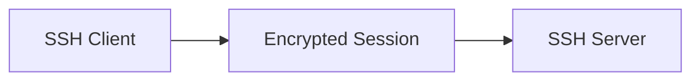

# SSH

SSH (Secure Shell) is a secure remote access and tunnelling protocol widely used for Linux administration, automation, and secure transport.

---

## Features

- Encrypted remote access
- Public key authentication
- Secure file transfer
- Port forwarding
- Tunnelling support

---

## Common SSH Services

| Service    | Purpose              |
| ---------- | -------------------- |
| SSH        | Remote shell         |
| SCP        | Secure copy          |
| SFTP       | Secure file transfer |
| SSH Tunnel | Encrypted forwarding |

---

## SSH Architecture



---

## Topics Covered

- SSH key authentication
- SSH hardening
- SCP and SFTP
- Port forwarding
- SSH tunnelling
- Linux administration
- Troubleshooting

---

## Generate SSH Keys

```bash
ssh-keygen -t ed25519
```

## Connect to a Server

```bash
ssh user@192.168.1.10
```

---

## Example SSH Tunnel

```bash
ssh -L 8080:localhost:80 user@server
```

!!! warning

    Password authentication should be disabled in production environments whenever possible.
