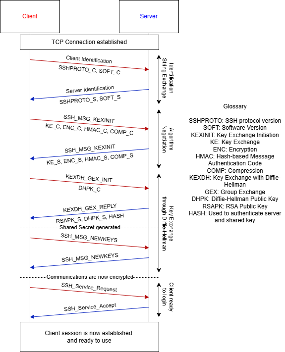
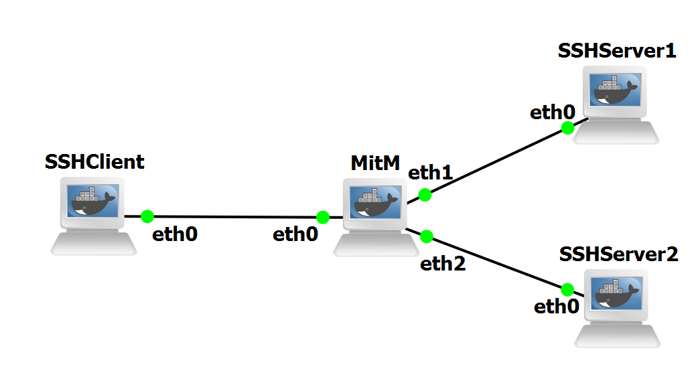

## SSH Laboratory

Secure Shell (SSH) is a protocol for secure remote access, encrypted command execution and file transfer. Standardised by IETF in RFCs 4251 through 4254, SSH provides confidentiality, integrity, and peer authentication through a flexible layered architecture.

Operating at the application layer and running over TCP, SSH offers user-centric access control, key-based authentication, and session multiplexing. These properties make it well suited for administrative access, secure management of remote hosts and port forwarding.

SSH is commonly used to create local, remote, or dynamic tunnels that protect otherwise insecure application flows. Typical use cases include secure system administration, tunnelling database
connections across untrusted networks and enabling secure file transfer through SFTP.

## SSH Architecture and Handshake

SSH is divided into three logical layers: the transport layer, the authentication layer, and the connection layer.

The transport layer, described in RFC 4253, establishes a secure channel, with its handshake present in Figure 1, providing confidentiality and integrity for subsequent protocol layers, negotiating encryption algorithms, for example AES-GCM or ChaCha20-Poly1305, MACs, compression, and key exchange algorithms such as Curve25519 or ECDH.

The authentication layer supports mechanisms such as public-key authentication, with RSA, Ed25519 or ECDSA and password, while the connection layer multiplexes multiple logical channels, like, shell, exec, subsystem and portforwarding, over a single transport connection as defined by RFC 4254.

<figure markdown id="figure-1">
  
  <figcaption>Figure 1: SSH Handshake</figcaption>
</figure>

## Laboratory Topology

The topology of this laboratory consists in:

- Three docker containers, using the image ghcr.io/groudonramsay/ubuntu-ssh:latest, which are SSHClient, SSHServer 1 and SSHServer 2.
- One docker container acting as a MitM, using the image ghcr.io/groudonramsay/ipsec-replay:latest.

The topology is visible in Figure 2:

<figure markdown id="figure-2">
  
  <figcaption>Figure 2: SSH Topology</figcaption>
</figure>

When adding the container to your templates, use 2 adapters and the following environment variables:

```bash
--cap-add NET_ADMIN
--cap-add NET_RAW
```

Before beggining the configuration, modify the MitM machine to have 3 adapters.

## Device Configuration

We will begin the configuration by setting up the IPs and routes necessary for communication between all devices.

Use the following commands to configure SSHClient:

```bash
ip addr add 10.0.1.10/24 dev eth0
ip link set eth0 up
ip route add 10.0.2.0/24 via 10.0.1.1
ip route add 10.0.3.0/24 via 10.0.1.1
```

Use the following commands to configure SSHServer1:

```bash
ip addr add 10.0.2.10/24 dev eth0
ip link set eth0 up
ip route add 10.0.1.0/24 via 10.0.2.1
ip route add 10.0.3.0/24 via 10.0.2.1
```

Use the following commands to configure SSHServer2:

```bash
ip addr add 10.0.3.10/24 dev eth0
ip link set eth0 up
ip route add 10.0.1.0/24 via 10.0.3.1
ip route add 10.0.2.0/24 via 10.0.3.1
```

Use the following commands to configure MitM:

```bash
ip addr add 10.0.1.1/24 dev eth0
ip link set eth0 up
ip addr add 10.0.2.1/24 dev eth1
ip link set eth1 up
ip addr add 10.0.3.1/24 dev eth2
ip link set eth2 up
sysctl -w net.ipv4.ip_forward=1
```

You can test the configuration by pinging from SSHClient to both servers and ensuring there is a response.

With the network setup and ready to go, we will now configure the two SSHServers, in order to be able to use them.

We will beginwith SSHServer1, using the following commands to setup a user authorized to login through a password, and setting up the server itself:

```bash
useradd -m -s /bin/bash sshuser
passwd sshuser
ssh1234
```

These commands create the user named, sshuser, and give it a password, ssh1234, which we will use in the client to login into the server.

Now, use the following commands to setup the server:

```bash
mkdir -p /run/sshd
chmod 755 /run/sshd
/usr/sbin/sshd
```

This creates the necessary folder and permissions to run the ssh server, and starts the server, which will be listening for connections, which we can see with:

```bash
ss -lntp | grep ':22'
```

For the SSHServer 2, we will configure a Public Key based login. To do so, use these commands on SSHServer2:

```bash
useradd -m -s /bin/bash sshuser
mkdir -p /run/sshd
chmod 755 /run/sshd
```

Then access the configuration file with:

```bash
nano /etc/ssh/sshd_config
```

And change the line with #PubkeyAuthentication no to PubkeyAuthentication yes, and the line #PasswordAuthentication yes to PasswordAuthentication no.

This will change this server´s expected login method from password usage to public key usage.

Now, we will generate the key pair in SSHClient, and copy the public key to the SSHServer2. First, create the key with:

```bash
ssh-keygen -t ed25519
```

Simply press enter 3 times to complete the process.

Then copy the public key shown using the command:

```bash
cat ~/.ssh/id_ed25519.pub
```

Ensure that you copy the whole line, and then back on SSHServer 2, create a folder to store and authorized keys, and paste what you copied in the file that will open:

```bash
mkdir -p /home/sshuser/.ssh
nano /home/sshuser/.ssh/authorized_keys
```

Then secure the file with:

```bash
chown -R sshuser:sshuser /home/sshuser/.ssh
chmod 700 /home/sshuser/.ssh
chmod 600 /home/sshuser/.ssh/authorized_keys
```

Now you can start SSHServer 2 and ensure it is working with:

```bash
/usr/sbin/sshd
ss -lntp | grep ':22'
```

And finally, try logging in with:

```bash
ssh sshuser@10.0.3.10
```

After accepting the server, you will see that no password was required, since we used our public key to authenticate ourselves.

With all these setups, your client and servers should now be ready for the following [Experiments](experiments.md).
