## Laboratory Experiments

With our topology ready and devices configured, we will now begin our experiments to better understand how TLS works, from its TCP session establishment, handshake comparison between TLS 1.2 and 1.3, study of the components of its protected packets and attacks against the establishment of a session and reordering, retransmission and loss of packets during operation.

## TCP Session Establishment

To begin our experiments, we will briefly analyse the establishment of the TCP session, prior to the TLS handshake, since we will attack this further ahead.

This handshake is composed by three messages, the TCP SYN message, sent by the client, which begins the handshake process.

The response to this message comes from the server, in the shape of a TCP SYN ACK message, acknowledging the reception of the SYN and beggining the connection.

Finally, the client acknowledges the reception of the SYN ACK with its own ACK message, and from this point forward, TLS will begin its handshake through the newly established TCP connection.

We can easily see this in practice by starting a WireShark probe in the connection between the client and server. Then we restart the TLS server, and begin a connection with the client.

The capture should look like Figure 1:

<figure markdown id="figure-1">
  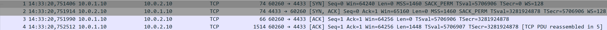
  <figcaption>Figure 1: TCP Handshake Capture</figcaption>
</figure>

We can see that the client initiated the contact with a TCP packet with the SYN flag active. This was the answered by the server with a TCP packet with the flags SYN and ACK active. To conclude the handshake the client answers with a TCP packet only with the ACK flag active, following to the letter what was the theory of this connection.

These messages are absolutely necessary for the creation of a TCP connection, and any interference with this process will result in a failed connection, as we will see with our attacks.

## TLS 1.2 Handshake vs TLS 1.3 Handshake

For this experiment, our focus will be on the second handshake that we captured, the TLS handshake.

<figure markdown id="figure-2">
  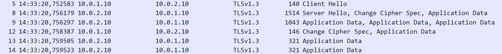
  <figcaption>Figure 2: TLS 1.3 Handshake Capture</figcaption>
</figure>

With the commands we used to create the server and client, we used TLS 1.3, since it is the default version. We can compare the handshake in WireShark with the one we saw in the Overview section, and we can see that it matches what we expected. It begins with a Client Hello, seen in Figure 3, which contains what we saw before, such as the Cypher suites available, the Key Exchange methods available as extensions, the session ID and a random number associated to the Client.

<figure markdown id="figure-3">
  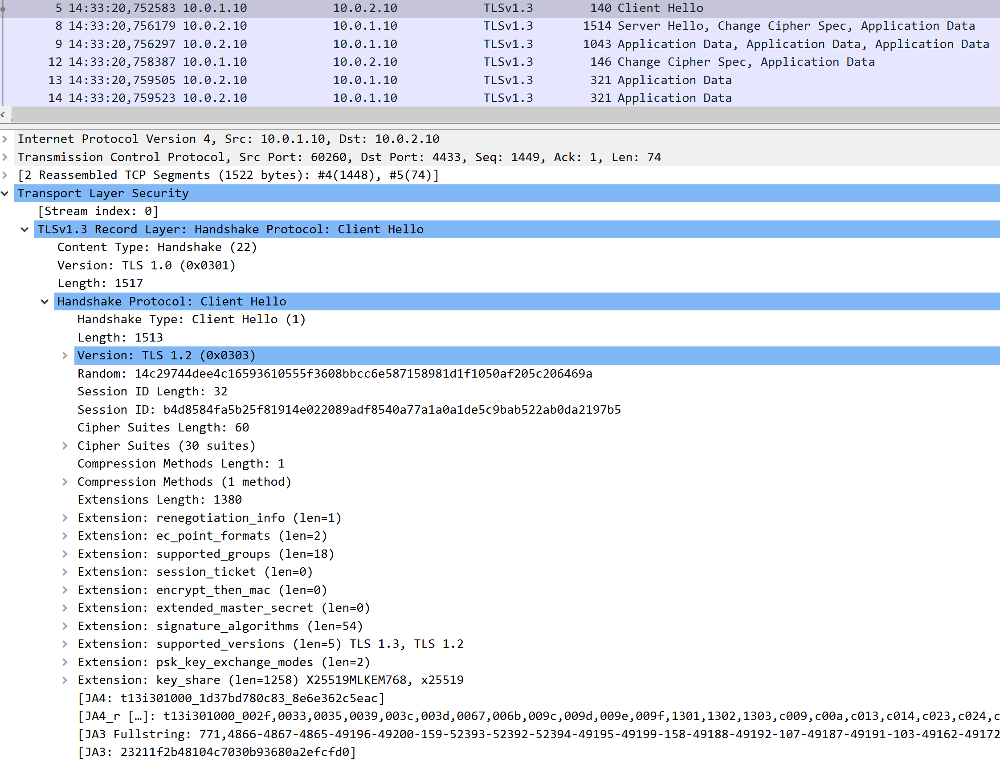
  <figcaption>Figure 3: TLS 1.3 Handshake Client Hello</figcaption>
</figure>

Then, in Figure 4, we can see the server response. This response contains the cypher suite chosen by the server, which is AES_256_GCM_SHA384, the key exchange method chosen, x25519mlkem768, which is a hybrid method, combining x25519 elliptic curve method with MLKEM 768, which is a post-quantum key exchange method. It also includes the session ID, the server random, and already encrypted goes the server certificate, just like we expceted from theory.

<figure markdown id="figure-4">
  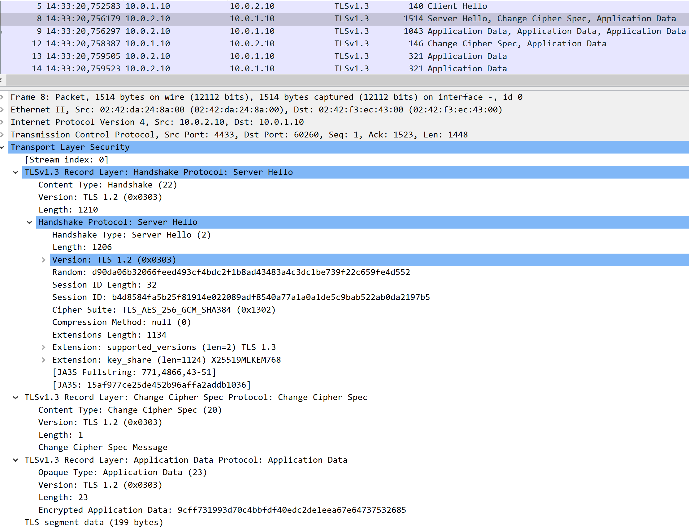
  <figcaption>Figure 4: TLS 1.3 Handshake Server Hello</figcaption>
</figure>

As we could see, in two compact messages we were able to begin a secure session, including a key exchange prepared for the quantum era of computing, and now all messages are secure by TLS.

But this is the most advanced version of TLS. TLS 1.2 is still present despite not being the standard anymore, due to its larger handshake, exchange of authentication and key material in the clear, and overall outdated and insecure cyphers and key exchange methods. We will now study it, to see if it also matches the theory and to prove why TLS 1.3 became the standard.

To do this shut down the client and server, and use the following command to start a new server:

```bash
openssl s_server \
    -accept 4433 \
    -cert server.crt \
    -key server.key \
    -tls1_2 \
    -www
```

This command orders the server to use TLS 1.2. Now, in the client use the following command:

```bash
openssl s_client \
    -connect 10.0.2.10:4433 \
    -tls1_2 \
    -state
```

With these commands, we now have a TLS 1.2 client connected to a TLS 1.2 server, and should be able to see in WireShark the handshake that occured.

<figure markdown id="figure-5">
  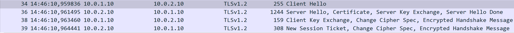
  <figcaption>Figure 5: TLS 1.2 Handshake</figcaption>
</figure>

We can see that the handshake´s structure is different, starting the same way with a Client Hello, containing the session ID, the random, the available cypher suites, which are weaker than the previous ones, but we can see that no information regarding key exchange is in this message.

<figure markdown id="figure-6">
  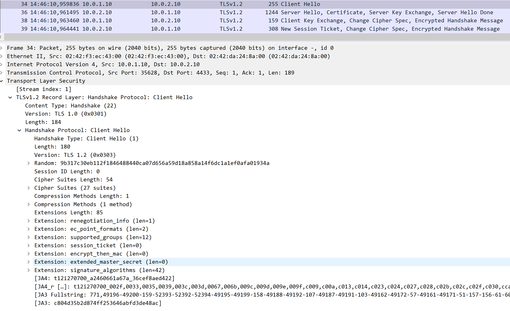
  <figcaption>Figure 6: TLS 1.2 Handshake Client Hello</figcaption>
</figure>

Following this message, comes the Server Hello, containing the same session ID, the server random, the chosen cypher suite, the server certificate in the clear and a possible key exchange method for the client to accept. This differs a lot from the previous handshake, which was resolved at this stage, with all methods chosen and a key already created and in use.

<figure markdown id="figure-7">
  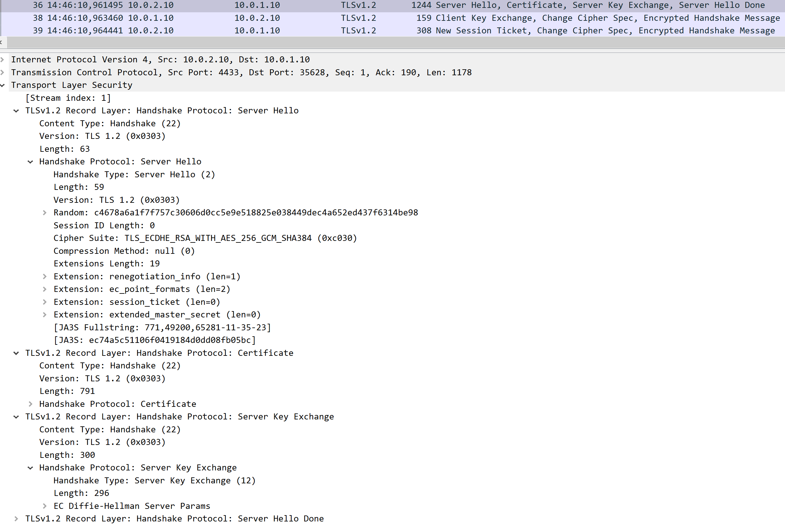
  <figcaption>Figure 7: TLS 1.2 Handshake Server Hello</figcaption>
</figure>

Afterwards, the client answers by choosing the key exchange method that the server proposed, and then sends a Change Cipher Spec message, which marks the point where its messages will now be encrypted.

<figure markdown id="figure-8">
  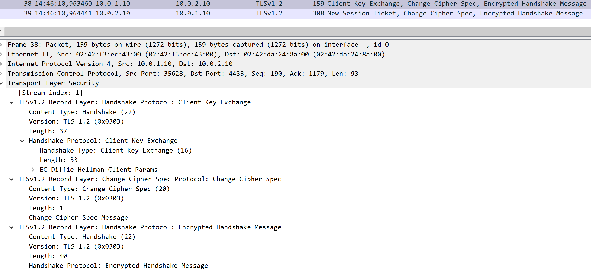
  <figcaption>Figure 8: TLS 1.2 Handshake Client Key Exchange</figcaption>
</figure>

This process ends with the server marking the beggining of the new session and changing its own cypher spec, which makes it so that all messages beyond this point are protected by the TLS tunnel.

<figure markdown id="figure-9">
  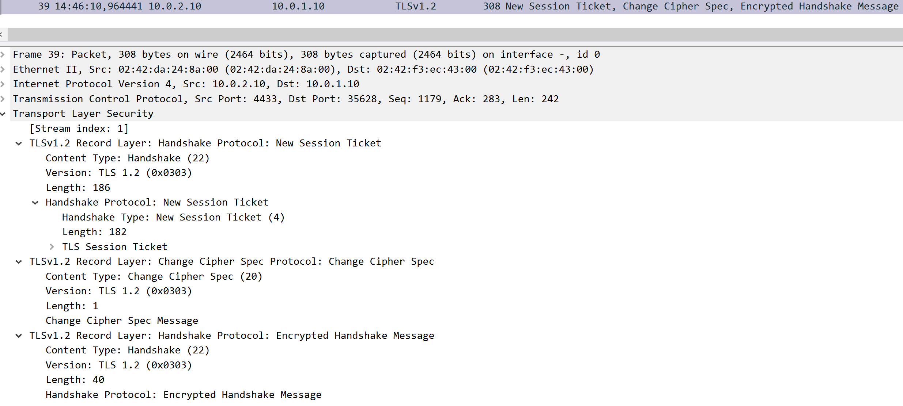
  <figcaption>Figure 9: TLS 1.2 Handshake Server New Session</figcaption>
</figure>

As we could see, TLS 1.3 was a clear evolution of its predecessor, performing its handshake in half the messages, with better cyphers, KEM and authentication.

## Attack on Session Establishment

With the experiments related to the establishment of the TCP and TLS handshakes complete, we will now begin attacking the foundations of TLS, and see what it is our is not prepared to protect.

We will begin by targeting the establishment of the TCP connection required by TLS to communicate between client and server.

To do this we will prepare a special firewall rule in the attacker, which will prevent any SYN , SYN ACK or ACK messages to go through it, replacing them with RST messages, forcing the connection to drop.

To configure it, use the following command in MitM:

```bash
iptables -I FORWARD \
    -p tcp \
    --tcp-flags SYN,ACK SYN,ACK \
    -j REJECT --reject-with tcp-reset
```

This rule ensures that any packet related to the handshake of TCP will be dropped, trapping the client in a cycle of retransmissions.

When looking at WireShark, this should be the result:

<figure markdown id="figure-10">
  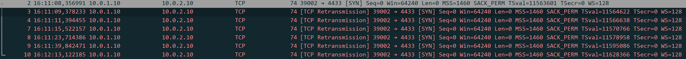
  <figcaption>Figure 10: TCP Retransmissions</figcaption>
</figure>

It will send the first SYN as usual, and then a string of unsuccessful retransmissions before stopping and giving an error message. Although TLS is a very secure protocol, it is not immune to attacks, especially at the transport layer.

To clear the rule, use the command:

```bash
iptables -D FORWARD \
    -p tcp \
    --tcp-flags SYN,ACK SYN,ACK \
    -j REJECT --reject-with tcp-reset
```

## Attack through forced reordering, duplication and loss of packets

For our final experiment and attack, we will now test TLS´s capability to withstand the loss, reordering or duplication of its packets. Although this attacks TLS indirectly, due to the separation between transport and application layers, or TCP from TLS, it is still interesting to see what happens when TLS comes under attack from this vector.

We will begin with a packet loss attack, hoping to see some behaviour signaling it is working or it is being sucessfully prevented.

To do this attack, use the following command on MitM:

```bash
tc qdisc add dev eth1 root netem loss 20%
```

This will make 20% of the packets going through eth1 to be dropped by MitM. Now we will resume the client process and see what appears in WireShark:

<figure markdown id="figure-11">
  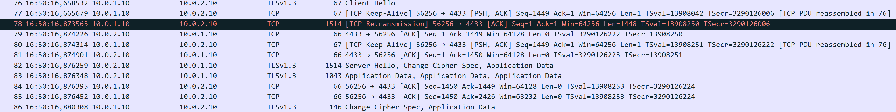
  <figcaption>Figure 11: Packet Loss Attack</figcaption>
</figure>

We can see that in the handshakle alone we already had a retransmission due to packet loss, but TLS still received an ordered byte stream thanks to the guarantees that TCP is providing in this area. We could even make the percentage of loss higher, and would still see the same result, the protocol will still function.

To clear the attack, use the command:

```bash
tc qdisc del dev eth1 root
```

For our next attack, we will be taking packets out of order, to test the capabilites of TLS, and the underlying TCP to reorder its packets back into the ordered byte stream that TLS requires.

To perform this attack, use the command:

```bash
tc qdisc add dev eth1 root netem \
    delay 100ms \
    reorder 50% 50%
```

With this not only are we introducing some delay, but are also reordering the packets that arrive at the server. If we restart the client, we can see that barely any effect can be noticed, since the packets are numbered when they leave the peers, they are automatically placed back in order upon reaching the destination.

With this test complete, let´s perform the final attack, duplication of packets.

Clear the command used for the previous attack, and use the following command for the new one:

```bash
tc qdisc add dev eth1 root netem \
    duplicate 25%
```

This will make it so that there is a 25% chance of every packet to be duplicated. We expect that TLS follows the same trend as before, and it works normally, thanks to the reliability of TCP.

<figure markdown id="figure-12">
  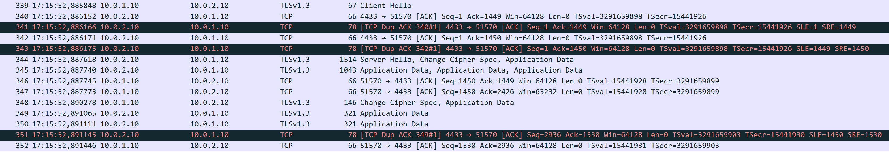
  <figcaption>Figure 12: Duplication Attack</figcaption>
</figure>

As we can see in Figure 12, there are several duplicated packets in the TLS handshake, but TCP detects them all and prevents them from affecting TLS, allowing it to finish its handshake and function without an issue.

From this experiments, we understood what is underneath TLS, in the form of TCP, we saw the evolution of TLS to reach its modern form, including better cyphers, handshakes, and even post-quantum KEMs to future proof TLS, and performed some attacks to the transport foundations of TLS to test its resilience.

We hope that these experiments allowed you to understand TLS slightly better, and gave you the tools to further experiment and improve. We hope to see you in DTLS!
