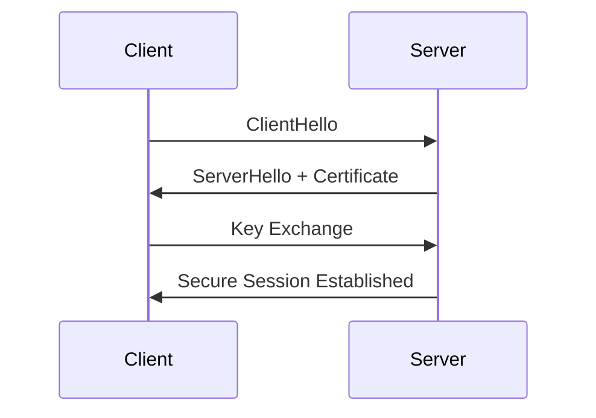

# TLS

TLS (Transport Layer Security) secures application traffic over TCP networks and is the foundation of HTTPS and many secure application protocols.

---

## Features

- Encryption
- Authentication
- Integrity validation
- Certificate-based trust
- Perfect Forward Secrecy

---

## Common Protocols Using TLS

| Protocol | Usage                |
| -------- | -------------------- |
| HTTPS    | Secure web           |
| SMTPS    | Secure email         |
| FTPS     | Secure file transfer |
| MQTT TLS | IoT security         |

---

## TLS Handshake



---

## Topics Covered

- OpenSSL
- TLS certificates
- Certificate Authorities
- CSR generation
- Cipher suites
- TLS debugging
- HTTPS testing

---

## Example OpenSSL Test

```bash
openssl s_client -connect google.com:443
```

!!! warning

    Self-signed certificates are suitable for labs but not production environments.
