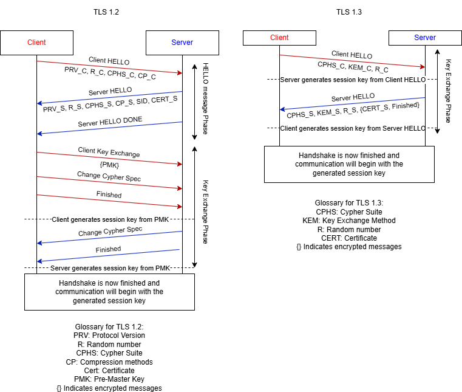
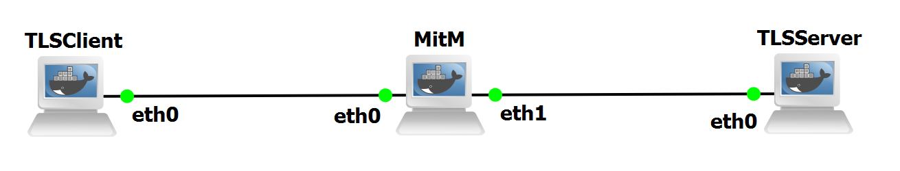

## TLS Laboratory

Transport Layer Security (TLS) is one of the most used protocols to secure Internet communications, providing confidentiality, integrity, and authentication for applications such as HTTPS, APIs, email, and enterprise services.

TLS 1.2 served as the industry standard for many years, but its complexity, dependence on numerous cipher suites, and susceptibility to downgrade and mode-specific vulnerabilities motivated the need for a more robust and modern successor.

TLS 1.3 addresses these challenges through a reduced handshake, removal of legacy algorithms, and stricter cryptographic guarantees, offering faster and more secure session establishment.

## TLS Handshake

TLS 1.2 relies on a multi-round-trip handshake that includes several optional messages, multiple cipher negotiation paths, and support for quantum-vulnerable primitives such as RSA key exchange
and CBC-mode ciphers. Although flexible, this design introduced complexity and multiple attack surfaces.

TLS 1.3 significantly simplifies this model by mandating modern AEAD ciphers, enforcing perfect forward secrecy, and reducing the handshake to a usual 1 RTT exchange.

We can observe in Figure 1 the comparison between the handshake of TLS 1.2 and 1.3. We can see some improvements between versions such as, reduced RTT for session establishment, through the front-loading of key exchange material into the Client HELLO, which allows TLS 1.3 to start a session faster and with encrypted messages sooner.

<figure markdown id="figure-1">
  
  <figcaption>Figure 1: TLS 1.2 and 1.3 Handshakes</figcaption>
</figure>

A major innovation in TLS 1.3 is its support for 0-RTT data during session resumption, enabling clients to send application data immediately after initiating a new handshake. While 0-RTT data is vulnerable to replay and requires careful use, it provides substantial performance gains for repeated connections and is a key enabler for low-latency secure communication.

## Laboratory Topology

The topology of this laboratory consists in:

- Three docker containers, using the container in ghcr.io-groudonramsay-tls, labeled as TLSClient, TLSServer and MitM.

The topology is visible in Figure 2:

<figure markdown id="figure-2">
  
  <figcaption>Figure 2: TLS Topology</figcaption>
</figure>

When adding the container to your templates, use 2 adapters and the following environment variables:

```bash
--cap-add NET_ADMIN
--cap-add NET_RAW
```

## Device Configuration

We will now configure our three devices. TLSClient and TLSServer will have their IP address, a route through the MitM and the key and certificates needed for TLS to work properly.

For TLSClient, use the following commands:

```bash
ip addr add 10.0.1.10/24 dev eth0
ip link set eth0 up
ip route add 10.0.2.0/24 via 10.0.1.1
```

For TLSServer, use the following commands to set the IP and to generate the key and certificate that the server will use:

```bash
ip addr add 10.0.2.10/24 dev eth0
ip link set eth0 up
ip route add 10.0.1.0/24 via 10.0.2.1

mkdir -p ~/tls
cd ~/tls

openssl genrsa -out server.key 2048

openssl req -new -x509 \
    -key server.key \
    -out server.crt \
    -days 365 \
    -subj "/CN=10.0.2.10"
```

For MitM, use the following commands to be able to route traffic:

```bash
ip addr add 10.0.1.1/24 dev eth0
ip link set eth0 up
ip addr add 10.0.2.1/24 dev eth1
ip link set eth1 up
sysctl -w net.ipv4.ip_forward=1
```

With these commands, you should be able to perform a ping between the client and server with no problems.

Now let´s create start up a server and client to test if TLS is working properly. We will begin by creating the server, in TLSServer, using the following:

```bash
openssl s_server \
    -accept 4433 \
    -cert server.crt \
    -key server.key \
    -www \
    -state
```

This will activate a server listening for a connection in port 4433. Then connect a client to it with the following commands in TLSClient:

```bash
openssl s_client \
    -connect 10.0.2.10:4433 \
    -state \
    -quiet
```

You should see a successful connection, and if you have WireShark open, you will see the handshake occuring, and encrypted TLS traffic passing afterwards. You will also see TCP packets that are the KeepAlive packets.

With this successful connection, we will now begin the experiments on TLS in the section [Experiments](experiments.md).
