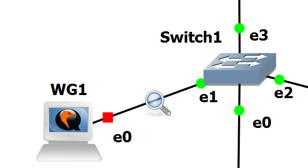
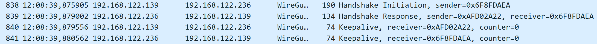
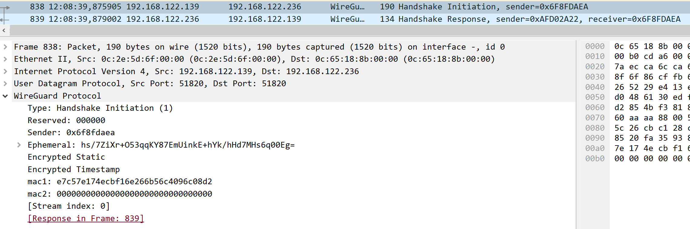
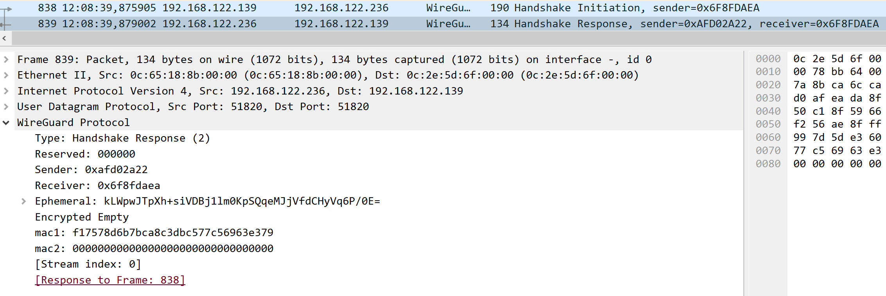
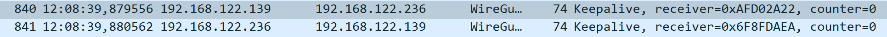
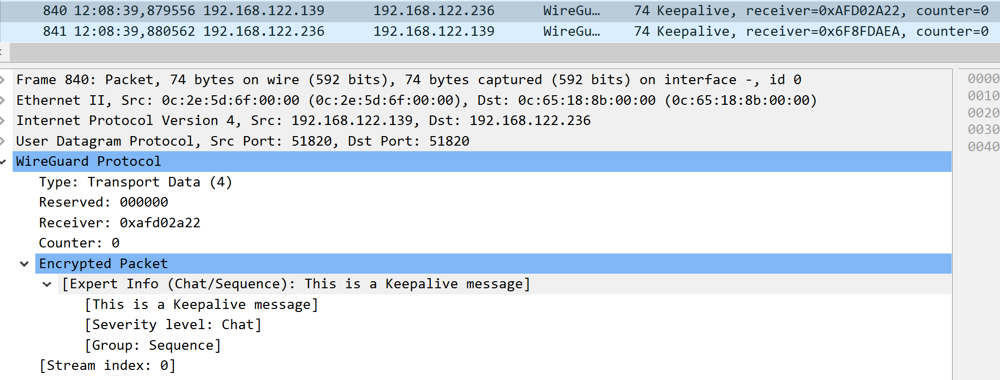
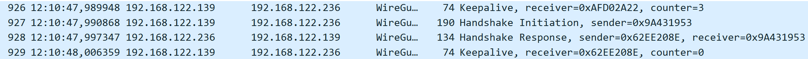
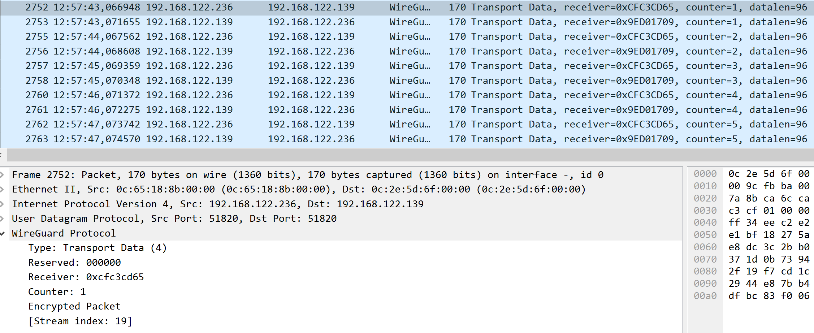
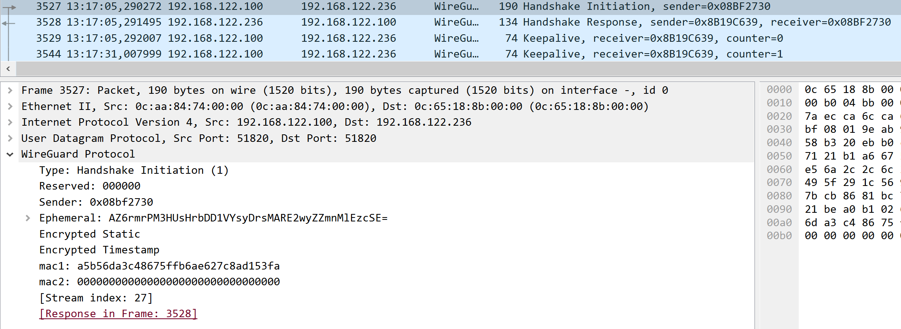
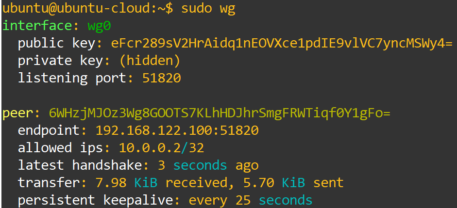

# Laboratory Experiments

Now that our topology is setup and running smoothly, we will perform some experiences and tests, to see WireGuard´s most important features and capabilities.

## WireGuard´s Handshake

We will begin our experiments by studying WireGuard´s handshake. As we have seen from Figure 1, WireGuard´s handshake is a very simple, 1-RTT handshake, that forms a connection by sharing some elements like an ephemeral Diffie-Hellman key, its encrypted public key, sender index and timestamp for replay protection.

Now lets evaluate if this correct and translates to the actual handshake performed.

To do this experiment ensure that all WireGuard interfaces are turned off, and then place a WireShark probe in the connection between WG1 and the switch.

<figure markdown id="figure-1">
  {width="400"}
  <figcaption>Figure 1: WireShark Probe</figcaption>
</figure>

With the probe set before turning WireGuard on, we will be able to capture the full handshake, and study it.

Now start up the WireGuard tunnel in WG1, and then in WG2. When this is done, we should see the following behaviour in WireShark:

<figure markdown id="figure-2">
  
  <figcaption>Figure 2: WireGuard Handshake</figcaption>
</figure>

In Figure 2, we can see two distinct moments, the first two packets describe WireGuard´s handshake, and the following two packets demonstrate the first KeepAlive performed.

For this section, we shall focus on the first two packets, detailing the handshake and its components. Open the first packet and analyse its contents.

<figure markdown id="figure-3">
  
  <figcaption>Figure 3: Handshake first packet</figcaption>
</figure>

??? question "What elements can you identify in the packet? Do they match the elements described in the theoretical handshake graph?"

    !!! solution "We can identify several elements, the type of message, Handshake Initiation, the Sender Index 0x6f8fdaea, the Ephemeral Public Diffie-Hellman key hs/7ZiXr+O53qqKY87EmUinkE+hYk/hHd7MHs6q00Eg=, the static Public Key encrypted by the Ephemeral Key and the encrypted Timestamp to secure against replay attacks. These elements match what was described in the Handshake image."

??? question "What do these elements provide in terms of functionality and security for WireGuard?"

    !!! solution "The Sender Index serves as a way to identify the peer that is connecting to the other device, the Ephemeral Key is used to create a stronger session key for this connection, the Encrypted Static acts as a way to authenticate the user of this connection as one of the allowed peers and the Encrypted Timestamp is used to protect against replay attacks."

Now that we have identified all elements of this packet and analysed their purpose in WireGuard, lets analyse the second packet and see if it matches what we theorized and what are these elements used for.

<figure markdown id="figure-4">
  
  <figcaption>Figure 4: Handshake second packet</figcaption>
</figure>

??? question "What elements can you identify from this packet? Do they still match what was expected?"

    !!! solution "From this packet we can identify the message type, Handshake Response, we can identify the Sender Index from the second device 0xafd02a22 and the Sender Index from the original device, the Ephemeral Key from this device and an Encrypted Nothing. This elements also match what we expected from the Handshake image."

??? question "And what do these elements provide to WireGuard in functionality and security?"

    !!! solution "The receiver Sender Index identifies the responding device and the initiator Sender Index is used to confirm the device we are responding to and that they initiated the Handshake process, the Ephemeral Key has the same usage, to derive a stronger session key and the Encrypted Nothing is used to prove possession of the respective Ephemeral Private Key, authenticating the user."

With this we have finished an in-depth study of WireGuard´s Handshake. Now we will study the format of its regular packets and KeepAlive packets.

## WireGuard´s Regular Operation and KeepAlive

We will now analyse how WireGuard works in its normal state of operation, verifying packets encrypted by it, and its KeepAlive packets, to better understande them and WireGuard as a whole.

Keep everything as it was when we finished the previous experiment. Lets begin by analysing the KeepAlive packets, that we had already seen from the previous experiments. WireGuard uses KeepAlive to ensure that the two peers are still up and connected, and has a setting to choose the time, in seconds, between each KeepAlive.

We will be using the first two KeepAlive packets, right after the initial handshake for analysis.

<figure markdown id="figure-5">
  
  <figcaption>Figure 5: WireGuard KeepAlive Packets</figcaption>
</figure>

From these packets we can see the follwing elements:

<figure markdown id="figure-6">
  
  <figcaption>Figure 6: WireGuard KeepAlive Analysis</figcaption>
</figure>

WireGuard identifies the packet as Transport Data, and includes an encrypted packet to confirm that the peer that answers is the correct one. Besides this, the packet also includes the Sender Index for the receiving peer and a counter to keep track of how many KeepAlives already occured.

This counter is important, as when it reaches a certain threshold WireGuard will perform a rekeying of the session key to maintain freshness. If you scroll through WireShark you should be able to identify the following packets:

<figure markdown id="figure-7">
  
  <figcaption>Figure 7: WireGuard Rekeying Packets</figcaption>
</figure>

??? question "At what number of KeepAlives does WireGuard rekey? How does WireGuard rekey? What are the benefits of rekeying the session?"

    !!! solution "When the KeepAlive counter reached 3, the device that reached that counter started a Handshake process to rekey. WireGuard rekeys by starting another Handshake, creating new Ephemeral Keys, that are used to derive a new session key. By rekeying WireGuard ensures freshness of keys, protecting against attackers trying to break its encryption."

Now that we have fully studied WireGuard´s KeepAlive and rekeying process, lets analyse a regular packet protected by WireGuard.

Creating these packets is as simple as performing a ping from WG1 to WG2, targeting WG2´s tunnel interface.

If we let 5 pings occur, we should get a capture that looks like this:

<figure markdown id="figure-8">
  
  <figcaption>Figure 8: WireGuard Regular Operation</figcaption>
</figure>

In this image we can see 10 WireGuard packets, that translate to the 10 ICMP packets sent by the ping we performed. As we can see the packets are fully protected by WireGuard, as we cannot even see what type of packet is encrypted.

??? question "What are the elements in these packets? And what are their uses?"

    !!! solution "These packets have their type identified as Transport Data, they have the current Sender Index of the receiving device, to ensure it is being received by the correct peer, they have a counter, to keep track of the packet being sent and what their response packet is, since the tunnel goes over UDP and its unreliability could lead to packet loss, and finally the encrypted packet itself, which will be decrypted upon reaching the peer tunnel interface, revealing its payload, an ICMP packet."

Now that we have finished this experiment and seen WireGuard in its normal operation, we will finish our experiments by testing WireGuard´s Roaming functionality with the Roaming Tester device.

## WireGuard´s Roaming Capabilities

For our final experiment, we will use the Roaming Tester device to showcase the Roaming capabilities of WireGuard, creating two identical interfaces in two different machines.

The idea behind this experiment is to demonstrate that a WireGuard interface, even after changing its underlying IP address, possibly from moving locations, changing providers, using mobile data, etc, is still capable of connection to its peer.

From the configuration phase, you could see that we did the exact same configuration for WG2 and RoamingTester. This was no mistake, since we want these two devices to have the same tunnel interface, which will be used to connect to WG1 in a seamless manner.

We have been using the same tunnel between WG1 and WG2 for our previous experiments, now we will turn off the interface in WG2, closing the tunnel and leaving WG1 looking for a connection.

Then we will turn on the interface in RoamingTester, and we should see in WireShark a connection forming, and by running in WG1 and RoamingTester the following command, we should see that a connection is indeed established with a new IP address, but with the same peer:

```bash
sudo wg
```

<figure markdown id="figure-9">
  
  <figcaption>Figure 9: WireGuard Roaming Packets</figcaption>
</figure>

<figure markdown id="figure-10">
  {width="600"}
  <figcaption>Figure 10: WireGuard Roaming Information</figcaption>
</figure>

As we can see from WireShark, a new session was formed, this time with a new IP address, and from the console command in WG1, we can see that the peer ID is still the same, but now the endpoint has changed, following exactly what we hoped to see happening.

This feature provides WireGuard the capability of setting up peer-to-peer connections that only rely on one of the devices having a stationary address, with the other capable of changing addresses.
