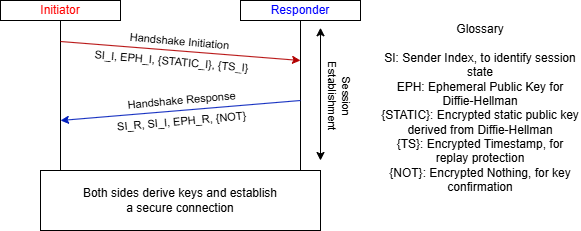
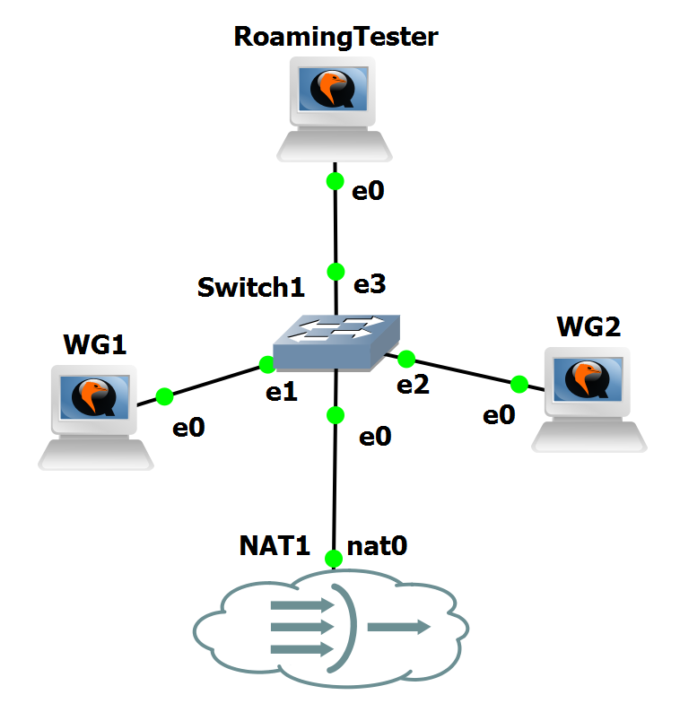
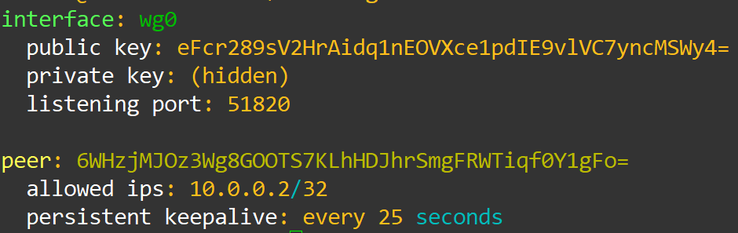
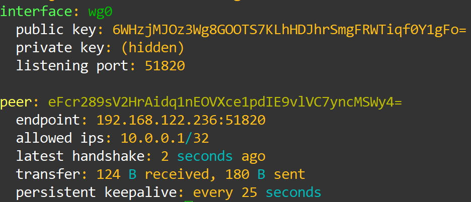
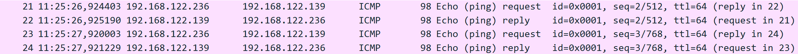
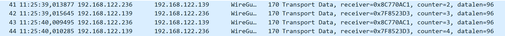

## WireGuard Laboratory

WireGuard is a modern VPN protocol that prioritises simplicity, minimal attack surface, and high performance. Designed to be small and auditable, WireGuard contrasts with the complex, feature-rich
designs of older VPN stacks by providing a concise codebase and a clear security model.

At its core, WireGuard implements a lightweight network tunnel with strong cryptography, aiming to deliver nearkernel-space performance while remaining easy to configure and maintain.

The protocol is built around a small set of cryptographic primitives chosen for performance and modern security characteristics: Curve25519 for ephemeral Diffie–Hellman, ChaCha20-Poly1305 for authenticated encryption, and Blake2s for hashing. Together these primitives provide robust perfect forward secrecy and resistance to common classes of attacks.

## Noise-based Handshake

WireGuard’s handshake is built on the Noise Protocol Framework, specifically the Noise_IKpsk2 pattern, defined by the prior knowledge of the initiator and responder static public keys, used
for authentication, and optionally of a Preshared Key for stronger key derivation.

In this construction, each peer possesses a long-term static Curve25519 keypair and generates fresh ephemeral keys for every handshake. This pattern provides mutual authentication by requiring the initiator to prove knowledge of the responder’s static public key via keyed MACs, while both sides verify possession of the corresponding private keys through multiple ECDH computations over static–ephemeral and ephemeral–ephemeral key pairs. The resulting shared secrets are expanded with HKDF-BLAKE2s to derive session keys with perfect forward secrecy.

The practical application of this handshake is rather simple, completing in 1-RTT. The following figure depicts the handshake:

<figure markdown id="figure-1">
  
  <figcaption>Figure 1: WireGuard´s Handshake</figcaption>
</figure>

## WireGuard Laboratory Overview

Now that we grasp some of WireGuard´s most important concepts and features, we will advance to the configuration of its experimental laboratory to see all these concepts in practice.

This laboratory demonstrates:

- GNS3 configuration for 3 Linux hosts with WireGuard installed
- Setup for two WireGuard hosts to form a tunnel
- Roaming capability of WireGuard to form a tunnel with the same peer in two different hosts
- Packet analysis of WireGuard´s handshake, KeepAlive messages and normal operation

## Laboratory Topology

The topology contains:

- Three Linux hosts with internet access
- A NAT for internet access
- An ethernet switch to connect all devices
- Two WireGuard peers, with two machines sharing the same host

<figure markdown id="figure-2">
  {width="400"}
  <figcaption>Figure 2: WireGuard Laboratory Topology</figcaption>
</figure>

## Topology Configuration

To create this topology, begin by placing the NAT, from GNS3´s appliances and an Ethernet Switch, and connect them both.

Then create the three Linux hosts. The hosts used for this laboratory were Cloud Guests, for their easy setup with internet connection.

!!! warning

    Before activating the Linux hosts, go to Configure -> HDD, and resize each of their drives to have at least 10000 more MB, to ensure there is space to update the host and install WireGuard.

Now that the hosts are in place and connected to the switch, start them one by one, waiting for the their setup to finish before activating the next one. To login use:

```bash
ubuntu
ubuntu
```

Then update their software before installing WireGuard with:

```bash
sudo apt update
sudo apt upgrade
```

Finally, install WireGuard with:

```bash
sudo apt install wireguard
```

With this, you should have all three hosts updated and with WireGuard available to use.

Now, we will generate the key pair for each host and setup their WireGuard configurations.

Firstly, we will generate the private/public key pair for WG1 and WG2, using the following commands:

```bash
wg genkey | tee privatekey | wg pubkey > publickey
cat privatekey
cat publickey
```

Save the two keys from both hosts in a note file to use afterwards.

With the keys generated and saved, we now need to check the IP address of WG1, so that the two other devices can connect to it.

Simply run the following command on WG1 and save the output in a note file:

```bash
ip add
```

With all the keys and necessary information obtained, we will now configure our WireGuard devices to be able to connect to each other and form a tunnel.

For WG1, use the following command to create and open a configuration file:

```bash
sudo nano /etc/wireguard/wg0.conf
```

Then, paste the following configuration into the file using right click:

```conf
[Interface]
PrivateKey = cat privatekey (WG1)
Address = 10.0.0.1/24
ListenPort = 51820

[Peer]
PublicKey = cat publickey (WG2)
AllowedIPs = 10.0.0.2/32
PersistentKeepalive = 25
```

Place the respective private and public keys in the marked spots, and then save and exit from the file.

With this configuration, we instruct WireGuard to create the virtual interface wg0, which will listen on port 51820 and use the address 10.0.0.1.

Now we will configure both WG2 and RoamingTester with the same configuration:

```conf
[Interface]
PrivateKey = cat privatekey (WG2)
Address = 10.0.0.2/24
ListenPort = 51820

[Peer]
PublicKey = cat publickey (WG1)
AllowedIPs = 10.0.0.1/32
Endpoint = WG1IP:51820
PersistentKeepalive = 25
```

With this configuration on both devices, we instruct them to create the wg0 interface, with 10.0.0.2 as their IP. Furthermore, we instruct them that their peer is 10.0.0.1, and that the IP to respond back during the handshake is the IP of WG1.

!!! question "Why did we configure RoamingTester with the same keys and interface as WG2? What can we accomplish with this?"

With the configurations complete, all that is left is to test if it was properly setup and if the tunnel forms.

To test this, first we will activate the interface in WG1, using the command:

```bash
sudo wg-quick up wg0
```

And we will check on its status using:

```bash
sudo wg
```

You should see an output similar to the one presented in Figure 3.

<figure markdown id="figure-3">
  {width="400"}
  <figcaption>Figure 3: WireGuard Interface Output</figcaption>
</figure>

This means that our interface is up and waiting for a peer to begin the connection. Now we will start the interface on WG2 to check if everything is correct.

To start the interface we will do the same command as WG1:

```bash
sudo wg-quick up wg0
```

And the same command to check the interface:

```bash
sudo wg
```

The difference this time, is the fact that now there are two interfaces up that are each other´s peer, which means that a tunnel will now form, and we will get a different output, detailed in Figure 4:

<figure markdown id="figure-4">
  {width="400"}
  <figcaption>Figure 4: WireGuard Tunnel formed</figcaption>
</figure>

With this output we can verify that this interface is also functioning, and that a peer, WG1, has formed a tunnel.

We will end our testing by opening WireShark in GNS3 in a link between WG1 and WG2, and then by performing a ping from WG1 to the tunnel entrance of WG2, to ensure that WireGuard is in use.

To test this we will first ping the regular interface of WG2, to see that the underlying connection still exists and works:

```bash
ping 192.168.122.139
```

And we will see in WireShark that the ICMP packets appear as usual and that connection is still here.

<figure markdown id="figure-5">
  
  <figcaption>Figure 5: WG1 Regular Ping</figcaption>
</figure>

Now we will ping through the WireGuard tunnel, and see that the connection is now encrypted. First, we ping using:

```bash
ping 10.0.0.2
```

And now we should see in WireShark the following packets:

<figure markdown id="figure-6">
  
  <figcaption>Figure 6: WG1 Tunnel Ping</figcaption>
</figure>

Which means that the tunnel has successfully formed and the packets that go through it are encrypted with WireGuard.

Now that the setup is complete, we will perform some experiments to see WireGuard in action, following the guides in [WireGuard Experiments](experiments.md)
